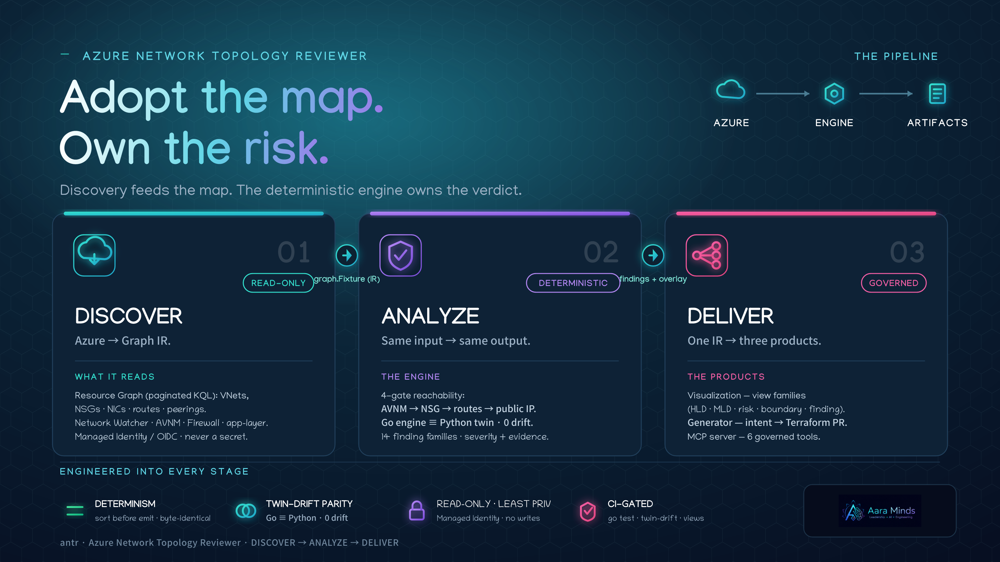

# Azure Network Topology Reviewer

**Deterministic, auditable, license-free Azure network-exposure analysis and pre-deploy change
simulation — delivered to engineers and AI agents as CI-gated, diffable artifacts.** Built for the
estate that isn't fully covered by paid Defender CSPM / Wiz.

> Repositioned 2026-06-16 (ADOPT-01). The value isn't "we compute reachability" or "we colour risk on a
> map" — Azure (AVNM Network Verifier), Defender, Wiz, and CloudNetDraw already do those. antr's wedge is
> the *combination* no incumbent ships: **deterministic + license-free + pre-deploy `simulate_change` +
> CI-gated artifacts + MCP-native delivery.** See `COMPETITIVE_ANALYSIS.md` and `BENCHMARK_vs_AVNM_Batfish.md`.



## Where antr fits (vs Defender / AVNM Verifier / Wiz)

| Use this when… | Tool |
|---|---|
| You need an **authoritative single-intent** answer on a *deployed* estate (and the subnet has a running VM) | **AVNM Network Verifier** (native, authoritative on AVNM admin rules) |
| You have **paid Defender CSPM / Wiz** and want the full multi-cloud security graph + attack paths | **Defender / Wiz** — antr *consumes* these signals where licensed (`azure-defender-signal-ingestion`) |
| You need **pre-deploy** reachability/severity *delta* of a change, an **estate-wide** exposure sweep with severity, **firewall-DNAT** depth, the **`None` black-hole** route, or analysis on **free-tier / empty subnets** — **deterministic, license-free, CI-gated, agent-consumable** | **antr** |

The honest line: where Defender/Wiz are licensed, antr complements them (consume, don't recompute); where
they're not, and for pre-deploy `simulate_change`, antr is the one that fits. Full evidence in
`BENCHMARK_vs_AVNM_Batfish.md`.

## Status

| Phase | Title | Status |
|---|---|---|
| **Phase 0** | Analysis Engine Proven | ✅ ACCEPTED (2026-06-03) |
| **Phase 1** | Azure Adapter + MCP v1 | ✅ ACCEPTED WITH CONDITIONS (2026-06-12) |
| **Phase 2** | Cost-Aware Simulation | ✅ MCP-WIRED (2026-06-16) — `simulate_change` + `forecast_cost` tools live + tested; acceptance memo pending live cost cross-check |
| **Phase 3** | Design Generation | ✅ ACCEPTED WITH CONDITIONS (2026-06-13) |
| **Phase 4** | Enterprise Topology Visualization | ⚠️ IN-SESSION SCOPE COMPLETE (26/26 eval PASS, 3 audits); live discovery/Go-port/pipeline deferred |

## Architecture in one sentence

A **deterministic graph engine** at the core — reachability, rules, severity computed without an LLM —
with the **LLM at the edges** (explain, recommend, intent→spec), exposed as MCP tools.

## What's built

```
engine/
  go/                  — Go 1.25 production engine (99/99 tests across 8 packages, go vet clean)
    internal/graph/    — graph.Fixture type (the contract the Azure adapter produces)
    internal/analyze/  — Analyze() — deterministic 4-gate reachability + severity
    adapter/           — Azure adapter: Resource Graph + Network Watcher → graph.Fixture
    mcp/               — MCP server: get_topology, analyze_risks, format_report, generate_topology, simulate_change, forecast_cost
    renderer/          — markdown + drawio output (drawio peering edges: see Phase 4 RC-1…RC-4)
    simulator/ forecast/ — Phase 2 simulate_change + forecast_cost engines (MCP-wired 2026-06-16)
    generator/         — Phase 3 Terraform projection + ValidateBeforeEmit + PR workflow
  reference/           — Python reference implementation (same fixtures, cross-check)
```

## Phase 4 — Visualization (in-session scope: DONE)

Triggered by the `ref-topology/generated_antr.pdf` failure (near-zero connectivity, every node
"Clean") vs. the human reference `ref-topology/BCLM-Revised-8June2026.drawio` (288 edges).
Strategy (sharpened — `phase-4/design/ADR-001-visualization-strategy.md`): **antr owns discovery and
risk; it delegates only layout geometry.** Shipped:

- **View families** (`phase-4/viz/views.py`) — HLD · MLD · risk-only · external-boundary · cross-sub ·
  one finding-centric k-hop view per Critical/High finding. Each is a deterministic projection over one
  whole-estate risk truth (a view can hide a resource but never change a verdict). Gated by `test_views.py`.
- **App-layer resources as first-class nodes** — App Gateway · AKS · Front Door · vWAN · APIM · Private
  Endpoint drawn and severity-painted; the diagram-eval gate (`eval_diagram.py`) positively enforces that
  every finding has a node.
- **Graph IR contract** (`phase-4/design/GRAPH_IR.md`) — `graph.Fixture` + overlay pinned as the stable
  contract any layout backend (ELK / Graphviz / a CloudNetDraw fork) consumes, so the geometry is
  swappable while identity, determinism, discovery, and risk are not.

CloudNetDraw (MIT) is retained as a **layout-only, adopt-and-patch option** (needs a one-line
sort-before-emit determinism fix), not the base — see the ADR for the decision and evidence.

## Getting started

```bash
# 1. Verify the engine is green (Go 1.25)
cd engine/go && go test ./...          # all packages pass; go vet clean

# 2. Cross-check the Python reference twin == Go engine (0 divergences)
cd engine && python3 twin_drift_check.py

# 3. One-command end-to-end demo: fixture → analyze → view families → report
make demo                              # or: ./demo.sh phase-4/fixtures/estate-multisub.json
```

`make demo` runs `Analyze()` over a sample estate, generates the full set of view-family `.drawio`
diagrams under `out/demo/`, and prints a severity summary — the whole discover→analyze→deliver pipeline
on one fixture, no Azure required.

## Key decisions

| Decision | Choice |
|---|---|
| Severity computation | Always in Go `Analyze()` — never the LLM |
| Container registry | JFrog Artifactory (AT&T standard — never ACR) |
| MCP ingress auth | Container Apps Entra (no APIM) |
| Model access | AskAT&T via JWT bearer |
| Write path | PR via GitHub Actions + OIDC only |

## Documentation

| Document | Purpose |
|---|---|
| `IMPLEMENTATION_PLAYBOOK.md` | Step-by-step guide with agent prompts + validation (Phases 0–4) |
| `baseline/IMPLEMENTATION_ROADMAP.md` | Phase map + locked decisions |
| `baseline/TARGET_ARCHITECTURE.md` | Component architecture reference |
| `phase-0/FINDINGS_MEMO.md` | Engine proof + locked design decisions |
| `phase-1/PHASE_1_ACCEPTANCE_MEMO.md` | Adapter + MCP v1 acceptance (G1–G5) |
| `phase-3/PHASE_3_ACCEPTANCE_MEMO.md` | Topology generation acceptance (G1–G5) |
| `phase-4/design/ADR-001-visualization-strategy.md` | The sharpened strategy: own discovery+risk, delegate layout, view families, CloudNetDraw as layout-only fallback |
| `phase-4/design/GRAPH_IR.md` | The stable `graph.Fixture` + overlay contract any layout backend consumes (identity + determinism rules) |
| `phase-4/viz/views.py` · `test_views.py` | View-family projections (HLD/MLD/risk/boundary/cross-sub/finding) + their gate |
| `phase-4/design/VISUALIZATION_MODEL.md` | Enterprise visualization design + OSS decision + root causes |
| `phase-4/PHASE_4_ACCEPTANCE_MEMO.md` | Phase 4 acceptance (in-session) + 4-round audit trail + engineering fixes |
| `docs/INSTRUCTING_ANTR.md` | How to instruct antr to produce a topology diagram — the scoped input contract, the framework mapping, and what's built vs. gaps |
| `docs/diagrams/architecture.svg` · `gen_architecture.py` | Brand-style architecture diagram (regenerable) |
| `engine/go/adapter/recorded_estate_test.go` | Offline recorded-ARM harness driving the full fetch fan-out (audit C-2) |
| `phase-2/PHASE_2_STATUS.md` | Phase 2 de-ambiguation (engines done; MCP wiring + acceptance pending) |
| `AGENT_ROSTER.md` | Which `aara-*` agents exist and where (engineering pack vs project-delivery) |
| `.github/workflows/engine-ci.yml` | CI: Go test, Python reference + V4-07, twin-drift, diagram-eval gate (required), Phase-3 generator tests |
| `engine/twin_drift_check.py` | Asserts Python reference == Go engine on every shared fixture |
| `NetworkTopologyReviewer-architecture.md` | Full Mermaid architecture diagram |
| `NetworkTopologyReviewer-build-plan.md` | Detailed phase requirements |
