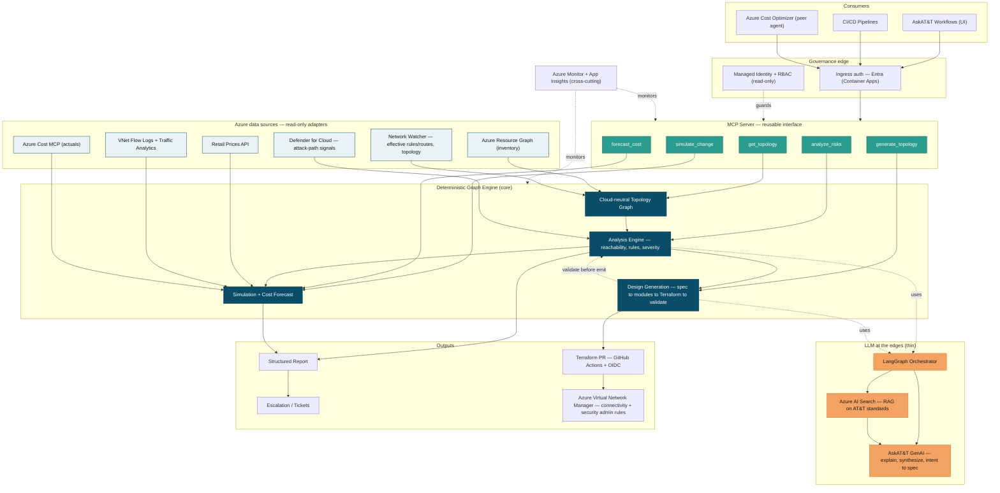

## How to read this

The **deterministic graph engine** is the center of gravity — graph model, analysis (reachability, rules, severity), simulation/forecast, and generation all operate on one cloud-neutral graph. The **LLM is at the edges**: it explains findings, synthesizes RAG-grounded recommendations, and translates architect intent into a spec. It never computes reachability or severity, and never authors network Terraform. Everything is reachable through one **MCP server**, so the agent UI, CI/CD, and the Cost Optimizer all consume the same interface. Two modes share the same core: **Review** (read-only, deployed topology) and **Generate** (architect intent → validated Terraform PR).

## Legend / key decisions encoded in the diagram

- **Core (dark teal):** the deterministic engine. Reachability and severity are computed here, not by the model.
- **Edges (orange):** the only places the LLM runs — explanation, RAG-grounded recommendation, intent→spec. RAG always grounds the model on a versioned AT&T standard.
- **Read-only adapters (light):** all data ingress is read. The identity that runs review holds no write permission.
- **Interface (green):** every capability is an MCP tool, so review, cost, and generation are reusable by the UI, CI/CD, and the Cost Optimizer alike.
- **Write path is PR-only:** generation emits a Terraform PR through GitHub Actions + OIDC and targets Azure Virtual Network Manager for enforcement. The agent never applies a change.

## Phasing overlay

`get_topology` + `analyze_risks` ship in **v1** (review). `simulate_change` + `forecast_cost` ship in **v2** (cost-aware simulation). `generate_topology` ships in **v3** (design generation). See `NetworkTopologyReviewer-build-plan.md` for the forced sequence and exit criteria.
