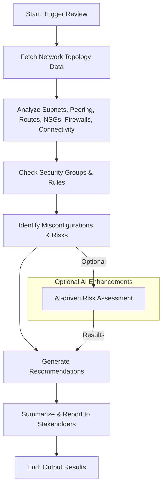

```mermaid
flowchart TD
    A[Start: Trigger Review] --> B[Fetch Network Topology Data]
    B --> C[Analyze Subnets, Peering, Routes, NSGs, Firewalls, Connectivity]
    C --> D[Check Security Groups & Rules]
    D --> E[Identify Misconfigurations & Risks]
    E --> F[Generate Recommendations]
    F --> G[Summarize & Report to Stakeholders]
    G --> H[End: Output Results]

    subgraph Optional AI Enhancements
        X[AI-driven Risk Assessment]
    end
    E -- Optional --> X
    X -- Results --> F
```
