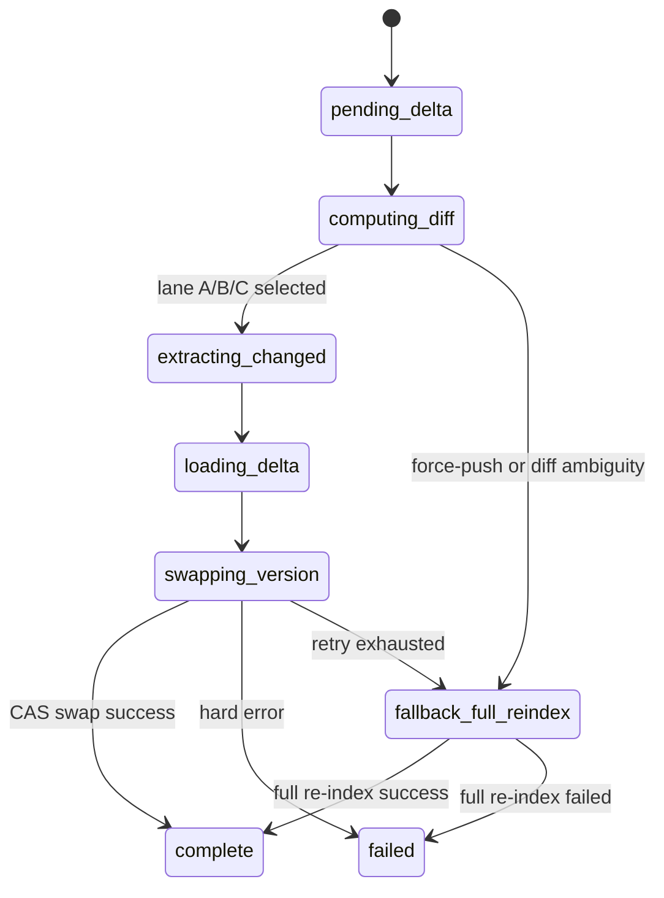

# ADR: Phase 5 Incremental Update Architecture

## Status

Accepted (Phase 5.1 / P22-INCR)

## Date

2026-06-30

## Context

Phases 1-4 rely on full re-index on each push. That guarantees correctness but does not meet the Phase 5 target (seconds-to-low-minutes update latency per commit). We need deterministic incremental updates while preserving the existing `index_version` atomic swap and provenance guarantees.

## Decision Summary

We will implement an incremental pipeline with:

1. Three-lane invalidation (A/B/C) for bounded recomputation.
2. Push coalescing (3+ pushes in 30s per repo) into one index job.
3. Force-push detection (`before=0000000`) -> full re-index.
4. Missed-webhook reconciliation every 15 minutes.
5. Atomic `index_version` swap with one retry, then fallback to full re-index.
6. Explicit `index_run` state machine for observability and failure recovery.

## Lane Model

### Lane A — File Changed

Trigger: file path appears in git diff between `before` and `after`.

Action:
1. Re-extract nodes/edges for changed files only (`--files` extractor mode).
2. Delete existing graph facts for those files (`source_ref` path match).
3. Insert refreshed NDJSON.
4. Continue to swap.

Guarantee: precise update for syntactically changed files.

### Lane B — Dependency Changed

Trigger: dependency-impact classification from changed entities (direct dependents depth=1).

Action:
1. Recompute impacted edges for direct dependents only.
2. Update edge set without full file re-extract.
3. Continue to swap.

Guarantee: dependency fanout kept bounded while preserving immediate callers/dependents consistency.

### Lane C — Cross-Service Boundary

Trigger: diff touches SOAP/REST boundary artifacts or cross-service connectors.

Action:
1. Mark boundary as stale immediately.
2. Enqueue asynchronous service-boundary full re-extract.
3. Do not block Lane A/B commit path unless consistency risk is critical.

Guarantee: no silent drift for cross-service contracts; expensive recomputation is decoupled.

## Coalescing Design

Rule: if the same repo receives >=3 pushes inside a 30-second window, process one job for the newest SHA.

### Queue Table

```sql
CREATE TABLE IF NOT EXISTS rif_meta.index_queue (
    id BIGSERIAL PRIMARY KEY,
    repo_id TEXT NOT NULL REFERENCES rif_meta.repositories(repo_id),
    queued_sha CHAR(40) NOT NULL,
    queued_at TIMESTAMPTZ NOT NULL DEFAULT NOW(),
    status TEXT NOT NULL DEFAULT 'queued',
    lane TEXT NOT NULL,
    before_sha CHAR(40),
    after_sha CHAR(40),
    attempts INTEGER NOT NULL DEFAULT 0,
    error_message TEXT,
    UNIQUE (repo_id, queued_sha, status)
);

CREATE INDEX IF NOT EXISTS idx_index_queue_repo_time
    ON rif_meta.index_queue (repo_id, queued_at DESC);
```

### Dispatcher

Poll every 5 seconds:
1. Fetch queued rows by `repo_id`.
2. Collapse rows in 30-second buckets.
3. Keep max `queued_at` / newest `queued_sha`.
4. Promote lane precedence: `full_reindex` > `lane_c` > `lane_a` > `lane_b`.
5. Mark consumed rows as `coalesced`; dispatch one runnable row.

## Diff and Branch Rules

1. `before=0000000` (or all zeros SHA) -> immediate full re-index enqueue.
2. Non-main branch pushes -> on-demand indexing only (no automatic queue unless explicitly configured).
3. Lane classification is deterministic from diff metadata + rule set; no LLM in the classifier.

## Missed-Webhook Reconciliation

Scheduled sweep every 15 minutes:
1. For each active repo, run `git ls-remote` HEAD.
2. Compare HEAD SHA to `rif_meta.repositories.current_sha`.
3. If diverged and no active run exists, enqueue full re-index with reason `reconcile_divergence`.

This closes webhook-loss gaps and handles out-of-band updates.

## Atomic `index_version` Swap

Delta load writes into shadow partition/version first, then compare-and-set swap:

```sql
UPDATE rif_meta.repositories
SET current_index_version = $new_version,
    current_sha = $after_sha,
    updated_at = NOW()
WHERE repo_id = $repo_id
  AND current_index_version = $expected_version;
```

If affected rows = 0:
1. Reload expected version and retry once.
2. If retry fails, mark run `fallback_full_reindex` and enqueue full re-index.

No partial delta becomes visible as current unless swap succeeds.

## `index_run` State Machine



## Failure Modes and Recovery

1. **Diff computation failure** -> direct fallback full re-index.
2. **Partial extraction failure** -> run failed; retry policy; if max retries exceeded, full re-index.
3. **Delta load conflict** -> swap retry once; then fallback full re-index.
4. **Queue storms** -> coalescing and lane precedence prevent N:1 churn.
5. **Reconciliation mismatch during active run** -> suppress duplicate enqueue; re-check next sweep.

## Ownership Boundaries

1. **Ingestion (phase-1/ingestion + phase-5 orchestration)**: webhook intake, queueing, coalescing, run lifecycle.
2. **Extractor (phase-1/extractor + new `--files`)**: deterministic extraction for changed file set.
3. **Loader (phase-5/loader)**: delete/insert delta facts, shadow write, swap, fallback enqueue.
4. **Reconciler (phase-5/ingestion/reconcile)**: periodic drift detection and enqueue.

## Implementation Contract for Step 5.2

1. `DiffResult{LaneA, LaneB, LaneC []string, ForceReindex bool}` is the canonical handoff.
2. Loader must be idempotent for repeated same-SHA delta runs.
3. Queue worker must serialize per `repo_id`.
4. Every transition writes to `index_runs.status` and structured logs for auditability.

## Consequences

Positive:
1. Update latency drops from full re-index to bounded delta paths.
2. Correctness remains protected by atomic swap and fallback full re-index.
3. Operational behavior is explicit and testable.

Trade-offs:
1. Pipeline complexity increases (queueing + lane logic + reconcile loop).
2. Lane-B/C quality depends on deterministic classifiers and boundary rules.
3. Additional integration tests are required for race and retry semantics.
