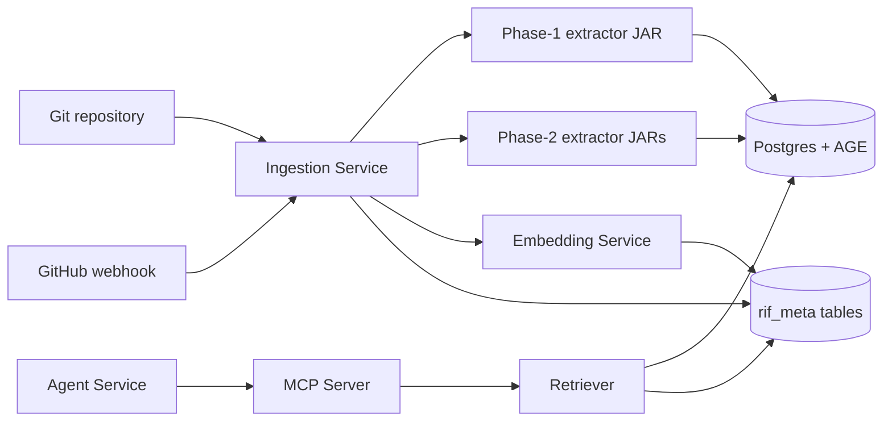
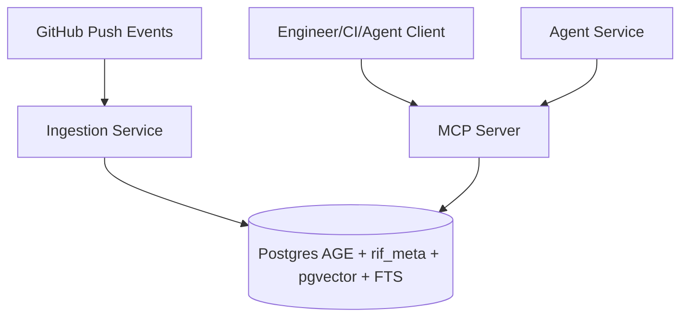
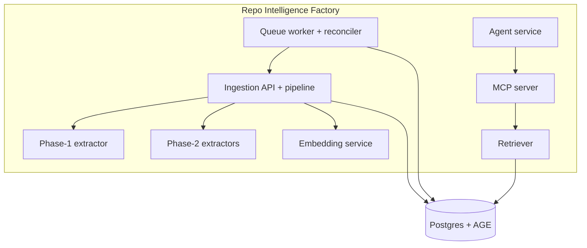
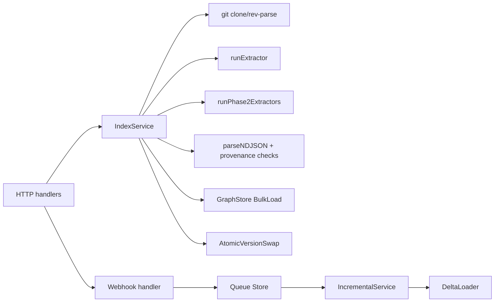
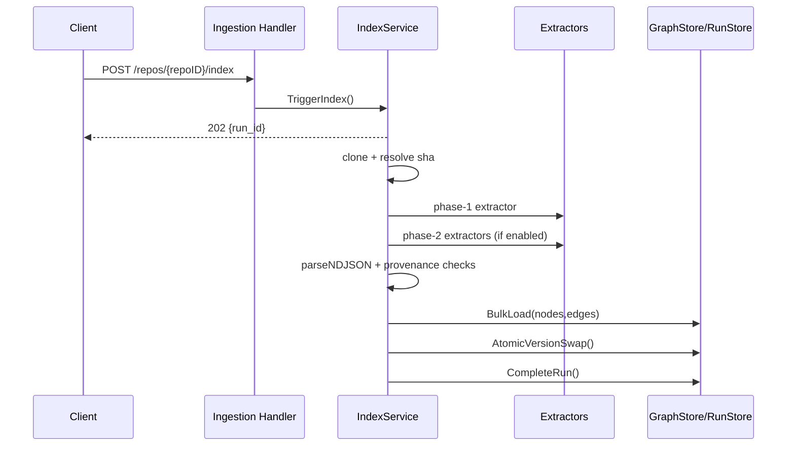
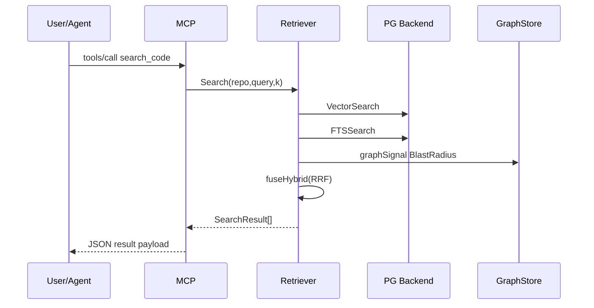
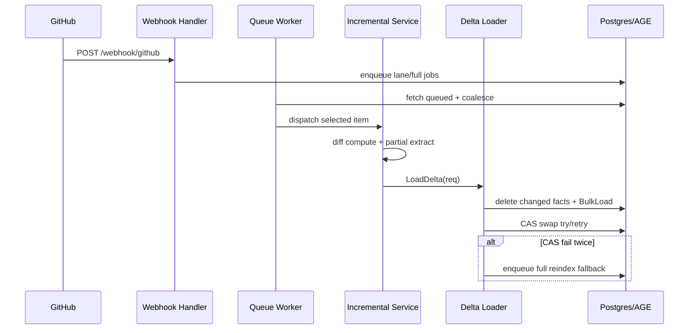

# Repo Intelligence Factory — Technical Documentation (Consolidated)

- **version:** 1.0  
- **date:** 2026-07-01  
- **repository:** `aaraminds/repo-intelligence-factory`  
- **commit_sha:** `60ae600a89304a51cea70426d583e23b589ff828`  
- **owner:** `[VERIFY]`  
- **review_cadence:** `[VERIFY]`  
- **next_review:** `[VERIFY]`  
- **audience:** senior engineers, architects, operators, technical leaders  
- **evidence policy:** Tier 1 (code/config/tests) > Tier 2 (eval reports) > Tier 3 (status/closure docs) > Tier 4 (planning/design docs)  
- **selected depth:** Enterprise (with evidence-scarcity handling for governance/production proof gaps)
- **line-citation validity:** line ranges are pinned to `commit_sha` above.

## Table of Contents

1. [Executive Technical Summary](#executive-technical-summary)
2. [System Overview](#system-overview)
3. [Architecture and Design](#architecture-and-design)
4. [Data Model and Schema](#data-model-and-schema)
5. [C4 Model](#c4-model)
6. [Architecture Decision Records (ADR-style)](#architecture-decision-records-adr-style)
7. [Workflows and Data/Control Flow](#workflows-and-datacontrol-flow)
8. [APIs and Interface Contracts](#apis-and-interface-contracts)
9. [Deployment and Runtime Topology](#deployment-and-runtime-topology)
10. [Observability and Operations](#observability-and-operations)
11. [Security, Risk, and Controls](#security-risk-and-controls)
12. [Testing and Validation](#testing-and-validation)
13. [Production Readiness Matrix](#production-readiness-matrix)
14. [Limitations and Assumptions](#limitations-and-assumptions)
15. [Roadmap and Deferred Work](#roadmap-and-deferred-work)
16. [Consistency and Contradiction Register](#consistency-and-contradiction-register)
17. [Claim-to-Evidence Traceability Matrix](#claim-to-evidence-traceability-matrix)
18. [Evidence Appendix](#evidence-appendix)
19. [References](#references)
20. [Acceptance Review](#acceptance-review)

## Executive Technical Summary

- **Fact:** The repo implements a multi-phase deterministic code-intelligence platform with ingestion, graphstore, phase-2 extractors, embedding service, retriever, MCP server, agent service, and incremental queue/reconcile/delta-load paths in code. (source: phase-1/ingestion/main.go#L96-L121, phase-3/retriever/retriever.go#L81-L109, phase-4/mcp-server/main.go#L32-L50, phase-5/loader/delta_load.go#L39-L75)
- **Fact:** Core stable architecture principle is deterministic graph facts first; LLM at narration edge. (source: RepoIntelligenceFactory-architecture.md#L10-L16)
- **Fact:** Hybrid retrieval A/B report shows numeric improvement over vector-only baseline (offline fixture mode). (source: phase-3/eval/AB_EVAL_REPORT.md#L9-L18)
- **Fact:** Incremental framework (queue coalescing, lane precedence, reconciliation, CAS swap fallback) is implemented and test-covered by integration tests (execution gated by env flags). (source: phase-5/ingestion/queue/queue.go#L109-L161, phase-5/ingestion/reconcile/reconcile.go#L47-L67, phase-5/loader/delta_load_integration_test.go#L49-L210)
- **Risk:** Production-readiness is not evidenced as complete: no verified SLO/alert/runbook ownership metadata, and governance owner/cadence fields are absent. (source: this document metadata; [VERIFY])
- **Risk:** Ingestion health endpoint is `/healthz`, but deploy workflow polls `/health`; deployment health checks are inconsistent. (source: phase-1/ingestion/main.go#L116-L121, .github/workflows/deploy-ingestion.yml#L229-L243)
- **Risk:** Webhook handler currently lacks GitHub HMAC signature verification. (source: phase-1/ingestion/handler/webhook.go#L37-L53)
- **Risk:** Phase-2 NodeIdComputer uses space separators while phase-1 uses NUL separators; identity compatibility requires verification. (source: phase-1/extractor/src/main/java/com/aaraminds/rif/extractor/resolve/NodeIdComputer.java#L12-L18, phase-2/extractor/common/src/main/java/com/aaraminds/rif/extractor/common/NodeIdComputer.java#L23-L31)

**Top production blockers**
1. Governance ownership/review metadata not evidenced (`owner`, `review_cadence`, `next_review`).  
2. Missing explicit authN/authZ contract for public API and MCP tool plane (`[VERIFY]`).  
3. Deployment health-path contradiction (`/healthz` vs `/health`).  
4. Missing webhook authenticity validation.  
5. No evidence-backed SLO/alert/runbook operating model.

**Top recommended next actions**
1. Add governance metadata + named accountable owner.  
2. Align deploy health probe path with ingestion route contract.  
3. Implement/verify webhook HMAC verification.  
4. Resolve and test NodeId compatibility contract across phase-1 and phase-2 extractors.  
5. Establish minimal ops baseline: SLI/SLOs, alerts, runbooks, and rollback drill evidence.

## System Overview

Repo Intelligence Factory (RIF) builds deterministic repository intelligence and exposes it through MCP tools and an agent service. The core runtime path is: register repo → index graph facts → enrich with embeddings/FTS → serve retrieval/impact analysis via MCP and agent endpoints. (source: phase-1/ingestion/main.go#L4-L13, phase-3/retriever/retriever.go#L107-L152, phase-4/agent-service/app.py#L39-L63)

| Scope area | Implemented evidence | Maturity |
|---|---|---|
| Repo registration/index lifecycle | Go HTTP routes + run store + async pipeline | Implemented |
| Graph persistence | AGE-backed GraphStore + schema DDL | Implemented |
| Semantic/lexical retrieval | pgvector + FTS backend + RRF fusion | Implemented |
| MCP tool interface | 5 tools + JSON schema | Implemented |
| Agent orchestration | FastAPI + MCP client + LangGraph fallback execution | Implemented |
| Incremental freshness | webhook classify + queue + reconcile + delta loader | Implemented |
| Production governance & operations ownership | `[VERIFY]` | Partial |

## Architecture and Design

**Conclusion:** Architecture is code-realized as a deterministic core plus model-assisted edge. Production-hardening controls remain partial.

### Stable core (durable principles)

1. **Deterministic graph facts over generated facts** (source: RepoIntelligenceFactory-architecture.md#L10-L16)  
2. **Atomic pointer swap for version visibility** (source: phase-1/ingestion/store/run_store.go#L247-L283, phase-5/loader/delta_load.go#L84-L107)  
3. **Bounded, explainable retrieval fusion** (source: phase-3/retriever/retriever.go#L107-L152, phase-3/retriever/retriever.go#L295-L334)

### Runtime architecture (implemented)

What this proves: all major service boundaries and call paths are represented by executable code/config, not planning-only docs. (source: phase-1/ingestion/main.go#L96-L121, phase-1/ingestion/service/index_service.go#L461-L509, phase-4/mcp-server/app.go#L193-L199, phase-4/agent-service/app.py#L43-L61)

### Architecture state classification

| Area | Implemented | Tested | Deployable | Production-ready |
|---|---|---|---|---|
| Ingestion + graph load | Yes | Yes (unit/integration/smoke artifacts) | Yes (Dockerfile + workflow + containerapp yaml) | Partial |
| Retriever + MCP | Yes | Yes (tests) | Partial (no Docker/IaC manifests for retriever/MCP) | Partial |
| Agent service | Yes | Yes (tests) | Yes (Dockerfile) | Partial |
| Incremental freshness | Yes | Yes (integration tests) | Partial (`[VERIFY]` runtime rollout evidence) | Partial |

## Data Model and Schema

**Conclusion:** Data model is strongly evidenced in schema and code. Versioning and incremental semantics are implemented. Source-of-truth ownership is mostly code-driven.

### Graph node/edge model (AGE)

- Graph `rif` is created in AGE schema setup; core vertex labels and edge labels are provisioned idempotently. (source: phase-1/schema/age_schema.sql#L40-L51, phase-1/schema/age_schema.sql#L68-L99, phase-1/schema/age_schema.sql#L118-L154)
- GraphStore `Node`/`Edge` contracts define canonical properties used in load/query paths. (source: phase-1/graphstore/graphstore.go#L34-L115)
- Phase-2 migration adds `URL_ENDPOINT`, `POINTCUT_EXPRESSION`, and `REGISTERS`. (source: phase-2/schema/migration_phase2.sql#L60-L163)

### Relational metadata tables (`rif_meta`)

- Core tables: `repositories`, `index_versions`, `index_runs`, `provenance_failures`, `file_nodes`, `method_nodes`. (source: phase-1/schema/relational_schema.sql#L29-L282)
- Queue table `index_queue` for incremental processing is created by phase-5 store schema. (source: phase-5/ingestion/queue/queue.go#L41-L59)
- MCP audit table `audit_log` is auto-created by server startup logic. (source: phase-4/mcp-server/app.go#L177-L191)

### Vector index layout (pgvector)

- `embedding vector(768)` and `embedding_model` columns added on file/method tables.
- HNSW indexes configured for cosine ops (`m=16`, `ef_construction=64`).  
(source: phase-2/schema/migration_pgvector.sql#L33-L101)

### Full-text layout (FTS)

- Adds `fts_vector` on file/method/class shadow tables.
- Adds GIN indexes + trigger-maintained tsvector functions.  
(source: phase-2/schema/migration_fts.sql#L30-L215)

### Schema migrations and versioning strategy

- Migrations are additive/idempotent across phase-1 and phase-2 SQL files. (source: phase-2/schema/migration_phase2.sql#L16-L18, phase-2/schema/migration_pgvector.sql#L17-L21, phase-2/schema/migration_fts.sql#L19-L21)
- Visibility versioning uses atomic `repositories.current_index_version` swap + immutable `index_versions` ledger. (source: phase-1/ingestion/store/run_store.go#L247-L283)
- Incremental CAS swap retries once, then falls back to full reindex queue. (source: phase-5/loader/delta_load.go#L58-L75)

### Source-of-truth boundaries

| Fact type | Source of truth |
|---|---|
| Graph facts (nodes/edges) | Extractor NDJSON + GraphStore BulkLoad |
| Active index visibility | `rif_meta.repositories.current_index_version/current_sha` |
| Historical versions | `rif_meta.index_versions` |
| Retrieval vectors/FTS | `rif_meta.file_nodes/method_nodes/class_nodes` |
| Tool invocation audit | `audit_log` |

### Known schema/data-model gaps

- **[VERIFY]** Node-ID separator mismatch (phase-1 NUL vs phase-2 space) may break identity consistency.
- **[VERIFY]** Edge `origin` handling in phase-2 extractor outputs is inconsistent with provenance-gate edge filtering assumptions.

## C4 Model

### L1 System Context

Proves external actors and major system boundary only. (source: phase-1/ingestion/main.go#L116-L121, phase-4/mcp-server/main.go#L39-L50, phase-4/agent-service/app.py#L43-L61)

### L2 Container View

Proves deployable container/service decomposition from code and manifests. (source: phase-1/ingestion/main.go#L96-L160, phase-2/embedding-service/app.py#L294-L311, phase-4/mcp-server/main.go#L32-L50)

### L3 Component View

Critical service: **Ingestion Service**

Proves ingestion internal orchestration and incremental integration. (source: phase-1/ingestion/service/index_service.go#L90-L246, phase-1/ingestion/service/index_service.go#L461-L509, phase-1/ingestion/service/incremental_service.go#L33-L192)

## Architecture Decision Records (ADR-style)

### ADR-01 Deterministic graph facts as system of record
- **Status:** Implemented  
- **Context:** Need reproducible, auditable impact analysis.  
- **Alternatives considered:** prompt-only impact inference.  
- **Consequences:** higher extractor complexity; lower hallucination risk.  
- **Operational impact:** supports provenance and deterministic re-runs.  
- **Failure modes:** extractor coverage gaps reduce recall; mitigated by tier/caveat signaling.  
- **Evidence:** RepoIntelligenceFactory-architecture.md#L10-L16

### ADR-02 Single ingestion service orchestrating clone→extract→load→swap
- **Status:** Implemented  
- **Context:** phase-1 scope favored operational simplicity.  
- **Alternatives considered:** split extract/load services or job handoff.  
- **Consequences:** simpler runtime now; JVM dependency in ingestion image.  
- **Operational impact:** one service boundary for run lifecycle.  
- **Failure modes:** tighter coupling and larger image.  
- **Evidence:** phase-1/design/INGESTION_SERVICE_ADR.md#L32-L45, phase-1/ingestion/Dockerfile#L47-L66

### ADR-03 Atomic version-swap for consistency
- **Status:** Implemented  
- **Context:** avoid exposing partial graph writes.  
- **Alternatives considered:** non-atomic direct overwrite.  
- **Consequences:** orphaned non-live writes possible; live pointer remains consistent.  
- **Operational impact:** rollback-by-pointer semantics.  
- **Failure modes:** swap conflict in incremental path; fallback full reindex.  
- **Evidence:** phase-1/ingestion/store/run_store.go#L247-L283, phase-5/loader/delta_load.go#L58-L75

### ADR-04 Hybrid retrieval with RRF and bounded graph expansion
- **Status:** Implemented  
- **Context:** vector-only lacked target quality on eval set.  
- **Alternatives considered:** vector-only or graph-only.  
- **Consequences:** better recall/precision; tuning complexity.  
- **Operational impact:** needs embedding + FTS + graph availability.  
- **Failure modes:** hub-node noise, bounded-depth misses.  
- **Evidence:** phase-3/retriever/retriever.go#L107-L152, phase-3/eval/AB_EVAL_REPORT.md#L13-L25

### ADR-05 Incremental freshness via lanes/coalescing/CAS fallback
- **Status:** Implemented (with runtime rollout `[VERIFY]`)  
- **Context:** full reindex on every push too slow for freshness targets.  
- **Alternatives considered:** full reindex only.  
- **Consequences:** lower update latency, higher orchestration complexity.  
- **Operational impact:** queue management and reconcile loop required.  
- **Failure modes:** diff errors, swap races, queue storms; fallback paths exist.  
- **Evidence:** phase-5/design/INCREMENTAL_UPDATE_ADR.md#L17-L25, phase-5/ingestion/queue/queue.go#L109-L161, phase-5/loader/delta_load.go#L58-L75

## Workflows and Data/Control Flow

### Full indexing flow

| Field | Detail |
|---|---|
| Trigger | `POST /repos/{repoID}/index` |
| Actor | API client |
| Service path | handler → `TriggerIndex` → async `runPipeline` |
| Data stores touched | git clone dir, AGE graph, `rif_meta.index_runs/repositories/index_versions` |
| Success result | run completes, version swap committed |
| Failure behavior | run status set `failed`, prior live version unchanged |
| Retry/fallback | caller retries trigger; no auto retry in this path |
| Idempotency notes | new run IDs per request; versioning guards live pointer |

Evidence: phase-1/ingestion/handler/index.go#L18-L50, phase-1/ingestion/service/index_service.go#L90-L246

### Query/search flow

| Field | Detail |
|---|---|
| Trigger | MCP tool call `search_code` |
| Actor | MCP client / agent |
| Service path | MCP app → retriever `Search` → PG vector+FTS+graph signal → fused result |
| Data stores touched | `rif_meta.file_nodes/method_nodes/class_nodes`, AGE |
| Success result | ranked result list with source refs |
| Failure behavior | tool error response |
| Retry/fallback | caller-level retry only `[VERIFY]` |
| Idempotency | read-only |

Evidence: phase-4/mcp-server/app.go#L201-L241, phase-3/retriever/retriever.go#L107-L152, phase-3/retriever/backend_pg.go#L21-L102

### Impact-analysis flow

| Field | Detail |
|---|---|
| Trigger | MCP tool call `impact_analysis` |
| Actor | MCP client / agent |
| Service path | MCP app → node resolver → retriever `Impact` |
| Data stores touched | AGE blast radius + `audit_log` |
| Success result | ranked impacted refs with tier + caveat |
| Failure behavior | returns error envelope |
| Retry/fallback | no internal retry `[VERIFY]` |
| Concurrency notes | rate limited per repo |

Evidence: phase-4/mcp-server/app.go#L269-L302, phase-3/retriever/retriever.go#L154-L220, phase-4/mcp-server/app.go#L379-L395

### Incremental update flow

| Field | Detail |
|---|---|
| Trigger | `POST /webhook/github` push event |
| Actor | GitHub webhook |
| Service path | webhook classify → queue → coalesce/dispatch → incremental service diff/extract delta → delta loader CAS |
| Data stores touched | `rif_meta.index_queue`, AGE graph, `repositories/index_versions` |
| Success result | delta loaded + CAS swap success |
| Failure behavior | enqueue full reindex fallback |
| Retry/fallback | one CAS retry then full reindex enqueue |
| Idempotency/concurrency | coalescing by repo window; lane precedence; CAS protects pointer race |

Evidence: phase-1/ingestion/handler/webhook.go#L81-L167, phase-5/ingestion/queue/worker.go#L47-L68, phase-1/ingestion/service/incremental_service.go#L109-L222, phase-5/loader/delta_load.go#L58-L75

## APIs and Interface Contracts

### Ingestion service (HTTP/JSON)

| Method/Route | Purpose | Required fields | Example request | Example response | Error behavior | Idempotency | AuthN/AuthZ | Rate limit |
|---|---|---|---|---|---|---|---|---|
| `POST /repos` | register repo | `repo_id`, `clone_url` | `{"repo_id":"demo","clone_url":"https://..."}` | `201 {"repo_id":"demo"}` | `400/409/500` | duplicate repo returns 409 | `[VERIFY]` | `[VERIFY]` |
| `POST /repos/{repoID}/index` | start index run | path `repoID`; optional `sha` | `{"sha":"<40hex>"}` | `202 {"run_id":"..."}` | `400/404/500` | non-idempotent (new run each call) | `[VERIFY]` | `[VERIFY]` |
| `GET /repos/{repoID}/status` | latest run status | path `repoID` | n/a | run status JSON | `404/500` | read-only | `[VERIFY]` | `[VERIFY]` |
| `POST /webhook/github` | enqueue incremental jobs | webhook JSON payload | GitHub push payload | queued/ignored summary | `400/500` | event-driven; duplicate handling via queue/coalesce | HMAC `[VERIFY]` (not evidenced) | `[VERIFY]` |
| `GET /healthz` | service health | none | n/a | `{"status":"ok"}` | `503 degraded` | read-only | none | none |

Evidence: phase-1/ingestion/main.go#L116-L121, phase-1/ingestion/handler/repos.go#L16-L44, phase-1/ingestion/handler/index.go#L18-L50, phase-1/ingestion/handler/status.go#L24-L53, phase-1/ingestion/handler/webhook.go#L37-L167, phase-1/ingestion/handler/health.go#L9-L24

### Embedding service (FastAPI)

| Method/Route | Purpose | Required fields | Example request | Example response | Error behavior | Idempotency | AuthN/AuthZ | Rate limit |
|---|---|---|---|---|---|---|---|---|
| `GET /health` | model + dimension health | none | n/a | `{"status":"ok","model":"...","dim":768}` | 500 init/runtime errors | read-only | `[VERIFY]` | `[VERIFY]` |
| `POST /embed` | batch embeddings | list of `{node_id,text}` | `[{"node_id":"n1","text":"alpha"}]` | list of embeddings | 500 on dim/runtime errors | deterministic for same model/input | `[VERIFY]` | `[VERIFY]` |

Evidence: phase-2/embedding-service/app.py#L294-L311, phase-2/embedding-service/tests/test_embed_api.py#L41-L51

### MCP server

| Interface | Purpose | Required fields | Example request | Example response | Error behavior | Idempotency | AuthN/AuthZ | Rate limit |
|---|---|---|---|---|---|---|---|---|
| `POST /mcp` (`tools/call`) | tool execution | tool-specific schema | `{"method":"tools/call","params":{"name":"search_code","arguments":{...}}}` | JSON-RPC result content | unknown tool/validation/runtime errors | read-heavy idempotent except audit side-effect | `[VERIFY]` | per-repo token bucket (10 rps) |
| `GET /health` | health check | none | n/a | `{"status":"ok"}` | n/a | read-only | none | none |

Evidence: phase-4/mcp-server/main.go#L43-L50, phase-4/mcp-server/tools.schema.json#L6-L71, phase-4/mcp-server/app.go#L379-L395

### Agent service

| Method/Route | Purpose | Required fields | Example request | Example response | Error behavior | Idempotency | AuthN/AuthZ | Rate limit |
|---|---|---|---|---|---|---|---|---|
| `POST /explain` | architecture narrative | `repo_id`,`component` | `{"repo_id":"demo","component":"PaymentProcessor"}` | explanation + citations | 502 MCP failures, 500 others | read path + LLM generation | `[VERIFY]` | `[VERIFY]` |
| `POST /investigate_impact` | impact narrative/tiering | `repo_id`,`changed_entity` | `{"repo_id":"demo","changed_entity":"AmountValidator"}` | narrative + tiers + citations | 502/500 | read path + LLM generation | `[VERIFY]` | `[VERIFY]` |
| `GET /health` | health | none | n/a | model + max_hops | n/a | read-only | none | none |

Evidence: phase-4/agent-service/app.py#L39-L63, phase-4/agent-service/models.py#L12-L37

## Deployment and Runtime Topology

| Runtime unit | Artifact evidence | Current maturity | Notes |
|---|---|---|---|
| Ingestion service | Dockerfile + Container App YAML + deploy workflow | Deployable / Partial production-ready | Health path mismatch in workflow |
| Extractor JAR (phase-1) | built in deploy workflow and Docker image | Buildable/Deployable | bundled into ingestion image |
| Phase-2 extractors | invoked by ingestion when enabled | Implemented/Tested | runtime enablement env-dependent |
| Embedding service | FastAPI app + bicep manifest | Deployable | rollout state `[VERIFY]` |
| Retriever | Go package | Implemented/Tested | no dedicated deploy manifest evidenced |
| MCP server | Go app | Implemented/Tested | no Dockerfile/IaC evidenced |
| Agent service | FastAPI + Dockerfile | Deployable | production rollout `[VERIFY]` |
| Queue worker/reconciler | in ingestion process | Implemented | controlled by `PHASE5_INCREMENTAL_ENABLED` |

Evidence: phase-1/ingestion/Dockerfile#L26-L76, phase-1/infra/ingestion.containerapp.yaml#L25-L143, .github/workflows/deploy-ingestion.yml#L204-L251, phase-2/infra/embedding-app.bicep#L23-L143, phase-1/ingestion/config/config.go#L82-L117

**Rollback path:** Index pointer rollback is conceptually available via `repositories.current_index_version/current_sha`; explicit operational rollback runbook is `[VERIFY]`.

## Observability and Operations

| Capability | Implemented evidence | Current gap | Production requirement | Priority |
|---|---|---|---|---|
| Logs | structured request logs in ingestion | centralized log pipeline `[VERIFY]` | retained searchable logs | High |
| Metrics | run stage persisted in `run_metrics` | no explicit SLI/SLO calculations | defined SLIs + dashboards | High |
| Traces | Not evidenced | no distributed tracing | OpenTelemetry traces | Medium |
| Audit records | graph blast-radius JSONL + MCP SQL audit log | retention/PII policy `[VERIFY]` | audit retention + access policy | High |
| Dashboards | Not evidenced | no dashboard IaC | service + DB dashboards | High |
| Alerts | Not evidenced | no alert rules | paging thresholds | High |
| Runbooks | Not evidenced | no operator playbook in repo for incidents | runbook set with owner | High |
| SLO/SLI | Not evidenced | no numeric targets in runtime docs | latency/error/freshness SLOs | High |
| Operational ownership | `[VERIFY]` | no owner/cadence metadata | named on-call owner | High |
| Failure modes/operator actions | partially in ADRs/tests | no unified ops table/runbook | actionable incident procedures | Medium |

Evidence: phase-1/ingestion/main.go#L190-L205, phase-1/ingestion/store/run_store.go#L205-L210, phase-1/graphstore/middleware.go#L131-L176, phase-4/mcp-server/app.go#L438-L452

## Security, Risk, and Controls

### Control posture

| Control area | Current evidence | Residual risk | Production requirement | Priority |
|---|---|---|---|---|
| Data provenance | ingestion parse gate + provenance CI script | partial coverage assumptions for edge semantics | enforce provenance checks consistently for nodes/edges | High |
| Repo access boundaries | repo registration + existence checks in MCP | auth boundary unspecified | authenticated repo tenancy boundary | High |
| Authentication | not evidenced on service endpoints | unauthenticated access risk | authN in ingress/API | High |
| Authorization | repo-level existence + rate limit only | no role/policy model | RBAC/ABAC policy | High |
| Tenant/repo isolation | repo_id filters in queries | multi-tenant hardening `[VERIFY]` | explicit tenant model + tests | High |
| Secret handling | managed identity + Key Vault refs in manifest | runtime secret rotation evidence `[VERIFY]` | secret rotation policy | Medium |
| Prompt/tool injection resistance | token sanitization (`<tool>`, `<system>`, `</s>`) | minimal sanitizer only | stronger input policy + model-side guardrails | Medium |
| MCP tool policy controls | rate limiter + repo existence checks | no authN integration | authz per tool/repo | High |
| Audit logging | SQL audit_log + blast-radius audit file | retention and tamper controls `[VERIFY]` | immutable/centralized audit | High |
| Rate limiting / abuse prevention | per-repo token bucket in MCP | not system-wide | endpoint and tenant-wide policy | Medium |
| CI/CD supply chain | OIDC auth, JFrog push, workflow timeouts | provenance attestations/signing `[VERIFY]` | signed images/SBOMs | Medium |
| Data retention | not evidenced | unknown retention/deletion policy | explicit retention controls | High |
| Compliance posture | `[VERIFY]` | unknown compliance mapping | documented compliance controls | High |

Evidence: phase-1/ingestion/service/index_service.go#L619-L694, phase-1/eval/provenance_check.py#L54-L77, phase-4/mcp-server/app.go#L30-L31, phase-4/mcp-server/app.go#L379-L395, phase-1/infra/ingestion.containerapp.yaml#L30-L39, .github/workflows/deploy-ingestion.yml#L15-L23

### Risk Register

| ID | Risk statement | Impact | Likelihood | Current control | Gap | Mitigation | Owner | Status |
|---|---|---|---|---|---|---|---|---|
| R-01 | Webhook endpoint accepts payload without HMAC verification | High | Medium | event-type and branch filtering | authenticity not enforced | implement signature verification | `[VERIFY]` | Open |
| R-02 | Phase-1/phase-2 NodeId mismatch can fragment graph identity | High | Medium | deterministic ID functions exist | separator mismatch evidence | align algorithm + regression tests | `[VERIFY]` | Open |
| R-03 | Deploy workflow health endpoint mismatch can mask failed rollout | Medium | Medium | health polling exists | polls `/health` while service exposes `/healthz` | unify contract and test in CI | `[VERIFY]` | Open |
| R-04 | Missing authN/authZ for tool/API plane | High | Medium | repo existence + rate limit | no identity/policy boundary | add identity + policy checks | `[VERIFY]` | Open |
| R-05 | No SLO/alert/runbook ownership | High | Medium | basic logs/audit records | operational response undefined | define SLOs/alerts/runbooks + owner | `[VERIFY]` | Open |

## Testing and Validation

### Test coverage status

| Category | Evidence | Validates | Does not validate | Status |
|---|---|---|---|---|
| Unit tests | retriever/mcp/agent/extractor tests | logic correctness, schema contracts, tool handlers | production infra behavior | Pass |
| Integration tests | phase-5 queue/reconcile/delta loader integration tests | CAS race handling, coalescing, reconcile enqueue | always-on runtime (env-gated) | Partial |
| E2E smoke | phase-1 script (`bootstrap→extract→gate→load→query`) | baseline end-to-end path | cloud deployment behavior | Partial |
| CI gates | provenance gate workflow | extractor output provenance quality | runtime SLO/compliance | Pass |
| Eval reports (Tier-2) | phase-3 A/B + calibration reports | offline fixture retrieval quality | production traffic quality | Partial |
| Production acceptance tests | `[VERIFY]` | `[VERIFY]` | `[VERIFY]` | Fail |

Evidence: phase-1/scripts/e2e_smoke.sh#L4-L214, .github/workflows/provenance-gate.yml#L16-L123, phase-4/mcp-server/app_test.go#L118-L220, phase-5/loader/delta_load_integration_test.go#L148-L210, phase-4/agent-service/tests/test_e2e.py#L40-L82

### Evaluation metrics (numeric evidence)

| Eval area | Metric | Baseline | Current | Delta | Scope | Evidence | Caveat |
|---|---:|---:|---:|---:|---|---|---|
| Hybrid retrieval | Precision@10 | 0.1554 | 0.2492 | +60.36% | offline fixture heuristic | phase-3/eval/AB_EVAL_REPORT.md#L13-L18 | not production traffic |
| Hybrid retrieval | Recall@10 | 0.6359 | 1.0000 | +57.26% | offline fixture heuristic | phase-3/eval/AB_EVAL_REPORT.md#L13-L18 | not production traffic |
| Tier-A precision | P@10 | 0.1810 | 0.2714 | +49.94% | offline fixture heuristic | phase-3/eval/AB_EVAL_REPORT.md#L21-L24 | offline |
| Tier-C precision | P@10 | 0.1407 | 0.2630 | +86.92% | offline fixture heuristic | phase-3/eval/AB_EVAL_REPORT.md#L21-L25 | offline |
| Search latency | p95 latency | `[VERIFY]` | `[VERIFY]` | `[VERIFY]` | `[VERIFY]` | `[VERIFY]` | benchmark not provided |

## Production Readiness Matrix

| Capability area | Current maturity | Evidence | Production blocker | Priority | Recommended next action |
|---|---|---|---|---|---|
| Ingestion | Deployable / Partial | ingestion service + deploy workflow | health-path mismatch + auth controls | High | align probes; add authN |
| Extraction | Implemented/Tested | phase-1/phase-2 extractor code/tests | phase-2 ID consistency `[VERIFY]` | High | unify ID algorithm tests |
| Storage/schema | Deployable | phase-1 + phase-2 migrations | runtime migration rollout evidence `[VERIFY]` | Medium | add migration runbook evidence |
| Embedding service | Deployable | FastAPI + bicep + tests | production rollout evidence `[VERIFY]` | Medium | publish deployment evidence |
| Retriever | Implemented/Tested | retriever + backend code + eval | deploy artifact missing | Medium | add runtime manifest/container |
| MCP server | Implemented/Tested | server code + tests + schema | deploy artifact + auth boundary missing | High | add deploy manifest + auth |
| Agent service | Deployable/Partial | app + Dockerfile + tests | auth, ops, prod rollout proof | High | add ingress auth + runbooks |
| Incremental updates | Implemented/Tested | webhook/queue/reconcile/delta code/tests | webhook auth + rollout proof | High | implement HMAC + canary |
| Deployment automation | Partial | deploy-ingestion workflow only | missing full-stack pipelines | Medium | add retriever/MCP/agent pipelines |
| Observability | Partial | logs + audit | no SLO/alerts/dashboards | High | define SLI/SLO + dashboard IaC |
| Security/authz | Partial | some sanitization/rate-limit/identity patterns | missing authz model | High | define and implement policy |
| Testing/evaluation | Partial | broad test corpus + offline eval metrics | production acceptance tests absent | High | define prod acceptance suite |
| Operations/runbooks | Fail | not evidenced | no owner, runbooks, pager model | High | create runbook set + ownership |

## Limitations and Assumptions

### Facts
- Services and pipelines are implemented in repository code across phases 1–5.  
- Offline eval artifacts provide numeric quality deltas for retrieval.  
- Incremental path includes queue coalescing and fallback logic.

### Inferences
- System is engineering-complete for many core paths but not governance/operations-complete for production.  
- Deployment scope appears ingestion-centric; other services need explicit deploy parity.

### Assumptions
- Infrastructure manifests reflect intended runtime posture; live environment state is not proven from repo alone.  
- Agent and embedding services are assumed to run in isolated environments; explicit policy enforcement is `[VERIFY]`.

### `[VERIFY]` items
- Operational ownership and review cadence  
- Runtime authN/authZ model across APIs/tools  
- End-to-end production deployment evidence for retriever/MCP/agent  
- Rollback runbook and on-call procedures

## Roadmap and Deferred Work

| Work item | Rationale | Evidence/reason for deferral | Dependency | Priority | Recommended owner | Acceptance criteria |
|---|---|---|---|---|---|---|
| Governance metadata completion | required for governance-grade docs | owner/cadence absent | org assignment | High | `[VERIFY]` | owner + review policy committed |
| Webhook HMAC verification | reduce spoofing risk | not in handler logic | secret management | High | `[VERIFY]` | signature validation + tests |
| Health endpoint contract alignment | prevent deployment false negatives | `/health` vs `/healthz` mismatch | workflow update | High | `[VERIFY]` | deploy workflow passes against actual route |
| AuthN/AuthZ hardening | protect tool plane | no explicit policy controls | identity provider integration | High | `[VERIFY]` | authenticated + authorized tool/API calls |
| Observability hardening | operational readiness | no SLO/alerts/runbooks | telemetry stack | High | `[VERIFY]` | SLOs, alerts, dashboards, runbooks published |
| Service deployment parity | complete runtime topology | retriever/MCP manifests missing | containerization + IaC | Medium | `[VERIFY]` | reproducible deploy manifests for all services |

## Consistency and Contradiction Register

| ID | Conflicting claims | Sources | Winning claim | Evidence tier | Rationale | Status | Cleanup action |
|---|---|---|---|---|---|---|---|
| C-01 | “All phases validated in production” vs governance/ops gaps | RepoIntelligenceFactory-STATUS.md#L7-L8 vs code-level missing auth/runbook evidence | Production readiness is Partial | Tier 1 | runtime controls are not fully evidenced in code/config/tests | Resolved | update status doc language |
| C-02 | Build plan says phase-2 integration pending vs ingestion runs phase-2 extractors | RepoIntelligenceFactory-build-plan.md#L94-L97 vs phase-1/ingestion/service/index_service.go#L161-L164 | Phase-2 extractor invocation is implemented | Tier 1 | executable code outranks planning prose | Resolved | refresh build plan status |
| C-03 | Architecture doc says webhook HMAC verify vs handler lacks signature checks | RepoIntelligenceFactory-architecture.md#L165-L167 vs phase-1/ingestion/handler/webhook.go#L37-L53 | HMAC verification not implemented | Tier 1 | behavior absent in handler | Resolved | correct architecture doc or implement feature |
| C-04 | Deploy workflow health path `/health` vs ingestion route `/healthz` | .github/workflows/deploy-ingestion.yml#L229-L243 vs phase-1/ingestion/main.go#L116-L121 | Route mismatch exists | Tier 1 | direct code/config inconsistency | Resolved | align route/workflow |
| C-05 | Phase-2 NodeIdComputer comment says “matches Phase 1 exactly” but separators differ | phase-2/extractor/common/src/main/java/com/aaraminds/rif/extractor/common/NodeIdComputer.java#L11-L13 vs phase-1/extractor/src/main/java/com/aaraminds/rif/extractor/resolve/NodeIdComputer.java#L12-L18 | Identity compatibility `[VERIFY]` | Tier 1 | conflicting implementations require test proof | `[VERIFY]` | add compatibility tests and fix implementation/comment |

## Claim-to-Evidence Traceability Matrix

| Claim ID | Claim statement | Section | Evidence path(s) | Tier | Status | Notes |
|---|---|---|---|---:|---|---|
| CL-01 | Ingestion exposes register/index/status/webhook routes | System Overview | phase-1/ingestion/main.go#L116-L121 | 1 | Verified | route contract |
| CL-02 | Indexing pipeline is clone→extract→load→swap async | Workflows | phase-1/ingestion/service/index_service.go#L90-L246 | 1 | Verified | async goroutine path |
| CL-03 | Atomic version swap implemented in run store | Architecture | phase-1/ingestion/store/run_store.go#L247-L283 | 1 | Verified | transactional pointer swap |
| CL-04 | Phase-2 extractors are callable from ingestion | Architecture | phase-1/ingestion/service/index_service.go#L161-L164, phase-1/ingestion/service/index_service.go#L461-L509 | 1 | Verified | enablement via config |
| CL-05 | Incremental queue coalescing and lane precedence implemented | Workflows | phase-5/ingestion/queue/queue.go#L109-L161 | 1 | Verified | deterministic coalescing |
| CL-06 | Delta CAS swap fallback to full reindex exists | Workflows | phase-5/loader/delta_load.go#L58-L75 | 1 | Verified | one retry then fallback |
| CL-07 | Retriever fuses vector+FTS+graph via RRF | Architecture | phase-3/retriever/retriever.go#L107-L152, phase-3/retriever/retriever.go#L295-L334 | 1 | Verified | hybrid logic |
| CL-08 | MCP exposes five tools | APIs | phase-4/mcp-server/tools.schema.json#L6-L71 | 1 | Verified | schema contract |
| CL-09 | MCP has per-repo rate limiter | Security | phase-4/mcp-server/app.go#L391-L395, phase-4/mcp-server/app.go#L540-L557 | 1 | Verified | token bucket |
| CL-10 | Agent service provides explain and impact endpoints | APIs | phase-4/agent-service/app.py#L43-L61 | 1 | Verified | FastAPI contract |
| CL-11 | pgvector migration adds embedding columns + HNSW indexes | Data Model | phase-2/schema/migration_pgvector.sql#L33-L101 | 1 | Verified | vector layout |
| CL-12 | FTS migration adds class_nodes + triggers + GIN indexes | Data Model | phase-2/schema/migration_fts.sql#L30-L215 | 1 | Verified | lexical layout |
| CL-13 | Offline eval reports show +60.36% precision lift | Testing | phase-3/eval/AB_EVAL_REPORT.md#L13-L18 | 2 | Verified | offline fixture scope |
| CL-14 | Webhook HMAC validation not implemented | Security | phase-1/ingestion/handler/webhook.go#L37-L53 | 1 | Verified | no signature check path |
| CL-15 | Deployment health-path mismatch exists | Contradictions | .github/workflows/deploy-ingestion.yml#L229-L243, phase-1/ingestion/main.go#L116-L121 | 1 | Verified | `/health` vs `/healthz` |
| CL-16 | Owner/review cadence metadata not evidenced | Metadata/Acceptance | this document metadata | 3 | Partial | governance incomplete |

## Evidence Appendix

### Ingestion
- `phase-1/ingestion/main.go`
- `phase-1/ingestion/service/index_service.go`
- `phase-1/ingestion/service/incremental_service.go`
- `phase-1/ingestion/handler/*.go`
- `phase-1/ingestion/config/config.go`

### Extraction
- `phase-1/extractor/src/main/java/...`
- `phase-2/extractor/{di,aop,crossservice}/src/main/java/...`
- `phase-2/extractor/*/src/test/java/...`

### Storage/schema
- `phase-1/schema/age_schema.sql`
- `phase-1/schema/relational_schema.sql`
- `phase-2/schema/migration_phase2.sql`
- `phase-2/schema/migration_pgvector.sql`
- `phase-2/schema/migration_fts.sql`

### Embedding
- `phase-2/embedding-service/app.py`
- `phase-2/embedding-service/tests/*`
- `phase-2/infra/embedding-app.bicep`

### Retrieval
- `phase-3/retriever/retriever.go`
- `phase-3/retriever/backend_pg.go`
- `phase-3/retriever/*test.go`
- `phase-3/eval/AB_EVAL_REPORT.md`
- `phase-3/eval/CALIBRATION_REPORT.md`

### MCP
- `phase-4/mcp-server/main.go`
- `phase-4/mcp-server/app.go`
- `phase-4/mcp-server/tools.schema.json`
- `phase-4/mcp-server/app_test.go`

### Agent service
- `phase-4/agent-service/app.py`
- `phase-4/agent-service/agents.py`
- `phase-4/agent-service/mcp_client.py`
- `phase-4/agent-service/tests/*`

### Incremental updates
- `phase-5/ingestion/diff/*`
- `phase-5/ingestion/queue/*`
- `phase-5/ingestion/reconcile/*`
- `phase-5/loader/delta_load.go`
- `phase-5/*integration_test.go`

### Deployment/CI
- `.github/workflows/provenance-gate.yml`
- `.github/workflows/deploy-ingestion.yml`
- `phase-1/infra/ingestion.containerapp.yaml`
- `phase-1/ingestion/Dockerfile`
- `phase-4/agent-service/Dockerfile`

### Status/planning docs (lower-tier evidence)
- `RepoIntelligenceFactory-STATUS.md`
- `RepoIntelligenceFactory-build-plan.md`
- `RepoIntelligenceFactory-architecture.md`
- `phase-5/design/INCREMENTAL_UPDATE_ADR.md`

## References

1. `tech-doc.prompt.md`
2. `phase-1/ingestion/*`
3. `phase-1/graphstore/*`
4. `phase-1/schema/*`
5. `phase-2/schema/*`
6. `phase-2/embedding-service/*`
7. `phase-3/retriever/*`
8. `phase-3/eval/*`
9. `phase-4/mcp-server/*`
10. `phase-4/agent-service/*`
11. `phase-5/*`
12. `.github/workflows/*`
13. `RepoIntelligenceFactory-STATUS.md`
14. `RepoIntelligenceFactory-build-plan.md`
15. `RepoIntelligenceFactory-architecture.md`

## Acceptance Review

| Item | Status | Evidence or reason | Required follow-up |
|---|---|---|---|
| ToC is present and links work | Pass | Section present with anchors | None |
| Mandatory sections present in required order | Pass | All required headings included | None |
| Selected depth stated and justified | Pass | Metadata + enterprise treatment with gap handling | None |
| Metadata includes commit_sha | Pass | commit pinned in metadata | None |
| Metadata includes owner/review fields or `[VERIFY]` | Partial | fields present but unresolved | assign owner/cadence/date |
| Line-range citations pinned to commit context | Pass | metadata includes commit + line citations | keep updated per commit |
| Executive technical summary present | Pass | section complete | None |
| Data Model and Schema section evidence-backed | Pass | schema/code evidence and gaps marked | resolve `[VERIFY]` gaps |
| C4 L1/L2/L3 included and evidence-backed | Pass | all three diagrams + evidence notes | None |
| Required sequence diagrams included/justified | Pass | indexing/search/incremental diagrams included | add dedicated impact seq if needed |
| ADR-style decisions evidence-backed | Pass | ADR section with evidence/failure modes | None |
| Workflow/data-control flow coverage complete | Pass | full indexing/search/impact/incremental covered | None |
| APIs/interfaces include examples and caveats | Partial | examples present; auth/rate/idempotency gaps marked | add auth/rate contracts |
| Deployment/runtime topology explicit | Pass | runtime unit table with maturity | add missing deploy manifests |
| Observability/security/testing evidence-backed | Partial | partial controls evidenced; ops gaps explicit | define SLO/alerts/runbooks |
| Tier-2 eval metrics include numeric values | Pass | AB metrics quoted with scope/caveat | add latency benchmarks |
| Production Readiness Matrix present | Pass | matrix included with blockers/actions | update after hardening |
| Limitations/assumptions explicit and separated | Pass | separated into fact/inference/assumption/verify | None |
| Roadmap defers without invention | Pass | recommendation-oriented, evidence-linked | owner assignment |
| Contradictions resolved or marked `[VERIFY]` | Pass | contradiction register included | cleanup docs/code mismatches |
| Traceability matrix maps major claims | Pass | claim table included | maintain on changes |
| Evidence appendix present | Pass | grouped by subsystem | None |
| No hallucinated implementation claims | Partial | evidence-backed narrative; some runtime state marked `[VERIFY]` | keep validating against code |
| Evidence-scarce areas gap-focused | Pass | governance/ops/auth marked as gaps | collect missing evidence |
| No chain-of-thought/internal logs | Pass | none included | None |

