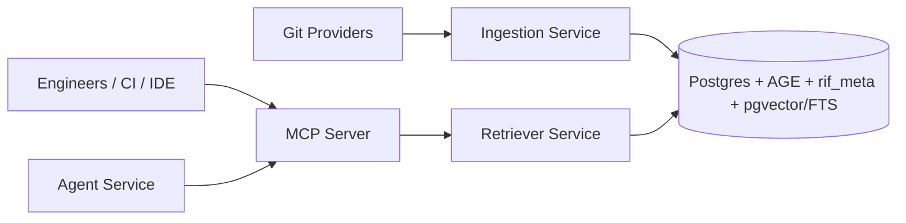
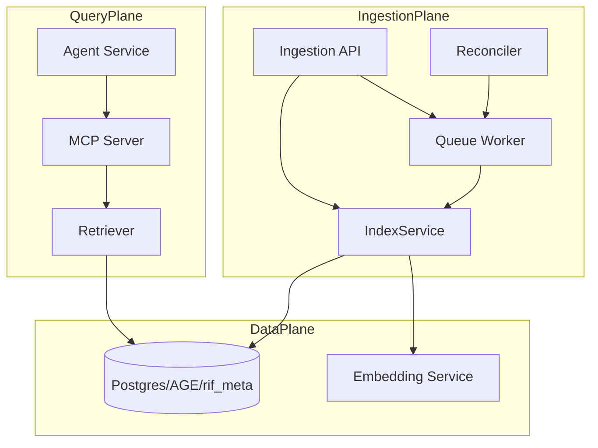
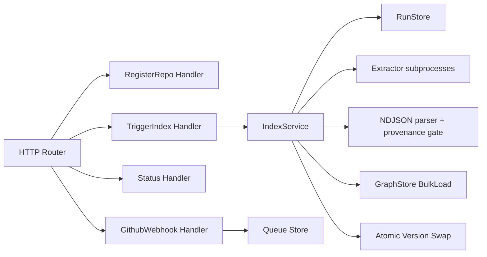

# Repo Intelligence Factory — Technical Documentation (Consolidated)

**Version:** 1.0  
**Date:** 2026-07-01  
**Repository:** `rb692q_ATT/repo-intelligence-factory`  
**Audience:** Engineers, architects, operators  
**Evidence policy:** Source-of-truth precedence applied (Tier 1: code/config/tests; Tier 2: eval outputs; Tier 3: status docs; Tier 4: planning docs).

## Table of Contents

- [1. System Overview](#1-system-overview)
- [2. Architecture and Design](#2-architecture-and-design)
- [3. C4 Model](#3-c4-model)
  - [3.1 L1 System Context](#31-l1-system-context)
  - [3.2 L2 Container View](#32-l2-container-view)
  - [3.3 L3 Component View](#33-l3-component-view)
- [4. Architecture Decision Records (ADR-style)](#4-architecture-decision-records-adr-style)
- [5. Workflows and Data/Control Flow](#5-workflows-and-datacontrol-flow)
- [6. APIs and Interface Contracts](#6-apis-and-interface-contracts)
- [7. Deployment and Runtime Topology](#7-deployment-and-runtime-topology)
- [8. Observability and Operations](#8-observability-and-operations)
- [9. Security, Risk, and Controls](#9-security-risk-and-controls)
- [10. Testing and Validation](#10-testing-and-validation)
- [11. Limitations and Assumptions](#11-limitations-and-assumptions)
- [12. Roadmap and Deferred Work](#12-roadmap-and-deferred-work)
- [13. Consistency and Contradiction Register](#13-consistency-and-contradiction-register)
- [14. Claim-to-Evidence Traceability Matrix](#14-claim-to-evidence-traceability-matrix)
- [15. References](#15-references)
- [16. Acceptance Checklist](#16-acceptance-checklist)

## 1. System Overview

**Fact**

- The implemented system spans deterministic ingestion, hybrid retrieval, MCP tooling, agent endpoints, and incremental update orchestration in repository code (source: phase-1/ingestion/main.go#L4-L13) (source: phase-3/retriever/retriever.go#L81-L85) (source: phase-4/mcp-server/main.go#L32-L50) (source: phase-4/agent-service/app.py#L39-L62) (source: phase-5/ingestion/queue/worker.go#L21-L28).
- Ingestion routes include `/repos`, `/repos/{repoID}/index`, `/repos/{repoID}/status`, `/webhook/github`, `/healthz` (source: phase-1/ingestion/main.go#L116-L121).
- Phase-6 production hardening remains deferred in current progress artifacts (source: prompts/playbook.md#L33-L35).

**Inference**

- Current maturity is “implemented through phases 0–5, not production-hardened” because core services and tests are present while phase-6 controls are deferred (source: prompts/playbook.md#L30-L35) (source: .github/workflows).

**Assumption**

- Environment-specific runtime posture (private networking, central telemetry backend, full IaC rollout) is not asserted unless phase-6 artifacts are present. `[VERIFY]`

## 2. Architecture and Design

**Stable core principle**

- Deterministic extraction is the graph source-of-truth; LLM components explain but do not author graph facts (source: RepoIntelligenceFactory-architecture.md#L10-L16).

| Layer           | Implemented components                                                     | Evidence                                                                                                                                                                                                              |
| --------------- | -------------------------------------------------------------------------- | --------------------------------------------------------------------------------------------------------------------------------------------------------------------------------------------------------------------- |
| Ingestion       | HTTP service + async pipeline orchestration + run store                    | (source: phase-1/ingestion/main.go#L95-L121) (source: phase-1/ingestion/service/index_service.go#L90-L99)                                                                                                             |
| Extraction      | Tier-A extractor + optional Phase-2 extractor merge                        | (source: phase-1/ingestion/service/index_service.go#L157-L165) (source: phase-1/ingestion/service/index_service.go#L461-L509)                                                                                         |
| Storage         | AGE graph + rif_meta relational + vector/FTS migrations                    | (source: phase-1/schema/age_schema.sql#L26-L33) (source: phase-1/schema/relational_schema.sql#L21-L29) (source: phase-2/schema/migration_pgvector.sql#L33-L35) (source: phase-2/schema/migration_fts.sql#L69-L73)     |
| Retrieval       | Vector + FTS + graph fusion, impact ranking                                | (source: phase-3/retriever/retriever.go#L107-L152) (source: phase-3/retriever/retriever.go#L154-L220)                                                                                                                 |
| Tool interface  | MCP server with 5 registered tools                                         | (source: phase-4/mcp-server/main.go#L32-L50) (source: phase-4/mcp-server/tools.schema.json#L6-L71)                                                                                                                    |
| Agent interface | FastAPI `/explain` + `/investigate_impact`                                 | (source: phase-4/agent-service/app.py#L43-L62)                                                                                                                                                                        |
| Freshness       | Webhook diff classification + coalescing + reconciler + delta CAS/fallback | (source: phase-1/ingestion/handler/webhook.go#L88-L137) (source: phase-5/ingestion/queue/worker.go#L47-L68) (source: phase-5/ingestion/reconcile/reconcile.go#L47-L67) (source: phase-5/loader/delta_load.go#L50-L75) |

**Fact**

- Pipeline controls include provenance gating and degenerate-run prevention before load/swap (source: phase-1/ingestion/service/index_service.go#L619-L623) (source: phase-1/ingestion/service/index_service.go#L687-L694) (source: phase-1/ingestion/service/index_service.go#L196-L214).

**Inference**

- The architecture is designed for correctness-first updates (atomic swap + fallback), then freshness optimization (source: phase-5/loader/delta_load.go#L58-L75).

**Assumption**

- Cross-environment sizing/SLO targets beyond benchmark artifacts are not yet canonicalized. `[VERIFY]`

## 3. C4 Model

### 3.1 L1 System Context

Evidence: MCP and ingestion endpoints, retriever backend dependencies, and agent-to-MCP usage are implemented (source: phase-4/mcp-server/main.go#L39-L50) (source: phase-1/ingestion/main.go#L116-L121) (source: phase-3/retriever/retriever.go#L89-L93) (source: phase-4/agent-service/agents.py#L83-L97).

### 3.2 L2 Container View

Evidence: runtime construction and calls are implemented (source: phase-1/ingestion/main.go#L96-L103) (source: phase-1/ingestion/main.go#L145-L160) (source: phase-1/ingestion/service/index_service.go#L183-L194) (source: phase-4/mcp-server/app.go#L136-L143) (source: phase-4/agent-service/app.py#L23-L28).

### 3.3 L3 Component View

Critical service: **Ingestion Service**.

Evidence: route wiring, stage orchestration, and stage safeguards are present (source: phase-1/ingestion/main.go#L116-L121) (source: phase-1/ingestion/service/index_service.go#L121-L129) (source: phase-1/ingestion/service/index_service.go#L151-L165) (source: phase-1/ingestion/service/index_service.go#L626-L697) (source: phase-1/ingestion/service/index_service.go#L217-L226).

## 4. Architecture Decision Records (ADR-style)

### 4.1 ADR-1 — Deterministic graph as system-of-record

- **Decision:** Keep graph facts extractor-derived; LLM limited to explanation.
- **Context:** Architecture explicitly separates deterministic core from LLM edge behavior.
- **Alternatives considered:** LLM-authored graph augmentation.
- **Consequences:** Higher correctness and auditability; lower flexibility for speculative edges.
- **Evidence:** (source: RepoIntelligenceFactory-architecture.md#L10-L16) (source: phase-1/ingestion/service/index_service.go#L619-L623)

### 4.2 ADR-2 — Hybrid retrieval with RRF fusion

- **Decision:** Combine vector, FTS, and graph signals; fuse with reciprocal rank fusion.
- **Context:** Retriever fans out to independent signals then fuses ranked hits.
- **Alternatives considered:** Vector-only retrieval baseline.
- **Consequences:** Better recall/precision in eval report; increased system complexity.
- **Evidence:** (source: phase-3/retriever/retriever.go#L107-L152) (source: phase-3/retriever/rrf.go#L3-L17) (source: phase-3/eval/AB_EVAL_REPORT.md#L15-L18)

### 4.3 ADR-3 — MCP as unified tool interface

- **Decision:** Expose fixed tool contracts via MCP server (5 tools).
- **Context:** Server registers tools and validates typed payloads against schemas.
- **Alternatives considered:** Direct service-to-service bespoke APIs per client.
- **Consequences:** Unified integration path for IDE/CI/agents; tool governance concentrated in one service.
- **Evidence:** (source: phase-4/mcp-server/main.go#L32-L50) (source: phase-4/mcp-server/tools.schema.json#L6-L71)

### 4.4 ADR-4 — Incremental updates with coalescing + CAS swap fallback

- **Decision:** Classify diffs into lanes A/B/C, coalesce, reconcile drift, attempt CAS swap with one retry then full reindex fallback.
- **Context:** Phase-5 ADR and implementation align on queue, reconcile, and fallback semantics.
- **Alternatives considered:** Full reindex on every push.
- **Consequences:** Lower update cost for common changes; higher orchestration complexity.
- **Evidence:** (source: phase-5/design/INCREMENTAL_UPDATE_ADR.md#L19-L25) (source: phase-5/ingestion/queue/worker.go#L52-L68) (source: phase-5/loader/delta_load.go#L58-L75)

## 5. Workflows and Data/Control Flow

### 5.1 Full indexing workflow

1. Trigger run and return `run_id` asynchronously (source: phase-1/ingestion/handler/index.go#L20-L22) (source: phase-1/ingestion/service/index_service.go#L83-L87).
2. Clone repository, resolve SHA, run extractor(s) (source: phase-1/ingestion/service/index_service.go#L121-L142) (source: phase-1/ingestion/service/index_service.go#L157-L165).
3. Parse NDJSON, enforce provenance gate, reject degenerate runs (source: phase-1/ingestion/service/index_service.go#L626-L697) (source: phase-1/ingestion/service/index_service.go#L204-L214).
4. Bulk load and atomically swap live version (source: phase-1/ingestion/service/index_service.go#L217-L226).

### 5.2 Query workflow (search + impact)

1. MCP sanitizes input, validates repo/rate limit, executes tool handler (source: phase-4/mcp-server/app.go#L379-L395) (source: phase-4/mcp-server/app.go#L454-L456).
2. Retriever performs vector + FTS + graph retrieval and RRF fusion (source: phase-3/retriever/retriever.go#L129-L151).
3. Impact path executes depth-bounded blast radius and tiered scoring with caveats (source: phase-3/retriever/retriever.go#L174-L206) (source: phase-3/retriever/impact.go#L88-L100).

### 5.3 Incremental update workflow

1. Webhook collects changed files and classifies lane A/B/C with force-reindex conditions (source: phase-1/ingestion/handler/webhook.go#L81-L93) (source: phase-5/ingestion/diff/diff.go#L76-L103).
2. Queue worker coalesces and dispatches latest effective jobs per window (source: phase-5/ingestion/queue/worker.go#L52-L68) (source: phase-5/ingestion/queue/queue.go#L109-L146).
3. Reconciler periodically enqueues full reindex on SHA divergence (source: phase-5/ingestion/reconcile/reconcile.go#L47-L67).

## 6. APIs and Interface Contracts

### 6.1 Ingestion service

| Method | Route                    | Contract summary                | Evidence                                                |
| ------ | ------------------------ | ------------------------------- | ------------------------------------------------------- |
| POST   | `/repos`                 | register `repo_id`, `clone_url` | (source: phase-1/ingestion/handler/repos.go#L10-L44)    |
| POST   | `/repos/{repoID}/index`  | async trigger; optional SHA     | (source: phase-1/ingestion/handler/index.go#L13-L50)    |
| GET    | `/repos/{repoID}/status` | latest run status               | (source: phase-1/ingestion/handler/status.go#L24-L53)   |
| POST   | `/webhook/github`        | enqueue incremental jobs        | (source: phase-1/ingestion/handler/webhook.go#L36-L167) |
| GET    | `/healthz`               | liveness                        | (source: phase-1/ingestion/main.go#L116-L121)           |

### 6.2 Embedding service

| Method | Route     | Contract summary                      | Evidence                                             |
| ------ | --------- | ------------------------------------- | ---------------------------------------------------- |
| GET    | `/health` | returns status/model/dim              | (source: phase-2/embedding-service/app.py#L294-L300) |
| POST   | `/embed`  | returns embeddings per `node_id,text` | (source: phase-2/embedding-service/app.py#L301-L309) |

Provider modes: `local/jina`, `litellm`, `hash` (source: phase-2/embedding-service/app.py#L272-L282).

### 6.3 MCP tools

| Tool                   | Required fields             | Evidence                                               |
| ---------------------- | --------------------------- | ------------------------------------------------------ |
| `search_code`          | `repo_id`, `query`          | (source: phase-4/mcp-server/tools.schema.json#L8-L19)  |
| `find_callers`         | `repo_id`, `qualified_name` | (source: phase-4/mcp-server/tools.schema.json#L21-L32) |
| `impact_analysis`      | `repo_id`, `changed_entity` | (source: phase-4/mcp-server/tools.schema.json#L34-L45) |
| `explain_architecture` | `repo_id`, `component`      | (source: phase-4/mcp-server/tools.schema.json#L47-L57) |
| `dependency_analysis`  | `repo_id`, `entity`         | (source: phase-4/mcp-server/tools.schema.json#L59-L70) |

### 6.4 Agent service

| Method | Route                 | Contract summary                        | Evidence                                       |
| ------ | --------------------- | --------------------------------------- | ---------------------------------------------- |
| GET    | `/health`             | returns model and hop limits            | (source: phase-4/agent-service/app.py#L39-L42) |
| POST   | `/explain`            | architecture narrative + citations      | (source: phase-4/agent-service/app.py#L43-L52) |
| POST   | `/investigate_impact` | impact narrative + tier map + citations | (source: phase-4/agent-service/app.py#L53-L62) |

## 7. Deployment and Runtime Topology

**Fact**

- Ingestion has explicit deployment workflow and Container App manifest (source: .github/workflows/deploy-ingestion.yml#L61-L67) (source: phase-1/infra/ingestion.containerapp.yaml#L25-L33).
- Provenance gate workflow enforces extractor + gate checks on phase-1 changes (source: .github/workflows/provenance-gate.yml#L16-L27) (source: .github/workflows/provenance-gate.yml#L107-L113).
- Workflow inventory currently includes two workflow files (`deploy-ingestion.yml`, `provenance-gate.yml`) (source: .github/workflows).

| Runtime unit            | Current state                                                              | Evidence                                                                                                                                 |
| ----------------------- | -------------------------------------------------------------------------- | ---------------------------------------------------------------------------------------------------------------------------------------- |
| Ingestion service       | Deployable via GitHub Actions to Container App                             | (source: .github/workflows/deploy-ingestion.yml#L181-L203)                                                                               |
| Embedding service       | Code and tests present; deployment path not standardized in root workflows | (source: phase-2/embedding-service/app.py#L255-L315) (source: .github/workflows)                                                         |
| Retriever / MCP / Agent | Buildable/testable in repo; no root deploy workflow evidence               | (source: phase-4/mcp-server/app_test.go#L181-L220) (source: phase-4/agent-service/tests/test_e2e.py#L40-L77) (source: .github/workflows) |

**Inference**

- Multi-service production rollout orchestration remains incomplete in-repo and should be treated as deferred. `[VERIFY]`

## 8. Observability and Operations

### 8.1 Implemented controls

- Structured request logging middleware in ingestion service (source: phase-1/ingestion/main.go#L190-L205).
- GraphStore operation logging and BlastRadius audit records (source: phase-1/graphstore/middleware.go#L16-L24) (source: phase-1/graphstore/middleware.go#L131-L175).
- MCP audit table and per-tool audit writes (source: phase-4/mcp-server/app.go#L177-L190) (source: phase-4/mcp-server/app.go#L438-L451).
- Run-stage and status tracking in relational store (source: phase-1/ingestion/store/run_store.go#L156-L169) (source: phase-1/ingestion/store/run_store.go#L184-L217).

### 8.2 Operational run paths

- DB bootstrap and smoke workflow scripts are present (source: phase-1/scripts/bootstrap_db.sh#L18-L29) (source: phase-1/scripts/e2e_smoke.sh#L4-L6).
- Migration validation script exists for phase-2 schema stack (source: phase-2/schema/test_migrations.sh#L81-L93) (source: phase-2/schema/test_migrations.sh#L176-L183).

### 8.3 Operational unknowns

- Centralized metrics pipeline, dashboarding, and alert routing are deferred with phase-6 scope. `[VERIFY]` (source: prompts/playbook.md#L34-L35)

## 9. Security, Risk, and Controls

| Area                | Implemented control                                        | Evidence                                                                                                                 | Residual risk                                                                                      |
| ------------------- | ---------------------------------------------------------- | ------------------------------------------------------------------------------------------------------------------------ | -------------------------------------------------------------------------------------------------- |
| Data provenance     | Source-ref regex gate in parser and CI provenance workflow | (source: phase-1/ingestion/service/index_service.go#L619-L623) (source: .github/workflows/provenance-gate.yml#L107-L113) | Edge-level provenance scope outside node-only CI paths should be continuously verified. `[VERIFY]` |
| Input safety        | MCP strips dangerous tool/system tags from queries         | (source: phase-4/mcp-server/app.go#L30-L31) (source: phase-4/mcp-server/app.go#L454-L456)                                | Sanitization is token-based, not full policy engine.                                               |
| Abuse throttling    | Per-repo token-bucket rate limiter in MCP path             | (source: phase-4/mcp-server/app.go#L391-L393) (source: phase-4/mcp-server/app.go#L530-L557)                              | Global/user-level authn/z not demonstrated in code. `[VERIFY]`                                     |
| Run consistency     | Degenerate-run rejection and atomic swap semantics         | (source: phase-1/ingestion/service/index_service.go#L196-L214) (source: phase-5/loader/delta_load.go#L77-L107)           | Race/fallback behavior depends on operational replay policy.                                       |
| Supply chain/deploy | OIDC-based Azure login and JFrog tokenized push            | (source: .github/workflows/deploy-ingestion.yml#L16-L18) (source: .github/workflows/deploy-ingestion.yml#L197-L203)      | Broader service deployment parity not present. `[VERIFY]`                                          |

## 10. Testing and Validation

| Scope                                                      | Evidence                                                                                                                                                                                                                                                                               | Status                                    |
| ---------------------------------------------------------- | -------------------------------------------------------------------------------------------------------------------------------------------------------------------------------------------------------------------------------------------------------------------------------------- | ----------------------------------------- |
| Extractor determinism + provenance + integration fixtures  | (source: phase-1/extractor/src/test/java/com/att/rif/extractor/DeterminismTest.java#L37-L50) (source: phase-1/extractor/src/test/java/com/att/rif/extractor/ProvenanceTest.java#L39-L57) (source: phase-1/extractor/src/test/java/com/att/rif/extractor/IntegrationTest.java#L94-L106) | Verified                                  |
| Ingestion E2E smoke and CI provenance gate                 | (source: phase-1/scripts/e2e_smoke.sh#L101-L108) (source: .github/workflows/provenance-gate.yml#L95-L113)                                                                                                                                                                              | Verified                                  |
| Embedding API behavior (shape, truncation, provider modes) | (source: phase-2/embedding-service/tests/test_embed_api.py#L25-L51) (source: phase-2/embedding-service/tests/test_embed_api.py#L76-L97) (source: phase-2/embedding-service/tests/test_embed_api.py#L106-L123)                                                                          | Verified                                  |
| Retriever ranking and hub damping logic                    | (source: phase-3/retriever/rrf_test.go#L5-L29) (source: phase-3/retriever/impact_test.go#L55-L98)                                                                                                                                                                                      | Verified                                  |
| Hybrid eval outcome                                        | (source: phase-3/eval/AB_EVAL_REPORT.md#L7-L18)                                                                                                                                                                                                                                        | Verified (offline-fixture heuristic mode) |
| MCP tool handlers + streamable HTTP path                   | (source: phase-4/mcp-server/app_test.go#L118-L179) (source: phase-4/mcp-server/app_test.go#L181-L220)                                                                                                                                                                                  | Verified                                  |
| Agent service orchestration and fixture e2e                | (source: phase-4/agent-service/tests/test_agents.py#L60-L68) (source: phase-4/agent-service/tests/test_e2e.py#L40-L77)                                                                                                                                                                 | Verified                                  |
| Phase-5 queue/reconcile/delta integration tests            | (source: phase-5/ingestion/queue/worker_integration_test.go#L20-L69) (source: phase-5/ingestion/reconcile/reconcile_integration_test.go#L16-L55) (source: phase-5/loader/delta_load_integration_test.go#L148-L210)                                                                     | Verified                                  |

**Inference**

- Validation coverage is broad for module behavior; production-environment acceptance is still distinct from repository tests. `[VERIFY]`

## 11. Limitations and Assumptions

### 11.1 Facts

- Root workflow automation is ingestion-focused; full multi-service deployment automation is not evidenced (source: .github/workflows).
- Phase-6 hardening is explicitly deferred (source: prompts/playbook.md#L33-L35).
- Some planning/status artifacts contain stale or conflicting statements (source: RepoIntelligenceFactory-build-plan.md#L89-L97) (source: RepoIntelligenceFactory-STATUS.md#L3-L8).

### 11.2 Inferences

- Documentation drift can mislead readiness decisions unless source precedence is enforced.

### 11.3 Assumptions

- Runtime SLAs/SLOs beyond benchmark/eval artifacts are not declared as contractual. `[VERIFY]`
- Production authz boundaries outside shown service logic are externally managed. `[VERIFY]`

## 12. Roadmap and Deferred Work

| Work item                                                                 | Current evidence                                                                                          | Classification           |
| ------------------------------------------------------------------------- | --------------------------------------------------------------------------------------------------------- | ------------------------ |
| Phase-6 production hardening (Terraform/private networking/observability) | (source: prompts/playbook.md#L34-L35)                                                                     | Deferred                 |
| Unify status/progress docs to remove stale contradictions                 | (source: RepoIntelligenceFactory-build-plan.md#L89-L97) (source: RepoIntelligenceFactory-STATUS.md#L3-L8) | Deferred governance work |
| Standardize deployment workflows for non-ingestion services               | (source: .github/workflows)                                                                               | Deferred `[VERIFY]`      |
| Confirm environment-level security controls end-to-end                    | repository code/workflows are partial evidence only                                                       | Deferred `[VERIFY]`      |

## 13. Consistency and Contradiction Register

| ID   | Conflicting claims                                                                                            | Sources                                                                                                                                                                                                                                          | Winning claim (tier)                                         | Rationale                                                                        | Status   |
| ---- | ------------------------------------------------------------------------------------------------------------- | ------------------------------------------------------------------------------------------------------------------------------------------------------------------------------------------------------------------------------------------------ | ------------------------------------------------------------ | -------------------------------------------------------------------------------- | -------- |
| C-01 | Phase-2 listed as “CURRENT” vs repo contains implemented phase-3/4/5 code paths                               | (source: RepoIntelligenceFactory-build-plan.md#L89-L97) vs (source: phase-3/retriever/retriever.go#L107-L152) (source: phase-4/mcp-server/main.go#L32-L50) (source: phase-5/loader/delta_load.go#L39-L75)                                        | Code artifacts indicate phases 3–5 implemented (Tier 1)      | Tier-1 implementation overrides older planning status                            | Resolved |
| C-02 | Playbook header says phase-2 in progress; completion table says phases 2–5 accepted                           | (source: prompts/playbook.md#L4-L4) vs (source: prompts/playbook.md#L24-L35)                                                                                                                                                                     | Completion table + code reality (Tier 1 + Tier 3)            | Header appears stale relative to later section and code                          | Resolved |
| C-03 | Engine/architecture docs mention jina/1536; implementation defaults to `text-embedding-3-small` and 768 dims  | (source: RepoIntelligenceFactory-engine-plan.md#L258-L263) (source: RepoIntelligenceFactory-architecture.md#L35-L36) vs (source: phase-2/embedding-service/app.py#L19-L23) (source: phase-2/schema/migration_pgvector.sql#L33-L35)               | Runtime code/schema (Tier 1)                                 | Executable defaults and DB schema are authoritative                              | Resolved |
| C-04 | Closure report references `phase-4/agent-service/main.py`; implemented API file is `app.py`                   | (source: FINAL_SESSION_CLOSURE.md#L55-L57) vs (source: phase-4/agent-service/app.py#L1-L1)                                                                                                                                                       | Repository path reality (Tier 1)                             | Direct file presence overrides prose claim                                       | Resolved |
| C-05 | Container App manifest comments/fields reference ACR placeholders while deploy workflow uses JFrog image refs | (source: phase-1/infra/ingestion.containerapp.yaml#L15-L16) (source: phase-1/infra/ingestion.containerapp.yaml#L52-L59) vs (source: .github/workflows/deploy-ingestion.yml#L126-L129) (source: .github/workflows/deploy-ingestion.yml#L161-L170) | Environment-specific registry setup not singularly evidenced | Both are templates/pipelines; active deployed value depends on env configuration | [VERIFY] |

## 14. Claim-to-Evidence Traceability Matrix

| Claim ID | Claim statement                                                         | Section                                | Evidence path(s)                                                                                               | Evidence tier (1–4) | Status   |
| -------- | ----------------------------------------------------------------------- | -------------------------------------- | -------------------------------------------------------------------------------------------------------------- | ------------------- | -------- |
| CL-01    | Ingestion exposes repo/index/status/webhook/health routes               | APIs and Interface Contracts           | `phase-1/ingestion/main.go#L116-L121`                                                                          | 1                   | Verified |
| CL-02    | Indexing is async and returns run_id immediately                        | Workflows and Data/Control Flow        | `phase-1/ingestion/service/index_service.go#L59-L87`                                                           | 1                   | Verified |
| CL-03    | Provenance gate blocks invalid first-party source refs before bulk load | Architecture and Design                | `phase-1/ingestion/service/index_service.go#L619-L623`; `phase-1/ingestion/service/index_service.go#L687-L694` | 1                   | Verified |
| CL-04    | Phase-2 extractor outputs can be merged into base NDJSON in ingestion   | Architecture and Design                | `phase-1/ingestion/service/index_service.go#L461-L509`                                                         | 1                   | Verified |
| CL-05    | Retriever fuses vector + FTS + graph signals with RRF                   | ADR-style                              | `phase-3/retriever/retriever.go#L134-L151`; `phase-3/retriever/rrf.go#L3-L17`                                  | 1                   | Verified |
| CL-06    | Hybrid retrieval outperforms baseline in offline fixture report         | Testing and Validation                 | `phase-3/eval/AB_EVAL_REPORT.md#L15-L18`                                                                       | 2                   | Verified |
| CL-07    | MCP server registers exactly five tools with schemas                    | APIs and Interface Contracts           | `phase-4/mcp-server/main.go#L32-L50`; `phase-4/mcp-server/tools.schema.json#L6-L71`                            | 1                   | Verified |
| CL-08    | Agent service exposes explain and impact investigation endpoints        | APIs and Interface Contracts           | `phase-4/agent-service/app.py#L43-L62`                                                                         | 1                   | Verified |
| CL-09    | Incremental queue worker coalesces and marks coalesced rows             | Workflows and Data/Control Flow        | `phase-5/ingestion/queue/worker.go#L52-L55`; `phase-5/ingestion/queue/queue.go#L109-L146`                      | 1                   | Verified |
| CL-10    | Delta loader performs CAS swap retry then full-reindex fallback         | ADR-style                              | `phase-5/loader/delta_load.go#L58-L75`; `phase-5/loader/delta_load.go#L77-L107`                                | 1                   | Verified |
| CL-11    | Reconciler checks remote HEAD and enqueues divergence full reindex      | Workflows and Data/Control Flow        | `phase-5/ingestion/reconcile/reconcile.go#L47-L67`                                                             | 1                   | Verified |
| CL-12    | Ingestion deployment automation exists in GitHub Actions                | Deployment and Runtime Topology        | `.github/workflows/deploy-ingestion.yml#L61-L67`; `.github/workflows/deploy-ingestion.yml#L181-L203`           | 1                   | Verified |
| CL-13    | Provenance gate workflow runs extractor + provenance check in CI        | Security, Risk, and Controls           | `.github/workflows/provenance-gate.yml#L67-L69`; `.github/workflows/provenance-gate.yml#L107-L113`             | 1                   | Verified |
| CL-14    | Phase-6 hardening is deferred                                           | System Overview / Roadmap              | `prompts/playbook.md#L33-L35`                                                                                  | 3                   | Verified |
| CL-15    | ACR-vs-JFrog registry source conflict requires environment confirmation | Consistency and Contradiction Register | `phase-1/infra/ingestion.containerapp.yaml#L52-L59`; `.github/workflows/deploy-ingestion.yml#L126-L129`        | 1                   | [VERIFY] |

## 15. References

1. `phase-1/ingestion/main.go`
2. `phase-1/ingestion/service/index_service.go`
3. `phase-1/ingestion/handler/*.go`
4. `phase-1/ingestion/store/run_store.go`
5. `phase-1/graphstore/middleware.go`
6. `phase-1/schema/age_schema.sql`
7. `phase-1/schema/relational_schema.sql`
8. `phase-1/scripts/bootstrap_db.sh`
9. `phase-1/scripts/e2e_smoke.sh`
10. `phase-1/extractor/src/test/java/com/att/rif/extractor/*.java`
11. `phase-2/embedding-service/app.py`
12. `phase-2/embedding-service/tests/*.py`
13. `phase-2/schema/migration_phase2.sql`
14. `phase-2/schema/migration_pgvector.sql`
15. `phase-2/schema/migration_fts.sql`
16. `phase-2/schema/test_migrations.sh`
17. `phase-3/retriever/*.go`
18. `phase-3/retriever/*_test.go`
19. `phase-3/eval/AB_EVAL_REPORT.md`
20. `phase-4/mcp-server/main.go`
21. `phase-4/mcp-server/app.go`
22. `phase-4/mcp-server/tools.schema.json`
23. `phase-4/mcp-server/app_test.go`
24. `phase-4/agent-service/app.py`
25. `phase-4/agent-service/agents.py`
26. `phase-4/agent-service/tests/*.py`
27. `phase-5/design/INCREMENTAL_UPDATE_ADR.md`
28. `phase-5/ingestion/diff/diff.go`
29. `phase-5/ingestion/queue/*.go`
30. `phase-5/ingestion/reconcile/reconcile.go`
31. `phase-5/loader/delta_load.go`
32. `phase-5/*/*_integration_test.go`
33. `.github/workflows/provenance-gate.yml`
34. `.github/workflows/deploy-ingestion.yml`
35. `.github/workflows`
36. `RepoIntelligenceFactory-STATUS.md`
37. `RepoIntelligenceFactory-build-plan.md`
38. `RepoIntelligenceFactory-engine-plan.md`
39. `RepoIntelligenceFactory-architecture.md`
40. `prompts/playbook.md`
41. `FINAL_SESSION_CLOSURE.md`

## 16. Acceptance Checklist

- [x] ToC is present and links work.
- [x] All mandatory sections are present in required order.
- [x] C4 L1/L2/L3 views are included.
- [x] ADR-style decisions are evidence-backed.
- [x] Workflow + data/control flow coverage is complete.
- [x] APIs/interfaces are documented with contracts and caveats.
- [x] Deployment/runtime topology is explicit.
- [x] Observability/security/testing sections are evidence-backed.
- [x] Limitations and assumptions are explicit and separated from facts.
- [x] Roadmap identifies deferred work without inventing implementation.
- [x] Contradictions are resolved or marked `[VERIFY]`.
- [x] Traceability matrix maps claims to evidence paths.
- [x] No hallucinated implementation claims.
