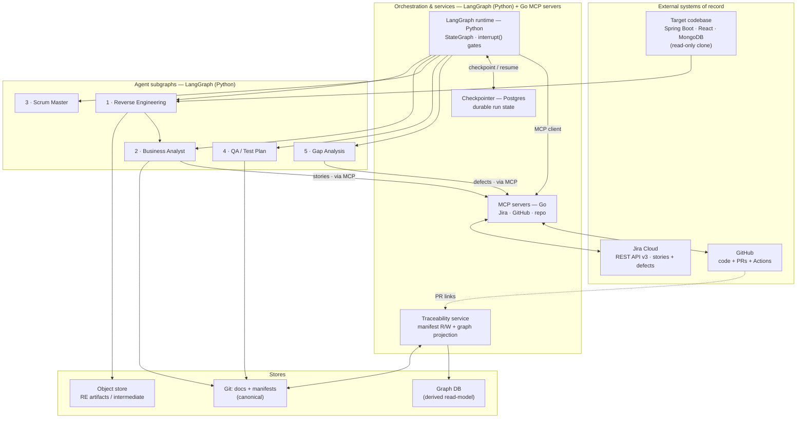

# Code Intelligence Factory — Architecture Blueprint

**Status:** Draft for review · **Date:** 2026-05-29 · **Lifecycle mode:** Design · **Scope:** Platform-level
**Author altitude:** Architecture-level. Implementation specs (service APIs, agent prompt contracts, Jira field maps, extractor adapters) are flagged as downstream handoffs in §12 — they are not produced inline.

> Composition note (transparency): the readiness-review and redesign triggers in §9 follow the AaraMinds AI Engineering Architect persona's Lifecycle Coherence Gate; component decomposition follows Module 5 conventions. This is structural transparency, not credit-claiming.

---

## 0. Decisions locked, and defaults assumed

**Locked with you (2026-05-29):**

| Decision | Choice |
| --- | --- |
| Issue tracker / ALM | **Jira (Atlassian)** — stories and defects live here |
| Lifecycle | **Hybrid** — one-time reverse-engineering now, architected continuous-ready |
| Autonomy | **Gated autonomy** — agents generate, humans approve at checkpoints |
| Runtime | **LangGraph (Python) orchestration** — durable Postgres checkpointer + `interrupt()` gates; Go retained for the MCP servers |

**Assumed as defaults — correct any of these and the design adjusts:**

1. **Traceability store** = Git-versioned YAML manifests (canonical), projected into a graph for queries.
2. **Gap taxonomy** = Requirement gap / Design gap / Implementation miss / Test gap / Works-as-specified / Environment-or-data.
3. **Reverse-engineering input** = source code only. If a running instance, DB dumps, existing tests, or partial docs are available to seed from, RE accuracy rises materially (see §5.1, §11).
4. **Docs** = Markdown-in-Git canonical, rendered to Word/Confluence for stakeholders on demand.

---

## 1. Verdict

**This is not five agents. It is a traceability platform with five specialized agents as producers and consumers around a shared spine.** The spine — a stable ID scheme and a typed link graph running `BRD → HLD → LLD → User Story → PR → Test → Defect → Gap`, queryable in both directions — is the actual product. Build it first. Get it right and the agents become replaceable. Get it wrong and you have five disconnected document generators that cannot answer your two hardest questions (#6 "requirement gap or developer miss?" and #7 "trace BRD to defect").

**On "single agent or multiple agents":** multiple — five specialized agents plus one orchestrator — but *justified, not by default*. The five have genuinely different input/output contracts, run at different cadences (RE and BA run once per system; QA and Gap run per story and per defect), and have different human-approval gates. A single mega-agent would blur gate ownership and traceability authorship. More than ~6 would be sprawl. Five-plus-orchestrator is the right granularity.

**Scrum Master, scoped honestly:** since development is out of scope, this component does **not** execute or generate code. It does backlog shaping, sprint planning support, story↔PR linkage tracking, status roll-up, and *traceability-leak detection* (stories with no linked PR; PRs with no linked story). It is mostly Jira/GitHub sync (through the MCP servers) plus a thin summarization step — a light LangGraph subgraph, not heavy reasoning.

**Business outcomes (proposed — you supplied none, so confirm or replace one as primary):**

- **Outcome A — Triage speed.** Cut the mean time to answer "is this defect a requirement gap, a design gap, a dev miss, or a test gap?" *Target declined by name:* this requires baselining your current triage time first; set the target after ~30 defects run through the loop. Do not pre-commit a number without that baseline.
- **Outcome B — Traceability coverage.** Percentage of merged PRs that link to a requirement ID, and percentage of requirements covered by at least one test. *Target declined by name:* measure the Phase-1 baseline, then set the floor.

Pick A as primary unless B matters more to your stakeholders — A is the capability that justifies the whole spine.

---

## 2. The traceability spine (the core)

### The chain

```
BR (business req) ──derives──▶ HL (HLD element) ──derives──▶ LL (LLD element)
      │                                                            │
      └────────────────────traces-to────────────────────────────▶ US (user story)
                                                                   │ implemented-by
                                                                   ▼
                                                            PR (GitHub pull request)
                                                                   │ verified-by
                                                                   ▼
                                                            TC (test case)
DEF (Jira defect) ──gap-of──▶ GAP (gap record) ──points-to──▶ {BR | HL | LL | US | TC}
```

Every link is **typed** (`derives_from`, `traces_to`, `implemented_by`, `verifies`, `violates`, `gap_of`, `points_to`) and **bidirectional in query** (the graph answers both "what implements BR-0007?" and "what requirement does PROJ-412 trace back to?").

### ID scheme

Human-readable, stable, prefix-typed. IDs are assigned by the traceability service and never reused.

| Prefix | Artifact | Source of truth |
| --- | --- | --- |
| `BR-0001` | Business requirement (BRD) | Git docs |
| `HL-0001` | HLD element | Git docs |
| `LL-0001` | LLD element | Git docs |
| `US-0001` | User story | **Jira** (mirror ID in Git manifest) |
| `TC-0001` | Test case | Git docs / test-mgmt tool |
| *(native)* `PROJ-123` | Defect | **Jira** |
| *(native)* `org/repo#42` | Pull request | **GitHub** |
| `GAP-0001` | Gap record | Git docs |

### Storage — the one decision that determines everything downstream

**Canonical = Git-versioned YAML manifests beside the code (or in a dedicated `*-traceability` repo). Derived = a graph read-model rebuilt from Git.**

- **Why Git is canonical:** link changes go through pull request, so *the human-approval gate for traceability is just code review* — diffable, auditable, revertible, and it survives any tool churn (Jira migration, graph-DB swap). The manifest never copies ticket bodies or code; it holds **IDs, links, and provenance**, pointing at Jira keys, GitHub PR URLs, and doc anchors.
- **Why a graph is derived:** queries like "every open defect whose confirmed root cause is a requirement gap on BR-0007" are graph traversals. Use **Neo4j** or, to stay Azure-native, **Cosmos DB (Gremlin API)**. The graph is disposable — rebuildable from Git at any time, so it is never a second source of truth.
- **Single source of truth per fact:** requirement *text* in Git docs; ticket *state* in Jira; *code* in GitHub; *links* in the manifest. No fact lives in two places.

A worked example manifest is in [`examples/traceability-sample.yaml`](../examples/traceability-sample.yaml).

---

## 3. System architecture



**Why LangGraph orchestrates, and Go stays for the MCP layer:** LangGraph (Python) owns the pipeline as one `StateGraph` — the five agents are subgraphs, and the human gates are `interrupt()` nodes that pause the graph and persist to a durable checkpointer (Postgres / Azure Database for PostgreSQL), so a gate can wait days and resume on approval. One framework now spans both cross-stage flow and intra-agent reasoning, in the language where the LLM ecosystem is richest. Go is retained for what it is best at — the MCP servers (Jira, GitHub, repo) on the official `modelcontextprotocol/go-sdk` (stable, v1.x, Google-maintained), including the custom Jira MCP server over the Jira Cloud REST API. MCP is a protocol, so the LangGraph app is simply an MCP **client** and the Go servers are unchanged. The traceability service remains a standalone service (Go or Python), reached over its API.

---

## 4. Traceability data model

**Entities** (one manifest record each; fields are the minimum to link and audit, not to duplicate):

| Entity | Key fields | Lives where (truth) |
| --- | --- | --- |
| Business requirement | `id, title, statement, confidence(INFERRED\|CONFIRMED), source_refs[]` | Git |
| HLD element | `id, name, kind(service\|integration\|dataflow), derives_from[BR]` | Git |
| LLD element | `id, name, kind(class\|endpoint\|collection\|schema), derives_from[HL], code_refs[]` | Git |
| User story | `id, jira_key, traces_to[BR], acceptance_criteria[]` | Jira (mirror in Git) |
| Pull request | `repo, number, url, implements[US], declared_reqs[BR\|LL]` | GitHub |
| Test case | `id, verifies[US\|LL], type(unit\|api\|e2e), status` | Git / test-mgmt |
| Defect | `jira_key, summary, severity` | Jira |
| Gap record | `id, defect_key, classification, points_to[any], evidence` | Git |

**Link types** (serialized snake_case in YAML, stored in their natural direction): `derives_from`, `traces_to`, `implemented_by`, `verifies`, `declared_reqs` (→ `violates` if unmet), `gap_of`, `points_to`. Each link carries `created_by` (agent or human), `created_at`, and `approved_by` (for gated links).

**Provenance is mandatory.** Every `INFERRED` requirement must carry `source_refs` pointing at the code artifact(s) it was inferred from. A requirement with no source ref and no human confirmation is invalid and the traceability service rejects it. This is the single rule that keeps the BA agent honest (see §11).

---

## 5. The five components

Each is specified at architecture level: purpose, I/O, engine (with build-vs-buy), autonomy gate, tracker touchpoints, failure modes.

### 5.1 Reverse Engineering

- **Purpose:** turn the target codebase into a structured **System Model** (entities, endpoints, components, data flows, inferred capabilities) — the load-bearing input to everything downstream.
- **Inputs:** read-only clone of the Spring Boot + React + MongoDB repos. Optionally: a running instance, DB dumps, existing tests, partial docs (each lifts accuracy).
- **Engine — adopt OSS extractors, build the synthesis:**
  - *Java / Spring:* **jQAssistant** (scans bytecode + sources into a graph; has a Structurizr plugin) → **Structurizr** for C4 component extraction; **OpenRewrite** LST for precise structural facts (endpoints, beans, call graphs). Do **not** build a Java parser.
  - *React:* `ts-morph` (TS/JS AST), `react-docgen` (component props), `dependency-cruiser`/`madge` (module graph).
  - *MongoDB:* schema **inference by sampling** — Mongo is schemaless, so sample N documents per collection, infer shape, and **flag variance**. Never assert a field is required without evidence. If Mongoose schemas exist in the React/Node layer, prefer them as declared truth.
  - *Synthesis (Python LLM):* compose the structural facts into a human-readable "what the system does, and the *likely* intent" narrative. Likely intent is always marked `INFERRED`.
- **Output:** System Model (structured + narrative) in the object store, plus a draft entity list with `LL-` candidates.
- **Gate:** **human reviews the System Model before BA runs.** Errors here propagate to every requirement; this is the most important gate in the system.
- **Failure modes:** dynamic behavior invisible to static analysis (reflection, runtime DI, feature flags); schema drift across Mongo documents; generated code mistaken for authored code. Mitigation: mark inferred edges, surface variance, exclude vendored/generated paths.

### 5.2 Business Analyst

- **Purpose:** produce **BRD, HLD, LLD, and User Stories** from the System Model, every item ID'd and linked.
- **Inputs:** approved System Model + any seed docs/tickets.
- **Engine — build (LLM agent).** No off-the-shelf tool produces *traceable* BRD-from-code; this is core IP.
- **Output:** Markdown docs in Git with `BR-/HL-/LL-/US-` IDs and `derives_from`/`traces_to` links written to the manifest. Every requirement tagged `INFERRED` or `CONFIRMED` with `source_refs`.
- **Gate:** **BRD sign-off before stories are cut.** Stories then pushed to **Jira via our custom Go Jira MCP server** (over the Jira Cloud REST API v3), carrying the `US-` ID and `BR-` link in custom fields.
- **Failure modes:** hallucinated requirements (mitigated by the mandatory `source_refs` rule — unsupported requirements are rejected); over-documentation. The BA writes *what is traceable to code*, not an idealized spec.

### 5.3 Scrum Master (orchestration-heavy, no code generation)

- **Purpose:** plan and track delivery; **detect traceability leaks**. Development itself is out of scope.
- **Inputs:** Jira stories, GitHub PRs/branches.
- **Engine — a light LangGraph subgraph (Python) + Jira/GitHub sync through the MCP servers; thin summarization step, no heavy reasoning.**
- **Output:** sprint plan support, status roll-ups, and a **leak report**: stories with no linked PR, PRs with no linked story, requirements with no story. This is where #5 (PR-to-requirement tracking) is enforced operationally.
- **Gate:** advisory — humans run the ceremonies and own the plan.
- **Failure modes:** drifting out of sync with Jira/GitHub state (mitigated by webhook-driven sync, not polling snapshots).

### 5.4 QA / Test Plan

- **Purpose:** generate a **test plan for execution** (execution is by your team/CI, not the agent) and a coverage map.
- **Inputs:** stories + LLD + acceptance criteria.
- **Engine — build the generator (LLM agent); tests run in existing GitHub Actions CI.** Optionally push cases to a Jira-native test-management tool (Xray or Zephyr) — flagged as an option, not assumed.
- **Output:** test cases (`TC-` IDs) each `verifies`-linked to a story/requirement, plus a **traceability coverage report**: which requirements have zero tests. This is half of Outcome B.
- **Gate:** advisory; the team curates before execution.
- **Failure modes:** plausible-but-shallow tests; coverage theater (many tests, low requirement coverage). Mitigation: report coverage by *requirement*, not by test count.

### 5.5 Gap Analysis — the payoff

- **Purpose:** when a defect is raised, decide **requirement gap vs design gap vs developer miss vs test gap** — and prove it via the spine. This is #6 and the reason the whole platform exists.
- **Inputs:** a Jira defect.
- **Engine — build (LLM agent over the graph read-model).**
- **Method:** walk the spine both ways — `defect → story → LL → HL → BR` and `defect → tests`. Then classify:

| Classification | Evidence pattern in the spine |
| --- | --- |
| **Requirement gap** | Behavior expected by the defect traces to **no** `BR`/`US`; the requirement was never captured. |
| **Design gap** | Requirement exists; `HL`/`LL` does not cover the case. The chain breaks at design. |
| **Implementation miss (dev)** | `BR→HL→LL→US` all present and correct; PR was supposed to satisfy it and did not. |
| **Test gap** | Requirement implemented, but **no `TC` verifies** the failing behavior. |
| **Works-as-specified** | Behavior matches `BR`; the defect is a requirement disagreement, not a bug. |
| **Environment-or-data** | No artifact at fault; config/data/infra. |

- **Output:** a `GAP-` record linked to the defect (`gap_of`) and to the artifact at fault (`points_to`), with the broken link as evidence.
- **Gate:** classification is **advisory → a human triage lead confirms.** Confirmed *requirement gaps* feed back into BA as a change request — **closing the loop** and giving you end-to-end `BRD → defect → gap` traceability (#7).
- **Failure modes:** confident misclassification when the spine is incomplete. Mitigation: if any link in the chain is missing, the agent returns "indeterminate — spine incomplete at X" rather than guessing. Incomplete traceability degrades to an honest "don't know," never a fabricated verdict.

---

## 6. Orchestration & gated autonomy

The orchestrator is a LangGraph `StateGraph` (Python) that advances a run through stages, with the five agents composed in as subgraphs. Each gated stage ends in an `interrupt()` node: the graph pauses and its state is written to a durable checkpointer (Postgres / Azure Database for PostgreSQL), so a gate can wait hours or days. **The approval mechanism is still a pull request on the docs/manifest repo** — merging the PR (signalled by a GitHub webhook) resumes the graph from its checkpoint. Git review stays the audit trail; LangGraph supplies the durable pause/resume.

| Gate | After stage | What the human approves |
| --- | --- | --- |
| **G1 — System Model sign-off** | Reverse Engineering | The recovered structure + inferred capabilities are accurate enough to document. |
| **G2 — BRD sign-off** | Business Analyst | Requirements are correct before stories are cut into Jira. |
| **G3 — Gap confirmation** | Gap Analysis | The defect classification is correct before it feeds back. |

QA and Scrum Master outputs are advisory (no hard gate) — they inform humans who already own those decisions. Durable run state lives in the LangGraph checkpointer (Postgres) — this must not be the in-memory checkpointer, because gates wait across days and a lost checkpoint is a lost in-flight run. At larger scale, **LangGraph Platform** (managed durable execution) is the option to reach for; Temporal remains an alternative if you outgrow it.

---

## 7. End-to-end workflows

**W1 — Initial reverse-engineering pass (the one-time capability):**
`clone → RE → [G1] → BA → [G2] → BRD/HLD/LLD in Git + stories in Jira`. Delivers documentation and a seeded backlog for the pilot system.

**W2 — Forward delivery loop (continuous-ready):**
`story → developers implement (out of scope) → PR opened with the template declaring US-/BR- links → traceability service validates links on the PR → QA generates/updates test plan → merge → manifest + graph updated`. The Scrum Master flags any leak.

**W3 — Defect → gap analysis (the payoff):**
`Jira defect → Gap Analysis walks the spine → classification → [G3] human confirm → route:` requirement gap → BA change request · design gap → architecture · dev miss → team · test gap → QA · works-as-specified → product. Result: full `BRD → defect → gap` traceability.

---

## 8. Build vs buy

The differentiator you **build** is the spine plus the agents. Everything commodity is **bought or adopted**. This is the hybrid recommendation.

| Capability | Decision | Choice |
| --- | --- | --- |
| Issue-tracking platform | **Buy** | Jira Cloud |
| Jira MCP server | **Build** | Go (official MCP SDK) over Jira Cloud REST API v3 — *was* hosted Rovo; now in-house |
| Code & PR inventory | **Buy** | GitHub + Actions |
| Java/Spring structure extraction | **Adopt OSS** | jQAssistant · OpenRewrite · Structurizr |
| React structure extraction | **Adopt OSS** | ts-morph · react-docgen · dependency-cruiser |
| Mongo schema recovery | **Build (thin) / adopt** | sampling inferrer; prefer Mongoose schemas if present |
| Traceability store | **Build** | Git manifests + graph projection |
| BRD/HLD/LLD/story generation | **Build** | LangGraph subgraphs (Python) |
| Cross-stage orchestration | **Build on LangGraph (Python)** | `StateGraph` + durable Postgres checkpointer; gates via `interrupt()` (option: LangGraph Platform / Temporal) |
| Durable orchestration state | **Adopt** | Postgres checkpointer (Azure Database for PostgreSQL) |
| Graph read-model | **Adopt/Buy** | Neo4j or Cosmos DB Gremlin (Azure-native) |
| Agent execution runtime | **Adopt** | LangGraph subgraphs (Python); per-node LLM calls via Claude Agent SDK or direct |
| MCP servers (Jira/GitHub/repo) | **Build on SDK** | official Go MCP SDK; called by the LangGraph app as an MCP client (replaces the hosted Atlassian server) |

Hosting stays on your fixed stack: Azure Container Apps or AKS (the LangGraph app and the Go MCP servers as separate containers/sidecars), GitHub Actions with OIDC, the checkpointer on Azure Database for PostgreSQL, secrets in Azure Key Vault via managed identity. No drift to other clouds/CI.

---

## 9. Lifecycle coherence

**First review trigger:** end of Phase 1 — after the first real repo completes `RE → [G1] → BA → [G2]`. Run a production-readiness review of the spine and RE accuracy.

**What that review produces:** findings on (a) RE accuracy — confirmed-vs-inferred requirement rate after human review; (b) link integrity — orphan and dangling-link counts; (c) gate friction — how much human edit each gate required.

**Redesign triggers:**

- RE confirmed-requirement rate falls below the floor you set after the Phase-1 baseline (declined by name now — no honest number exists pre-baseline).
- Traceability leak rate exceeds the floor set in Phase 2.
- A second tech stack arrives that is not Spring/React/Mongo (new RE extractors needed).
- Jira Cloud REST API version or auth model changes materially. (We own the MCP server, so the external dependency is the REST API v3 + OAuth 2.0 / API-token auth and its rate limits — not a third-party transport. We pick our own MCP transport, e.g. streamable HTTP per the current spec.)
- Gap-classification confirmed-accuracy drops below a trustable threshold (set after ~30 defects).

---

## 10. Phasing roadmap (hybrid: one-time now, continuous-ready)

| Phase | Deliverable | Proves |
| --- | --- | --- |
| **0 — Spine first** | Traceability service, ID scheme, manifest format, graph projection, repo layout | The core works before any agent exists |
| **1 — RE + BA on one pilot repo** | One-time BRD/HLD/LLD + stories, with G1+G2 gates | The one-time documentation capability (your #1–3) |
| **2 — Jira + GitHub wiring** | Stories in Jira, PR template live, QA test plans, PR link validation | Forward traceability + coverage (your #4–5) |
| **3 — Gap Analysis + defect loop** | Defect classification, G3, feedback to BA | `BRD → defect → gap` end-to-end (your #6–7) |
| **4 — Continuous** | RE re-runs on change via CI; docs/manifests update via PR; drift detection | Flip on continuous-ready |

Phases 0–3 deliver the one-time factory; Phase 4 turns on continuous. Each phase is a usable increment — no big-bang.

---

## 11. Risks & open questions

- **Brownfield is lossy.** RE recovers *behavior*, not *intent*. Mitigated by `INFERRED`/`CONFIRMED` marking + the G1/G2 gates. Accept that the first BRD is a hypothesis humans correct, not ground truth.
- **LLM hallucination in requirements.** Killed by the mandatory `source_refs` rule: a requirement with no code provenance and no human confirmation is rejected by the traceability service. Downstream agents trust the *link*, not the prose.
- **Mongo schemalessness.** Inferred schema ≠ enforced schema. Sampling-based, variance flagged; never assert a required field without evidence.
- **Jira governance + the MCP server is now ours to build.** Needs an admin to add the `US-`/`BR-` link custom fields and a defect template that captures expected-vs-actual. Building the Jira MCP server means we own OAuth 2.0 (3LO) / API-token auth, pagination, rate-limit handling, and Jira REST API version churn — the cost we accept for a tool surface scoped to exactly what CIF needs and self-hosting on the Azure stack.
- **Durable orchestration is now a hard dependency.** Because gates wait days, the LangGraph checkpointer must be Postgres-backed (never in-memory) and backed up — a lost checkpoint is a lost in-flight run. That is new operational surface versus a stateless loop, and the cross-language boundary (Python orchestrator ↔ Go MCP servers) is one more thing to monitor.
- **Confirm the four assumed defaults** in §0 — especially RE inputs (a running instance + existing tests would change the RE design) and the gap taxonomy (add/remove buckets to match your triage reality).

**Open questions for you:** (a) one pilot repo or several to start? (b) is there a Jira test-management tool (Xray/Zephyr) already in use, or do test cases live in Git? (c) who owns the G1–G3 approvals — one architect, or role-split?

---

## 12. Implementation handoffs (flagged, not papered over)

This blueprint is architecture-level. Before build, each of these needs a downstream specification pass with the right specialist:

1. **Traceability service** — manifest JSON-schema, link-validation rules, graph-projection contract, REST/gRPC API. *(Service specialist; Go or Python.)*
2. **LangGraph orchestration + per-agent subgraphs** — the top-level `StateGraph`, the gate `interrupt()` nodes, the Postgres checkpointer wiring and the GitHub-webhook→resume bridge, plus each agent subgraph's prompt specs, structured output schemas, and scoring (especially RE accuracy and Gap classification). *(Python / LangGraph + LLM specialist.)*
3. **Jira MCP server (custom, Go) + Jira configuration** — build the MCP server over the Jira Cloud REST API v3 (official Go MCP SDK; OAuth 2.0 3LO or API-token auth; tools scoped to exactly what CIF needs, including an atomic *create-story-and-write-traceability-link* composite); plus custom fields, defect template, and webhook wiring. The LangGraph orchestrator consumes it as an MCP client. *(Go engineer + Atlassian admin — use the `mcp-builder` skill.)*
4. **RE extractor adapters** — per-stack adapter interface (jQAssistant/Structurizr, ts-morph, Mongo sampler) behind one System-Model contract. *(Static-analysis specialist.)*
5. **Graph schema** — node/edge model, indexes for the traversal queries in §5.5. *(Graph specialist.)*

Start with handoff #1. The spine is Phase 0, and nothing else is real until it exists.
