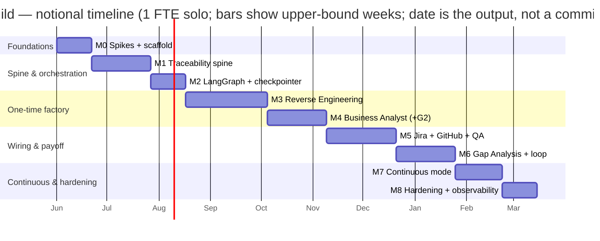

# Code Intelligence Factory — Delivery Plan

**Plan mode:** New plan (full delivery plan) · **Date:** 2026-05-30 · **Design baseline:** [`ARCHITECTURE.md`](./ARCHITECTURE.md) v0.2 (LangGraph)

> Composition note (transparency): this plan follows the AaraMinds Project Planner gates — one named fixed constraint, estimates as ranges with a basis, a critical path that governs the date, plan-date vs committed-date separated, named replan triggers, and an owner on every milestone. It is a **baseline to update**, not a contract to defend.

---

## 0. Plan basis — read this first

- **Plan mode:** New plan. The design is settled enough to build (blueprint v0.2), so estimating is honest. An estimate on an undecided design would be fiction; this isn't that.
- **Fixed constraint:** **scope** — the whole factory, Phases 0–4. Capacity is also given: **you, solo, full-time (1 FTE).** With scope and capacity both set, **time is the output of this plan, not an input** — the plan produces a *date range*, it does not hit a deadline. If you later want it sooner, §6 names the two levers (add capacity or cut scope); I do not assert an earlier date without one.
- **Estimates:** ranges at **1 FTE, calendar weeks**, each with a stated basis. No single-point dates anywhere. The widest range (M3) depends on the M0 spike and is tightened after it.
- **Owner:** you (solo, full-stack) own every build milestone. External items carry an explicit owner or `[owner: TBD]`.
- **Critical path:** because it's one person, the path is **near-linear** — the date is the *sum of the chain*, not an effort total spread across parallel hands. The only real parallelism is background/async work on external dependencies (§4).

---

## 1. Scope

**In scope (what this plan delivers):** the five components + the LangGraph orchestration + the traceability spine + the Go MCP servers + persistence, through to continuous mode, proven on **one small/medium pilot repo** (Spring Boot + React + MongoDB).

**Out of scope:** the application development the factory documents (your stated boundary); reverse-engineering stacks other than Spring/React/Mongo; multi-tenant production hardening beyond a single pilot.

**Already in hand (reduces M2/M5):** blueprint v0.2, the traceability-aware PR template, the sample manifest, the **Go Jira MCP server scaffold** (core tools written), and the architecture diagram.

---

## 2. Work breakdown — milestones

Every milestone is **demonstrable** (a thing you can run/show), not an activity. First milestone retires the biggest unknowns, not the easiest tasks.

### M0 — Foundations & de-risking spikes  ·  owner: you
Two time-boxed spikes that retire the load-bearing unknowns before the rest is committed:
- **RE-extraction spike:** run jQAssistant/Structurizr + ts-morph + a Mongo sampler against the real pilot repo; eyeball whether recovered structure is usable.
- **Orchestration spike:** a 2-node LangGraph graph that pauses on `interrupt()`, persists to a Postgres checkpointer, resumes on a signal, and calls the existing Go Jira MCP server as a client.
- Plus: monorepo scaffold, dev env, and **kick off** external provisioning (Azure, Jira instance) so lead times run in the background.
- **DoD:** both spikes produce a written go/no-go with a tightened estimate for M3 and M2; repo skeleton builds.

### M1 — Traceability spine (Phase 0)  ·  owner: you
The core. Manifest schema + ID assignment + link-validation rules + Git read/write + graph projection (Neo4j or Cosmos DB Gremlin).
- **DoD:** the sample manifest can be created, validated, and queried end-to-end; the graph read-model is rebuildable from Git from scratch.

### M2 — LangGraph orchestrator + durable gate (Phase 0→1 bridge)  ·  owner: you
StateGraph skeleton, Postgres checkpointer, one real `interrupt()` gate with a GitHub-webhook→resume bridge, MCP-client wiring to the Go servers.
- **DoD:** a run pauses at a gate, survives a process restart (durable), and resumes when an approval PR merges; it successfully calls the Jira MCP server.

### M3 — Reverse Engineering agent (Phase 1a)  ·  owner: you
Extractor adapters behind one System-Model contract + the RE synthesis subgraph + the G1 gate.
- **DoD:** the pilot repo produces a reviewed **System Model** signed off at G1, with inferred vs confirmed marked.

### M4 — Business Analyst agent (Phase 1b)  ·  owner: you  ·  *proves your #1–3*
BA subgraph → BRD/HLD/LLD/stories with IDs, links, `source_refs`, and `INFERRED/CONFIRMED` tags; G2 gate; push stories to Jira via the MCP server's composite tool.
- **DoD:** the pilot repo yields a signed-off BRD + stories in Jira, every item linked in the manifest; no story enters Jira unlinked.

### M5 — Jira + GitHub wiring + QA (Phase 2)  ·  owner: you  ·  *proves your #4–5*
Finish the Jira MCP server (auth, custom fields, composite tool against a real instance); build the GitHub + repo MCP servers; PR template live; PR link-validation CI check; QA test-plan agent + requirement-coverage report.
- **DoD:** a story→PR→test round-trip with link validation passing in CI; a coverage report flags requirements with zero tests.

### M6 — Gap Analysis + defect loop (Phase 3)  ·  owner: you  ·  *the payoff: #6–7*
The Gap decision-graph subgraph, the classification taxonomy, the G3 gate, and the requirement-gap→BA feedback edge.
- **DoD:** a seeded defect is classified correctly end-to-end and traces `BRD → defect → gap`; an incomplete chain returns "indeterminate," not a guess.

### M7 — Continuous mode (Phase 4)  ·  owner: you
RE re-runs on change via GitHub Actions; manifest/docs auto-update via PR; scheduled drift/leak detection.
- **DoD:** a code change to the pilot repo triggers an RE delta and opens a docs-update PR automatically.

### M8 — Hardening & observability  ·  owner: you
OpenTelemetry traces/metrics across the graph, cost controls on LLM nodes, checkpointer backup/restore drill, runbook.
- **DoD:** a full run is traceable end-to-end; checkpointer restore is demonstrated; a basic runbook exists.

---

## 3. Estimates (ranges with basis)

At **1 FTE, calendar weeks**. Ranges are honest, not padded — uncertainty lives in the visible buffer (§6), not inside these numbers.

| Milestone | Estimate (1 FTE) | Basis | Largest unknown |
| --- | --- | --- | --- |
| M0 Spikes + scaffold | **2–3 wks** | time-box | n/a (the spike *is* the unknown-retirement) |
| M1 Traceability spine | **3–5 wks** | decomposition | graph-projection edge cases |
| M2 Orchestrator + checkpointer + gate | **2–3 wks** | decomposition; de-risked by M0 | webhook→resume reliability |
| M3 Reverse Engineering | **4–7 wks** | decomposition + **explicit unknown** | RE accuracy on the real repo (gated on M0 spike) |
| M4 Business Analyst | **3–5 wks** | decomposition + analogy | requirement-quality / hallucination control |
| M5 Jira + GitHub + QA | **4–6 wks** | decomposition | external: Atlassian admin lead time |
| M6 Gap Analysis + loop | **3–5 wks** | decomposition | classification accuracy on real defects |
| M7 Continuous mode | **2–4 wks** | decomposition | CI re-run cost/latency |
| M8 Hardening + observability | **2–3 wks** | analogy | — |
| **Plan total (sum of chain)** | **≈ 25–41 wks** | — | ≈ **6–10 months at 1 FTE** |

M3's range is the widest on purpose; the M0 spike is what narrows it. Per the Estimate Honesty Gate, anything past M0 that the spike invalidates gets re-estimated, not forced.

---

## 4. Sequencing & critical path

**Critical path (governs the date):**

`M0 → M1 → M2 → M3 → M4 → M5 → M6 → M7 → M8`

Solo means the chain *is* the date — there is no second pair of hands to absorb work in parallel. What can run **async in the background** (started in M0, not on the critical path) and must land *before* the milestone that needs it:

- **Azure provisioning** (Postgres, Container Apps, Key Vault) — needed by M2.
- **Jira instance + Atlassian admin** (custom fields, API token/OAuth) — needed by M4/M5.
- **Graph DB choice + provisioning** — needed by M1.
- **Pilot repo access** (ideally a running instance + tests + a DB dump) — needed by M0/M3.

**Convergence points (watch these — late convergence is the usual cause of a final-third slip):** G1 (System Model sign-off), G2 (BRD sign-off), and the M5 integration where the Jira MCP server + GitHub MCP server + CI must all meet. M6 cannot start until the spine is populated end-to-end by M4–M5.

---

## 5. Risks & external dependencies

External dependencies are **risks with an owner and a fallback**, never ordinary tasks — because someone other than you keeps (or misses) their date.

| Risk / dependency | Owner | Impact | Mitigation / fallback |
| --- | --- | --- | --- |
| **RE accuracy too low on real code** | you | High — undermines BA quality | M0 spike first; if low, add running-instance/tests inputs or re-scope M3; mark inferred aggressively |
| Atlassian admin: custom fields + auth | `[owner: TBD]` | Med — blocks M4/M5 | Use a free Jira Cloud dev instance you control; add fields yourself |
| Azure provisioning (Postgres/ACA/KV) | you / `[owner: TBD]` | Med — blocks M2 | Local Postgres + Docker during dev; provision cloud before M7 |
| Graph DB choice (Neo4j vs Cosmos Gremlin) | you | Med — blocks M1 graph | Ship Git-only queries first; add graph projection as M1b |
| LangGraph durable interrupt + Go-MCP-from-Python integration | you | Med — blocks M2 | M0 orchestration spike retires it before commitment |
| jQAssistant/OpenRewrite/ts-morph learning curve | you | Med — inflates M3 | Time-boxed in M0; lean on adopted OSS, don't build parsers |
| LLM API cost / quota | you | Low–Med | Cheaper model on non-critical nodes; cost caps in M8 |
| **Solo capacity loss** (pulled to other work) | you | High — elapsed time balloons | Replan trigger (§7); the plan assumes sustained 1 FTE |
| Tool/version churn (Go MCP SDK, Jira REST, LangGraph) | you | Low | Pinned versions; currency items already marked `[VERIFY]` in the blueprint |

---

## 6. Commitment — plan date vs committed date

Two different dates; never conflate them.

- **Plan date (≈ even odds):** **~25–41 weeks** at 1 FTE — roughly **6–10 months**. This is what the estimates produce; it is *not* a commitment.
- **Committed date (buffered):** add a risk buffer for the solo single-point-of-failure and the RE-accuracy unknown → commit externally to **≈ 11 months (~46 weeks) at ~80% confidence.** The buffer is the visible gap between the 41-week high plan and the 46-week commitment — not padding hidden inside tasks.
- **Re-baseline after M0.** The spikes will move M3 (and the whole tail) materially; refresh both dates then. Until then, treat the committed date as provisional.

**If you want it sooner, the levers (named, not asserted):**

- **Add capacity** — a second engineer running the Go/MCP + GitHub + QA workstream (M5) in parallel with your Python agent workstream (M3/M4) would overlap the two longest stretches → estimated **~6–10 weeks off**. This is the highest-leverage move; solo is the single biggest schedule risk.
- **Cut scope** — stop after **M6** (the one-time factory + the defect-gap payoff), defer M7 continuous → **~2–4 weeks off**; or, for a docs-only first release, stop after **M4** → **~12–18 weeks off** but you lose the #4–7 capabilities.

Without one of those, an earlier date is a hope, not a commitment.

---

## 7. Replan triggers

Re-baseline (don't quietly absorb) when any of these fire:

- The **M0 spike** shows RE accuracy below usable, or the orchestration spike hits a wall.
- Any milestone slips **beyond its range's upper bound**.
- **Scope is added** — another agent, more pilot repos, a second tech stack (non Spring/React/Mongo).
- **Solo capacity changes** — you drop below full-time, or a second engineer joins (replan to exploit the parallelism).
- An **external dependency misses** its date (Atlassian admin, Azure, graph DB).
- A **load-bearing tool breaks** compatibility (Go MCP SDK, Jira REST API, LangGraph).

State which trigger fired on any future replan.

---

## 8. Handoff to execution tracking

This is the **baseline**, not the live tracker. Track day-to-day in Jira (you're standing it up for the product anyway) or a simple board — milestones as epics, the M0 spikes as the first two tickets.

**Start here:** **M0.** The two spikes retire the biggest unknowns (RE accuracy + durable LangGraph orchestration) and are what let you replace the wide ranges above with committable numbers. Nothing downstream is trustworthy until they're done.
