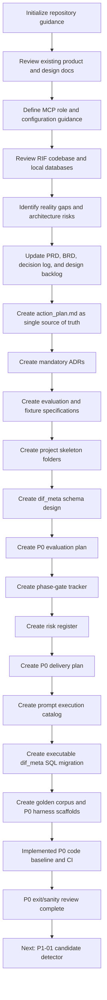
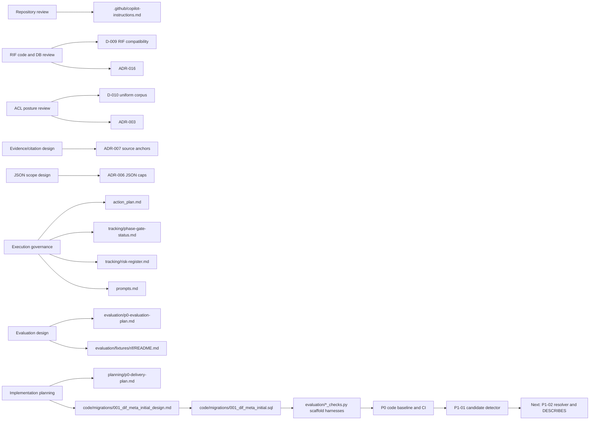

# DIF Implementation Process Plan

**Status:** Leadership review draft, synchronized with P0 exit evidence  
**Date:** 2026-07-09  
**Audience:** Leadership, product, engineering, production, platform, security, and QA  
**Purpose:** Show the process followed to move DIF from idea/design documents into a production-oriented implementation baseline that leadership can review, improve, and benchmark for other teams.

---

## 1. Executive summary

The DIF implementation process followed a **design-first, evidence-backed, gate-driven** model.

Instead of starting with code, the team first:

1. Established the project operating instructions.
2. Reviewed the product/business/design baseline.
3. Reviewed the related RIF system and local database reality.
4. Captured material architecture decisions as decision-log entries and ADRs.
5. Created a single source of truth for execution.
6. Created evaluation, risk, phase-gate, delivery planning, and prompt execution artifacts.
7. Created the executable `dif_meta` migration and P0 golden evaluation scaffolds.
8. Built the runnable P0 Go module baseline and CI-backed P0 evaluation gate.
9. Completed P0 exit/sanity review and unblocked P1-01 candidate detection.

This process reduced the risk of building against incorrect assumptions, especially around RIF integration and source-access posture.

---

## 2. Process at a glance



---

## 3. Leadership-level phase model

| Phase | Goal | Outcome | Status |
|---|---|---|---|
| 1. Orientation | Understand existing DIF intent and repository state. | Confirmed repository started as docs/scaffold only; P0 later added runnable Go packages and evaluation harnesses. | ✅ Complete |
| 2. Operating guidance | Make future AI-assisted work consistent. | Created `.github/copilot-instructions.md` with architecture, phase, MCP, and RIF guidance. | ✅ Complete |
| 3. External dependency review | Validate assumptions about RIF before designing federation. | Reviewed RIF code and local DBs; found AGE graph populated while RIF shadow tables may be empty/absent. | ✅ Complete |
| 4. Decision alignment | Record accepted decisions and correct over-assumptions. | Added RIF compatibility and uniform-readable corpus posture to decisions/docs. | ✅ Complete |
| 5. Design gates | Convert risks into ADRs and acceptance criteria. | Completed required P0 ADRs for parser strategy, ACL posture, JSON caps, source anchors, MCP/auth, ingestion orchestration, embeddings, evaluation gates, observability/audit, security threat model, and RIF compatibility. | ✅ Complete |
| 6. Execution control | Establish a source of truth and tracking model. | Created action plan, phase-gate tracker, risk register, delivery plan, and Aara-routed prompt catalog. | ✅ Complete |
| 7. Evaluation readiness | Define how success will be proven before code scales. | Created P0 evaluation plan, golden corpus, executable harnesses, Golden P0 runner, path/CI safety check, and CI baseline. | ✅ Complete |
| 8. Implementation readiness | Prepare skeleton and first implementation step. | Created runnable Go module baseline with P0 libraries for config/logging/context, migration, admission, anchors, ingestion runs, extraction, graph emission, retrieval, embeddings, `search_docs`, MCP/API, audit/usage, health, and RIF compatibility. | ✅ Complete for P0 |

---

## 4. Detailed process followed

### Step 1: Initialize repository guidance

**Objective:** Make future work consistent and reduce context loss.

**Actions completed:**

- Reviewed repository structure.
- Confirmed DIF was documentation-only at the start.
- Created `.github/copilot-instructions.md`.
- Added build/test status, source document guidance, phase boundaries, MCP expectations, and RIF compatibility rules.

**Leadership value:** Future contributors and AI agents now receive project-specific guardrails before making changes.

---

### Step 2: Clarify MCP server role

**Objective:** Define MCP's role in DIF before implementation.

**Actions completed:**

- Defined MCP as the governed API/tool boundary for agents.
- Added guidance for MCP tool phases, source anchors, audit/usage metering, auth/gateway posture, and explicit RIF status behavior.

**Leadership value:** Prevents MCP from becoming an ungoverned shortcut around security, audit, and citation requirements.

---

### Step 3: Review RIF code and local database reality

**Objective:** Validate assumptions about the code-intelligence system DIF will federate with.

**Actions completed:**

- Reviewed RIF codebase at `/Users/rb692q/projects/aaraminds-projects/cc-rif`.
- Reviewed local Postgres databases available as `repointel` and `rif_p19`.
- Found RIF uses Postgres + Apache AGE for canonical graph data.
- Found local RIF relational shadow tables may be empty or absent while AGE graph data is populated.

**Key finding:** DIF must not assume populated `rif_meta.file_nodes`, `rif_meta.method_nodes`, or `rif_meta.class_nodes`.

**Leadership value:** This avoided a major implementation risk: building federation on tables that may not contain the authoritative data.

---

### Step 4: Update product, business, and design documents

**Objective:** Align formal requirements with discovered implementation reality.

**Actions completed:**

- Updated `DECISIONS.md` with:
  - D-009 RIF compatibility layer.
  - D-010 v1 uniformly readable source ACL posture.
- Updated `dif_prd.md`.
- Updated `dif_brd.md`.
- Updated `design-decisions.md`.
- Updated `.github/copilot-instructions.md`.

**Leadership value:** Product claims, business claims, and architecture constraints now match system evidence.

---

### Step 5: Create the operating single source of truth

**Objective:** Prevent status fragmentation across many documents.

**Actions completed:**

- Created `action_plan.md`.
- Promoted it to the single source of truth for:
  - current status
  - completed work
  - next actions
  - blockers and risks
  - phase plans
  - execution queue
  - tracking artifacts

**Leadership value:** Teams can inspect one document to understand what is done, what is next, and what is blocked.

---

### Step 6: Create mandatory ADRs

**Objective:** Turn major risks and assumptions into reviewable architecture decisions.

| ADR | Purpose | Status |
|---|---|---|
| `design/adr/ADR-005-parser-strategy.md` | Defines parser strategy for Markdown, TXT, DOCX paragraph-model, and bounded JSON. | ✅ Complete |
| `design/adr/ADR-016-rif-compatibility-layer.md` | Defines RIF compatibility contract, statuses, AGE-first posture, and federation gate. | ✅ Complete |
| `design/adr/ADR-003-source-acl-posture.md` | Defines v1 uniformly readable corpus posture and defers per-user ACL to post-GA v2. | ✅ Complete |
| `design/adr/ADR-007-source-anchor-contract.md` | Defines canonical source refs, anchor fields, resolver behavior, and citation requirements. | ✅ Complete |
| `design/adr/ADR-006-json-expansion-limits.md` | Defines deterministic JSON traversal, caps, caveats, failure behavior, and security guidance. | ✅ Complete |
| `design/adr/ADR-008-mcp-gateway-auth-model.md` | Defines P0 MCP auth, gateway posture, and audit/usage expectations. | ✅ Complete |
| `design/adr/ADR-009-ingestion-orchestration.md` | Defines ingestion run statuses, output counts, and promotion guard. | ✅ Complete |
| `design/adr/ADR-010-embedding-strategy.md` | Defines embedding provider seam and deferred production dimensions. | ✅ Complete |
| `design/adr/ADR-011-evaluation-gates.md` | Defines P0 runner and CI release gate. | ✅ Complete |
| `design/adr/ADR-012-observability-audit-schema.md` | Defines safe logging plus separate audit and usage events. | ✅ Complete |
| `design/adr/ADR-013-security-threat-model.md` | Defines P0 security threats, controls, and phase boundaries. | ✅ Complete |

**Leadership value:** Critical decisions are explicit, reviewable, and tied to implementation gates.

---

### Step 7: Define evaluation and fixture strategy

**Objective:** Define how correctness will be proven before implementation expands.

**Actions completed:**

- Created `evaluation/fixtures/rif/README.md`.
- Created `evaluation/p0-evaluation-plan.md`.
- Created synthetic golden corpus fixtures and executable stdlib harnesses for:
  - source-anchor round trips
  - JSON caveat coverage
  - RIF compatibility contract expectations
  - `search_docs` anchored retrieval behavior
  - audit/usage write separation and safe record content
  - degenerate-run promotion safety

**Evaluation gates defined:**

- golden corpus and golden queries
- source-anchor round-trip tests
- JSON cap/caveat coverage
- RIF compatibility fixture matrix
- `search_docs` anchored-result contract
- audit and usage checks
- logging safety checks
- baseline metrics

**Leadership value:** Success criteria are defined before code, reducing subjective acceptance debates later.

---

### Step 8: Create implementation skeleton and schema design

**Objective:** Prepare the repository for implementation without prematurely choosing all code details.

**Actions completed:**

- Created scaffold folders under:
  - `code/`
  - `planning/`
  - `evaluation/`
  - `tracking/`
- Created `code/migrations/001_dif_meta_initial_design.md`.
- Created executable `code/migrations/001_dif_meta_initial.sql`.
- Validated the migration idempotently against a scratch local PostgreSQL database.

**Schema design covers:**

- corpora
- sources
- documents
- document versions
- nodes and edges
- source anchors
- retrieval passages
- ingestion runs
- audit log
- usage events
- RIF compatibility status
- code-entity candidates

**Leadership value:** The implementation surface is now scoped and ready for controlled execution.

---

### Step 9: Create tracking and governance artifacts

**Objective:** Make execution health visible to leadership and delivery teams.

| Artifact | Purpose | Status |
|---|---|---|
| `tracking/phase-gate-status.md` | Tracks P0-P3 gates, owners, evidence, blockers, and exit criteria. | ✅ Complete |
| `tracking/risk-register.md` | Tracks blockers, risks, severity, owners, mitigations, watchlist, and closure rules. | ✅ Complete |
| `planning/p0-delivery-plan.md` | Defines workstreams, execution sequence, dependencies, milestones, and first implementation task. | ✅ Complete |
| `prompts.md` | Defines paired implementation/QA prompts with Aara agent/skill routing from current state through P0-P3. | ✅ Complete |

**Leadership value:** The project has governance controls that stayed synchronized through P0 implementation and exit.

---

## 5. Current state

| Area | Current state |
|---|---|
| Repository type | Documentation plus runnable P0 Go module baseline and executable evaluation harnesses. |
| Design baseline | Complete for P0 exit ADR set. |
| Action plan | Active single source of truth. |
| ADR coverage | Required P0 risks covered: parser strategy, ACL, JSON, source anchors, MCP/auth, ingestion orchestration, embeddings, evaluation gates, observability/audit, security threat model, and RIF compatibility. |
| Evaluation plan | Executable through `python3 evaluation/run_p0.py` and CI baseline. |
| Phase tracking | Created. |
| Risk tracking | Created. |
| Delivery plan | Created. |
| Prompt catalog | Created with Aara agent/skill routing. |
| Executable migration | Created and validated idempotently. |
| Golden/evaluation scaffolds | Created for source anchors, JSON caveats, RIF compatibility, `search_docs`, audit/usage, and degenerate-run guard. |
| Next implementation item | P1-01 code-entity candidate detector. |

---

## 6. Key decision points and why they matter

| Decision point | Decision made | Why leadership should care |
|---|---|---|
| RIF federation | Use a compatibility layer, not direct dependency on optional RIF shadow tables. | Prevents brittle integration and false empty results. |
| Source ACL posture | v1 supports uniformly readable corpora only; per-user ACL moves to post-GA v2. | Prevents overbuilding and avoids false security claims. |
| Source anchors | Every retrieval result must be source-resolvable. | Protects trust, auditability, and explainability. |
| JSON support | JSON is P0 with deterministic caps/caveats. | Supports engineering artifacts while controlling ingestion blast radius. |
| Evaluation before scale | Define golden/evaluation gates before broad implementation. | Makes quality measurable and repeatable. |
| Single source of truth | `action_plan.md` governs execution status. | Reduces ambiguity across product, engineering, and production. |

---

## 7. Benchmarkable practices for other teams

This process can be reused by other teams as a delivery benchmark:

1. **Start with evidence, not assumptions.**
   - Review adjacent systems and live/local data before locking implementation design.

2. **Create a single source of truth early.**
   - Maintain one operating plan for status, next actions, blockers, and ownership.

3. **Turn architectural risks into ADRs.**
   - Major assumptions should become decision records with acceptance criteria.

4. **Separate product claims from implementation gates.**
   - Business/PRD language must match what the system can actually prove.

5. **Define evaluation before broad implementation.**
   - Golden corpus, fixtures, and pass/fail gates should exist before code scales.

6. **Track phase gates and risks separately.**
   - Gate status and risk mitigation need different artifacts but should tie back to the same action plan.

7. **Block downstream features until prerequisites are proven.**
   - DIF blocks federation features until the real RIF compatibility resolver passes service-level tests derived from the ADR-016 fixtures.

8. **Preserve auditability and source evidence.**
   - Every agent/tool result should be traceable to source evidence where trust is required.

---

## 8. Leadership review questions

Leadership can use these questions to review and benchmark the process:

1. Did the team validate external system assumptions before implementation?
2. Are the accepted decisions explicit and reviewable?
3. Is there one clear source of truth for status and next steps?
4. Are risks visible with owners and mitigations?
5. Are quality gates defined before implementation begins?
6. Are security and governance constraints addressed early enough?
7. Are product/business claims aligned with technical evidence?
8. Are downstream features blocked until prerequisites are proven?
9. Can this process be repeated by another team with minimal interpretation?

---

## 9. Current process flow with artifacts



---

## 10. Immediate next step

The next implementation step is:

```text
P1-02 RIF resolver and DESCRIBES edges
```

This should resolve the P1-01 unresolved candidates against the RIF compatibility layer and create `DESCRIBES` edges only when resolver evidence is sufficient.

`docs_for_code`, `code_for_doc`, and `drift_report` remain blocked until the P1 resolver/`DESCRIBES` gate is complete.

Definition of done:

1. Exact, inferred, ambiguous, and unresolved matches are explicit.
2. AGE/shadow compatibility behavior reuses `code/libs/rifcompat`.
3. No RIF-owned schema is mutated.
4. `DESCRIBES` edges are created only with resolver evidence.
5. `action_plan.md`, `tracking/phase-gate-status.md`, and `prompts.md` remain synchronized.
