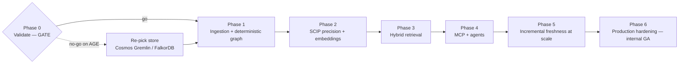

# Repository Intelligence Factory — Implementation Roadmap (v2)

**Status:** Supersedes `requirements-kickoff/IMPLEMENTATION_ROADMAP.md` (flat 7-phase feature list).
**Reads with:** `TARGET_ARCHITECTURE.md` (the *what*) and `REVIEW_AND_RECOMMENDATIONS.md` (the *why*).
**Date:** 2026-06-02

---

## How this roadmap is built

Two principles, both from the review:

1. **Validate before building wide.** A real spike on real repos retires the biggest risks (is this worth building? does AGE hold?) before any platform code is committed. That's Phase 0, and it's a gate.
2. **Measure from day one.** The evaluation set exists before the features it grades, so every phase has a testable exit — not a vibe.

Phases are **outcome-defined**: each ends at a state you can test and retires a named risk, rather than ticking off features. There is **no GraphRAG phase** — the graph is deterministic (AST/SCIP) from the start, which is why the original Phase 4 disappears.

Effort is T-shirt-sized (S / M / L). Absolute dates need your team's capacity and availability — give me that and I'll turn this into a calendared plan.

## Phase map

Cross-cutting through **every** phase: evaluation/measurement, provenance (`source_ref` on everything), confidence-tiering, on-stack discipline, and honest-completeness (never claim the graph is complete).

---

## Phase 0 — Validate the bet · [S–M] · **GATE**

**Goal:** know — with numbers, on real repos — whether this is worth building and whether AGE holds, before writing platform code.

**Work:**
- Stand up **potpie** on 1–2 real brownfield repos you actually work on (Neo4j in local Docker, disposable) → capability baseline.
- Build the **v1 eval set**: ~50–100 tagged Q/A pairs per repo (definition / usage / dataflow / cross-file / cross-service) + a git-history-mined impact gold set. This operationalizes the rewritten success criteria.
- Run the **AGE traversal benchmark**: your top 5 real impact queries against AGE at representative graph size.
- Resolve the three open decisions (below).

**Exit criteria:** capability baseline measured; **AGE go/no-go decided**; reusable eval harness exists.

**Risk retired:** "worth building?" and "does the on-stack graph store survive the impact-analysis query pattern?"

**If no-go on AGE:** re-pick the store *before* Phase 1 — Cosmos Gremlin (strict no-self-managed) or FalkorDB on Container Apps (if you relax that). The `GraphStore` interface keeps the blast radius to one adapter.

---

## Phase 1 — Ingestion + deterministic graph (walking skeleton) · [M]

**Goal:** one real repo flows end-to-end into a queryable, provenance-complete graph, fully on-stack.

**Work:**
- **Ingestion Service** (Go, Container Apps): register, clone, webhook receiver.
- **Tree-sitter** parse + **cAST** chunking for the priority language.
- **Deterministic graph in AGE**: nodes (file / class / function) + Tier-A edges (imports, same-file calls, extends/implements) from AST; module-dependency edges from native package tooling.
- Postgres schema: relational metadata + AGE + `index_version`.
- **`GraphStore` interface** so the spike→prod swap is one adapter.
- Provenance (`source_ref`) on every node/edge, **asserted in CI**.

**Exit criteria:** target repo ingested; Cypher queries return cited nodes/edges; provenance CI gate green.

**Risk retired:** end-to-end on-stack pipeline works.

**Defers:** cross-file precision (SCIP), embeddings, incremental updates (full re-index for now).

---

## Phase 2 — SCIP precision + embeddings + storage · [M–L]

**Goal:** the graph is accurate enough to trust, and both semantic and exact search exist.

**Work:**
- Per-language **SCIP indexer** (priority language) → precise cross-file call/reference edges; **confidence tiers** (`exact` / `probable` / `inferred`) + evidence on every edge.
- **Embedding Service** (chosen model) → pgvector + HNSW.
- **Postgres FTS** over identifiers/symbol names.
- **Two-tier indexing**: fast AST graph on push, full SCIP on a cadence.
- **Spring/DI extractor** if Java/Spring is in scope (highest-value language-specific lift).

**Exit criteria:** call-graph recall measured against the Phase 0 gold set, **per tier**; vectors + FTS populated and queryable.

**Risk retired:** call-graph quality.

**Defers:** fusion/ranking (Phase 3).

---

## Phase 3 — Hybrid retrieval (own code) · [M]

**Goal:** retrieval that beats vector-only, and impact analysis that is ranked and honest.

**Work:**
- **Retriever** (Go): pgvector + Postgres FTS + AGE bounded traversal → **RRF fuse** → optional cross-encoder rerank.
- Impact analysis as **ranked, depth-bounded, confidence-scored reachability** (not a transitive closure); hub-node damping.
- Always-on completeness caveat; every result carries `repo@commit:path:line`.

**Exit criteria:** retrieval beats a vector-only baseline on the eval set; impact precision/recall reported **per tier**; depth caps tuned.

**Risk retired:** retrieval + impact quality — the core value.

---

## Phase 4 — MCP server + agents · [M]

**Goal:** Claude/IDEs drive the platform; multi-step questions get answered.

**Work:**
- **Go MCP server** (official SDK) exposing `search_code`, `find_callers`, `impact_analysis`, `explain_architecture`, `dependency_analysis`.
- **LangGraph agent service** (isolated Python, behind MCP/HTTP) for architecture summaries and deep impact investigations.

**Exit criteria:** an engineer asks architecture/impact questions via MCP and gets cited answers on a real repo; the agent completes a multi-hop investigation.

**Risk retired:** usable interface + agentic workflows.

---

## Phase 5 — Incremental freshness at scale · [M–L]

**Goal:** the index stays fresh on an actively-committed repo without full re-indexing.

**Work:**
- The `TARGET_ARCHITECTURE.md` §4 commit-handling design: webhook delta, three-lane invalidation, per-repo coalescing + ordering, reconciliation sweep, force-push/branch handling.
- Scale tiers + vector quantization; multi-repo onboarding.

**Exit criteria:** per-commit update in **seconds-to-low-minutes** on an active repo; missed-webhook reconciliation verified; large-repo tier holds within latency budget.

**Risk retired:** freshness + scale.

---

## Phase 6 — Production hardening (internal GA) · [M]

**Goal:** a delivery engineer uses it on real client work.

**Work:**
- **Terraform AzureRM** (RBAC mode) + **GitHub Actions OIDC** deploy to Container Apps.
- **Key Vault** via managed identity; private networking (VNet integration + private endpoint) to Postgres.
- **OpenTelemetry → Prometheus + Grafana**; audit logging of queries + answers + provenance.
- Onboarding runbook.

**Exit criteria:** onboard onto a new client repo in under the target time using the platform; security review passed; dashboards live.

**Risk retired:** operability + security/SOC 2 fit.

---

## Deliberately deferred (not v1)

Selling it / multi-tenancy; architecture-*diagram* generation (commodity — DeepWiki gives it free); doc generation; LLM-derived semantic edges (post-v1 enrichment on top of the deterministic graph); languages beyond the priority set.

## Open decisions feeding Phase 0

1. **Embedding model** — self-hosted `jina-code-embeddings-1.5b` (no source egress) vs `voyage-code-3` (zero model-ops). Data-governance call.
2. **SCIP language priority** — which indexer first (Java/Spring? Go? TS? Python?), driven by your actual target repos.
3. **"No AKS" precise meaning** — Container Apps assumed; confirm it isn't "pure PaaS, no containers."

## Definition of done (internal GA)

A delivery engineer can point the platform at an unfamiliar brownfield repo and get **cited, confidence-tiered** answers to architecture and change-impact questions, kept **fresh per-commit**, running **fully on-stack** — and onboard in materially less time than today, measured on the eval set rather than asserted.
