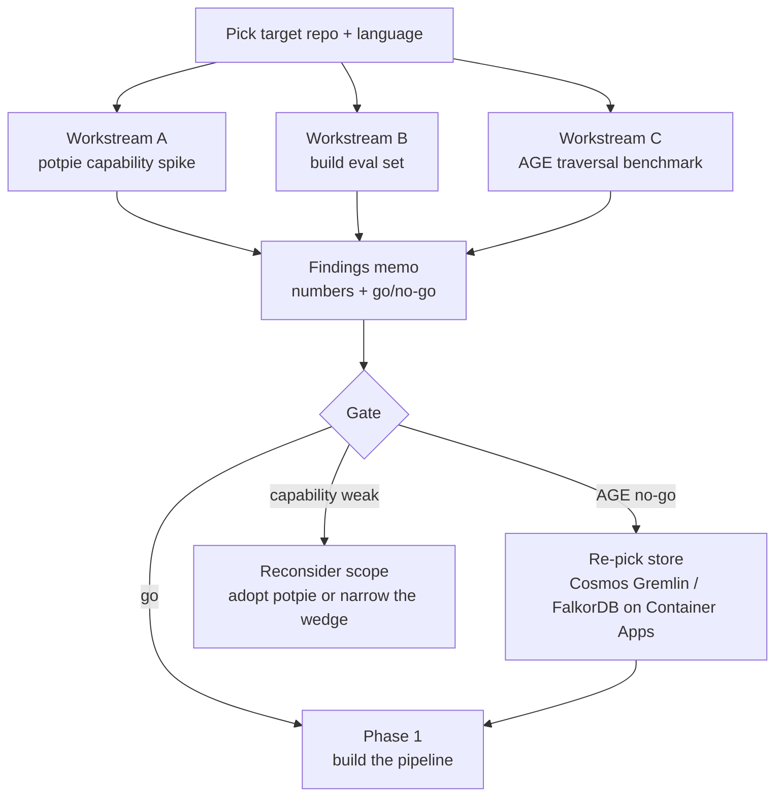

# Phase 0 — Spike Plan

**Status:** Execution plan for the roadmap's gating phase. Reads with `IMPLEMENTATION_ROADMAP.md` (Phase 0) and `TARGET_ARCHITECTURE.md`.
**Date:** 2026-06-02

---

## The question Phase 0 answers

Before any platform code, get **numbers on a real repo** for three things:

1. **Is it worth building?** — does repo intelligence meaningfully help on *our* codebases, or is an off-the-shelf tool already good enough?
2. **Does AGE hold?** — can Apache AGE serve the impact-analysis traversal pattern within budget, or do we fall back?
3. **What's the realistic ceiling?** — call-graph recall and answer quality on our actual code, so the success criteria become calibrated, not aspirational.

Exit = a one-page findings memo with go/no-go and the remaining decisions locked.

## Inputs — locked to the target repo

- **Target repo:** `apm0045942-credit-routing-service` (in `clear/`) — a real, actively-developed brownfield service.
- **Primary language:** **Java 17 / Spring Boot (Maven)** → SCIP indexer = **`scip-java`**.
- **Repo profile (measured 2026-06-02):**
  - **~117k Java LOC across 830 files**; Maven build (`pom.xml`, `mvnw`), already compiles (`target/` present) → `scip-java` is feasible out of the box.
  - **Spring Boot** stack: web, **security + oauth2-resource-server**, **data-mongodb**, **AOP**, actuator, log4j2. DI *and* AOP wiring → two dynamic-dispatch edge sources a static call graph won't fully see.
  - **Heavy SOAP/REST integration surface** (WSDL + openAPI client/server specs) → real cross-service edges to extract (Tier-C `inferred`).
  - **Spock tests** (`spock-spring`, ~35k Groovy LOC) → a ready test-coverage signal to intersect with impact analysis.
  - **2,705 commits**, latest 2026-05-29 → deep history, ideal for mining the impact gold set.
- **Why it's a good target:** DI + AOP + SOAP make it a genuine stress test of the confidence-tiering design (`exact` vs `probable` vs `inferred` edges) — exactly where naive call graphs fail. Scale is modest, so a clean pass validates AGE *for a service of this size*; a large monorepo stays a separate, harder benchmark later.
- **Environment:** potpie in **local Docker** (disposable, Neo4j included — *not* AKS, not production); a **dev Azure PostgreSQL Flexible Server (PG16) + AGE** for the benchmark. Nothing here is production infra.

## Flow

---

## Workstream A — Capability spike (potpie)

**Do:** stand up potpie via Docker Compose, point it at the target repo, let it build its graph + index. Run the eval set (Workstream B) through its Q&A, debugging, and blast-radius agents.

**Record:** initial indexing time; answer correctness per question type; blast-radius quality on the historical changes from Workstream B.

**This doubles as the build-vs-buy test.** Note explicitly where potpie-as-is is good enough vs where it falls short — that gap *is* the definition of what you'd actually build. If it's small, you adopt and barely build.

## Workstream B — Eval set (the measurement spine)

This is the reusable asset that makes every later phase testable. Two parts:

**Repo-understanding gold set** — 50–100 human-authored Q/A pairs, tagged by type. Example shape:

| id | question | type | gold answer | source_ref |
|----|----------|------|-------------|------------|
| q1 | Where is OAuth2 token validation enforced? | usage | resource-server security filter | `repo@sha:path:line` |
| q2 | What invokes the SOAP credit-bureau client? | cross-file / cross-service | callers list | `repo@sha:path:line` |
| q3 | If the routing-rules component changes, what's affected? | impact | impacted set | `repo@sha:path:line` |

**Impact gold set** — mine git history for 15–25 real changes where follow-up commits or CI failures reveal the *true* downstream set. That gives a recall ground truth (a lower bound — note it as such). Each row: changed entity → set of entities that actually needed follow-up. **For this repo:** draw from the 2,705-commit history and favor changes touching Spring-wired services, the AOP aspects, or the SOAP integration layer — where DI/AOP/cross-service edges make impact non-obvious. Intersect with the Spock suite as the test-coverage signal to catch dynamic edges static analysis misses.

**Scoring** — LLM-judge, but validate it first: on a 20-item calibration subset, require ≥90% agreement with two human raters before trusting automated scores. Report per question-type; don't average away the weak procedural/locational cases.

## Workstream C — AGE traversal benchmark (the go/no-go)

**Do:** load a graph representative of the target repo into dev `Postgres Flexible Server (PG16) + AGE` (export from the potpie/Neo4j spike, or build a quick deterministic AST graph). Run the top 5 real traversal queries: callers-of, transitive dependents at depth 1 / 2 / 3, cross-file impact, dependency chain.

**Measure:** latency p50 / p95 at representative graph size; behavior as depth grows 1 → 3; where it falls off.

**For this repo:** make sure the test graph includes the Spring DI/AOP-wired edges and the SOAP cross-service edges — that's where deep traversal and impact actually bite. The graph is modest (~830 Java files → low thousands of nodes), so a clean AGE pass here proves it *at this service's scale*, not at monorepo scale — keep that caveat in the memo.

---

## Pass / fail thresholds — set these BEFORE running (no moving goalposts)

Numbers below are placeholders to **calibrate to your UX need and the repo's size** — fix them before the spike, don't tune them after.

- **AGE — go:** representative impact queries return within your interactive budget (set a target, e.g. `p95 < 1–2 s` [VERIFY/calibrate]) at bounded depth ≤ 3 on the target-repo-sized graph.
- **AGE — no-go:** depth-≤3 impact queries blow the budget or fall over → trigger the fallback: **Cosmos Gremlin** (strict no-self-managed) or **FalkorDB on Container Apps** (lighter, keeps Cypher).
- **Capability — go:** the spike answers ≥ `X%` [set from baseline] of the gold set correctly *with citations*, and blast-radius is useful on ≥ `Y` of the historical changes. Calibrate honestly — rigorous SOTA on repo-understanding (SWE-QA) is ~48%, so a number anywhere near that on hard cross-file/impact questions is a real result, not a failure.
- **Build-vs-buy read:** an explicit verdict on whether potpie-as-is covers enough to adopt, vs how much custom build the gap implies.

## Decisions Phase 0 locks

- AGE vs fallback store (from Workstream C).
- Embedding model confirm (self-hosted `jina-code-embeddings-1.5b` is the default given client code).
- SCIP language priority — confirmed **`scip-java`** (Java 17 / Spring Boot).
- Build vs extend-potpie (from Workstream A).

## Deliverables

1. One-page **findings memo**: the numbers, the go/no-go, and the four locked decisions.
2. The reusable **eval set** (both gold sets) — reused in every later phase.
3. **AGE benchmark results** — query set, latencies, depth behavior.

## Effort & timebox

Roughly `~1–2 weeks for one engineer` [VERIFY — calibrate to capacity]. The three workstreams parallelize: B can start immediately; A needs the repo; C needs a graph (from A or a quick AST build).

## Out of scope for Phase 0

The real ingestion pipeline, the Go MCP server, the agent service, and incremental indexing — all Phase 1+. Phase 0 builds nothing production; it buys certainty cheaply.
