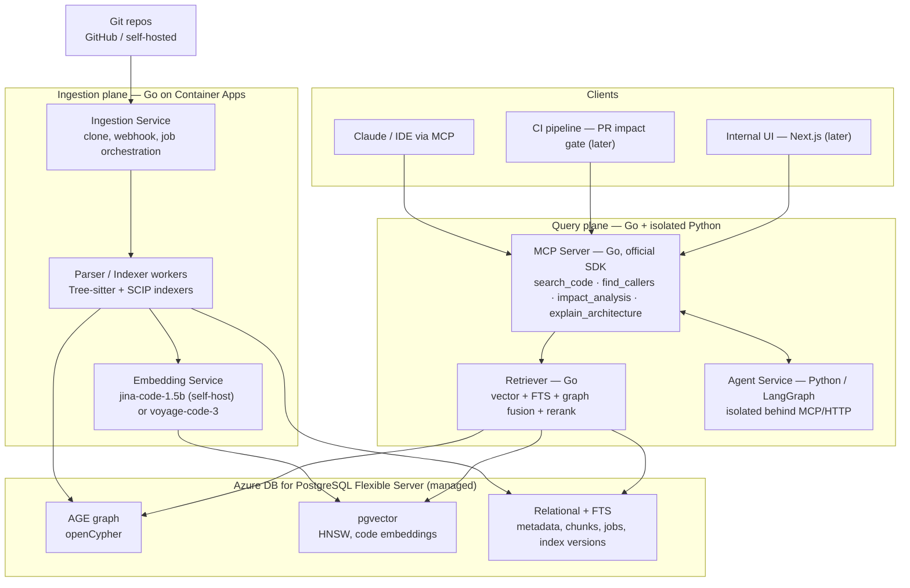
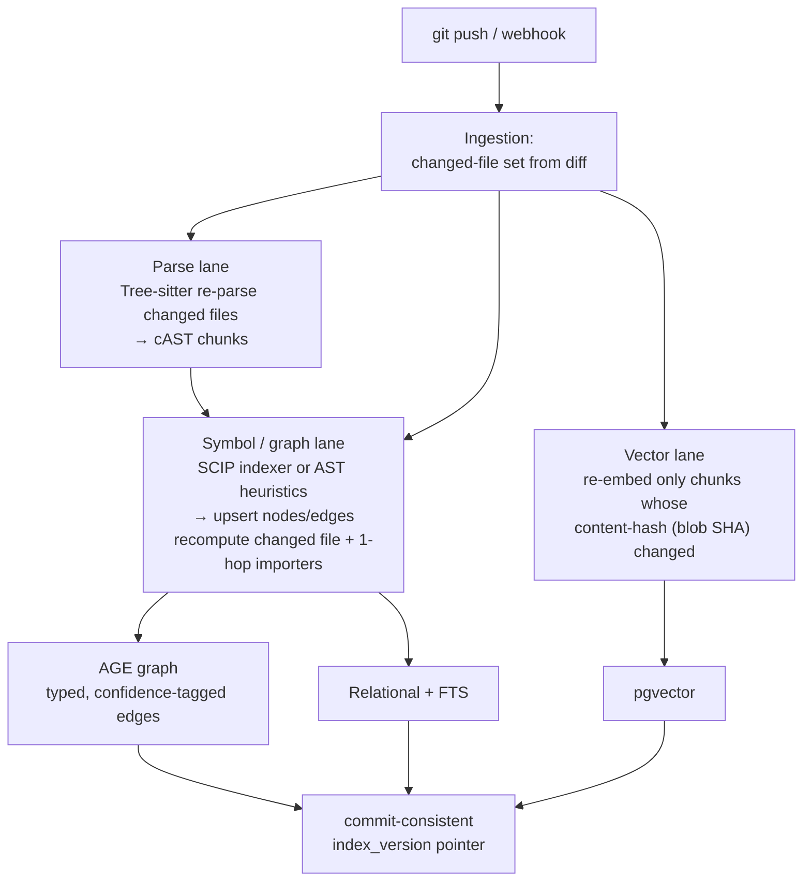
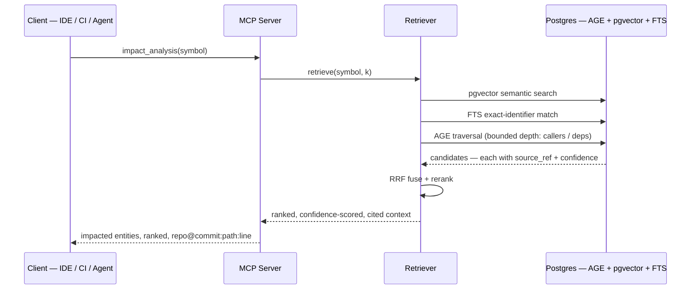
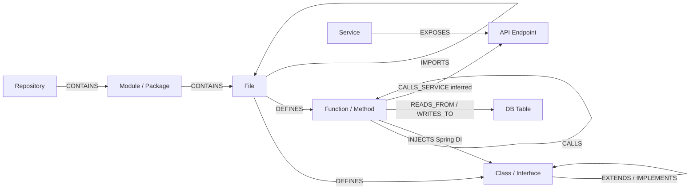

# Repository Intelligence Factory — Target Architecture (v2)

**Status:** Target state. Supersedes `requirements-kickoff/ARCHITECTURE.md` (one-line flow).
**Companion:** decisions and rationale live in `REVIEW_AND_RECOMMENDATIONS.md` → "Decisions locked (2026-06-02)".
**Date:** 2026-06-02

---

## 1. What this is

An **internal-leverage** platform that indexes brownfield Git repositories and answers architecture, dependency, and change-impact questions — to onboard AaraMinds onto its own and client codebases in hours instead of weeks. Not a multi-tenant product (for now), so the architecture optimizes for **operational simplicity and stack-fit**, not productization.

The whole system reduces to a loop: **parse code into a precise graph + embeddings, then retrieve over both at query time, and expose that through MCP tools and agents.** No LLM-built graph; no GraphRAG framework.

## 2. Locked decisions baked into this design

| Decision | Choice |
|---|---|
| Purpose | Internal delivery leverage |
| Graph construction | **Deterministic** from AST + SCIP (never LLM-inferred) |
| Graph store | **Apache AGE** on Azure Database for PostgreSQL Flexible Server (managed, GA) |
| Vector store | **pgvector** in the same Postgres instance |
| Retrieval | Hand-rolled **hybrid**: pgvector + Postgres FTS + AGE traversal → RRF fuse → rerank. No GraphRAG framework |
| Parsing | Tree-sitter (structure/chunking) + per-language SCIP indexers (symbols/call edges) |
| Agents | **LangGraph** (Python) — isolated microservice behind the MCP/HTTP boundary |
| MCP server | **Go**, official `modelcontextprotocol/go-sdk` |
| Compute | **Azure Container Apps** (no AKS) |
| Backends | Go (services), Python (agent service only) |

Deliberately **not** used: AWS, Neo4j/Memgraph in production, full Microsoft GraphRAG, Semgrep for fact extraction, MongoDB, Cosmos DB. One Postgres is the only datastore v1 needs.

## 3. Component view



**Responsibilities:**

- **Ingestion Service (Go)** — registers repos, receives `git push` webhooks via a **GitHub App**, mints short-lived installation tokens to clone/pull, computes the changed-file set from the diff, and enqueues indexing jobs. Owns the index-version pointer so reads are commit-consistent.
- **Parser / Indexer workers (Go)** — Tree-sitter parses changed files into ASTs and produces AST-aware (cAST) chunks; per-language **SCIP indexers** produce compiler-accurate symbols and call/reference edges; native package tooling (`go mod graph`, Maven/Gradle, `uv`) produces module dependency edges. Workers upsert nodes/edges into AGE and metadata into relational tables. Scale-to-zero jobs (KEDA on Container Apps).
- **Embedding Service** — embeds code chunks with a code-specific model. Default **self-hosted `jina-code-embeddings-1.5b`** on a GPU Container App (keeps private source in-tenant); **`voyage-code-3`** API is the alternative if egress is acceptable and you want zero model-ops.
- **Retriever (Go)** — the heart of "own retrieval code." Fans out to pgvector (semantic), Postgres FTS (exact identifiers), and AGE traversal (structural, bounded-depth); fuses with **Reciprocal Rank Fusion**; optional cross-encoder rerank. Returns ranked, confidence-scored, source-cited context.
- **MCP Server (Go)** — exposes the platform as MCP tools over the official SDK. Thin: validates, calls the Retriever and `GraphStore`, shapes results. The integration surface for Claude/IDEs/CI.
- **Agent Service (Python / LangGraph)** — the **only** Python in the system. Handles multi-step reasoning (architecture summaries, deep impact investigations) by calling MCP tools in a loop. Isolated behind MCP/HTTP so Python never leaks into the Go/Java services.
- **Store** — one managed Postgres holds the graph (AGE), the vectors (pgvector), and relational metadata + FTS. Single backup/HA/security surface.

## 4. Keeping the index fresh as commits land

Regular commits are the normal case, so freshness is **webhook-driven and delta-scoped**: each push re-indexes only what it touched, behind an atomic version flip — never a full re-scan. This is the model GitHub Blackbird (blob-SHA delta indexing) and Meta Glean (diff-sketch incremental) use, at far larger scale than these repos will hit.

### 4.1 Per-commit flow

```mermaid
sequenceDiagram
    participant GH as GitHub
    participant ING as Ingestion Service
    participant Q as Job queue
    participant W as Parser / Indexer workers
    participant PG as Postgres — AGE + pgvector + FTS
    GH->>ING: push webhook — before/after SHA
    ING->>ING: verify HMAC; git diff before..after → changed files
    ING->>Q: enqueue — coalesce per repo to head commit
    Q->>W: changed-file set
    par parse lane
        W->>PG: re-parse + re-chunk changed files (cAST)
    and graph lane
        W->>PG: re-extract symbols; edges for file + 1-hop importers
    and vector lane
        W->>PG: re-embed chunks whose blob SHA changed
    end
    W-->>ING: lanes complete at new index_version
    ING->>PG: atomically advance index_version pointer
    Note over ING,PG: readers pin to a version — never see a half-applied commit
    ING-->>ING: periodic reconcile — last-indexed SHA vs head
```

1. GitHub `push` webhook → Ingestion Service (HMAC-verified). The payload carries `before`/`after` SHAs.
2. Compute the delta from Git, not the payload: `git diff --name-status <before>..<after>` → added / modified / deleted / renamed files. That set is the unit of work.
3. Run the three lanes on just that set.
4. Atomically advance the `index_version` pointer. Queries pin to a version, so no reader sees a half-applied commit.

### 4.2 The three invalidation lanes



- **Parse/chunk** — Tree-sitter re-parses only changed files → re-chunks (cAST). Deletes drop their chunks; renames preserve symbol identity (stable symbol IDs) so history and impact links survive.
- **Graph** — re-extract symbols for changed files; recompute edges for the changed file **+ its 1-hop importers**, not the transitive closure. Deeper bindings are marked stale and resolved lazily — keep indexing file-local, push cross-file resolution toward read time. This matters most for AGE, whose weak spot is deep traversal: you never re-walk the whole graph on a commit.
- **Vectors** — re-embed only chunks whose **content hash (git blob SHA) changed**. A one-line edit in a 2,000-line file re-embeds one chunk; identical code dedupes to a single embedding.

### 4.3 Correctness and scale — the non-obvious parts

- **Commit-consistency.** Build the new state, then flip the `index_version` pointer atomically. Readers pin to a version; in-flight queries finish against the old one. No half-applied reads.
- **Burst coalescing + ordering.** Commits arrive faster than you index. Serialize per repo and **coalesce to the head commit** — one delta from last-indexed SHA → head — instead of replaying every intermediate commit. Keep commit metadata for history; don't materialize an index per commit.
- **SCIP is two-tier.** Precise SCIP indexers usually have to *compile* the project — too slow for per-commit. Fast AST/heuristic graph on every push (seconds); full SCIP re-index on a cadence (nightly / in CI / on-demand) to reconcile precision. Freshness from the fast lane, accuracy reconciled in the background.
- **Edge cases.** Force-push / history rewrite → `before` is no longer an ancestor → fall back to a full diff against the new head for affected paths. Branches → index the default branch; PR branches on-demand in a separate namespace, GC'd on merge/close. Missed webhooks → a periodic reconciliation sweep compares last-indexed SHA vs current head and re-syncs (webhook delivery isn't guaranteed).

### 4.4 Envelope

Fast-lane update per commit is **seconds-to-low-minutes**; the expensive full SCIP pass stays off the hot path. Because the graph is built deterministically from AST/SCIP, incremental updates are exact and nearly free — an LLM-built GraphRAG graph would instead burn real LLM cost and minutes on *every* push, which is why that approach was rejected (see `REVIEW_AND_RECOMMENDATIONS.md`).

## 5. Query / retrieval pipeline



Impact analysis is returned as **ranked, depth-bounded, confidence-scored reachability** — never a raw transitive closure (which on a hub node returns half the repo). Hub nodes (e.g., a function with hundreds of callers) are flagged, not blindly expanded. Every result carries the caveat that reflection / runtime-wired / cross-service edges may be invisible — the platform never claims completeness it can't have.

## 6. Graph data model

A property graph in AGE. Every node and edge carries `source_ref` (`repo@commit:path:line-range`), `confidence` (`exact` / `probable` / `inferred`), `evidence`, and `index_version`.



Edge confidence tiers, per the recall reality (real-world call-graph recall tops out ~70–90%):

- **Tier A `exact`** — static imports, `extends`/`implements`, same-file/direct calls from AST + SCIP symbol resolution.
- **Tier B `probable`** — dynamic-language method dispatch resolved by name/arity heuristics.
- **Tier C `inferred`** — cross-service calls matched by route/proto/topic; Spring DI wiring. Never labeled `exact`.

A dedicated **Spring/DI extractor** (parse `@Component`/`@Service`/`@Autowired` + bean config) is the highest-value language-specific investment for Java/Spring brownfield work and lifts a big chunk of Tier-C edges into something usable.

## 7. Storage layout — one Postgres

| Layer | Mechanism | Notes |
|---|---|---|
| Graph | AGE (openCypher) | Source of truth for nodes/edges + traversal. Bounded-depth queries only |
| Vectors | pgvector, HNSW index | Code embeddings (Matryoshka dims + int8 to cut storage); function/symbol granularity |
| Metadata | Relational tables | `repositories`, `files`, `symbols`, `chunks`, `edges` projection, `index_versions`, `jobs` |
| Exact search | Postgres FTS (`tsvector`) | BM25-style matching on identifiers/symbol names — where pure vector fails |
| Jobs/queue | Postgres-backed job table (v1) | Promote to Azure Service Bus only if throughput demands |

Co-locating all four in one managed instance is the entire operational argument for AGE: one backup, one HA story, one security boundary, and you can JOIN graph results against relational metadata.

## 8. On-stack mapping (no drift)

| Component | Tech | Azure service | On approved stack? |
|---|---|---|---|
| Ingestion, Parser, Retriever, MCP | Go | Container Apps | Yes |
| Agent Service | Python / LangGraph | Container Apps | **Blessed exception** (record in `aaramind/.claude/CLAUDE.md`) |
| Embedding Service | jina-code / voyage | Container Apps (GPU) or external API | Yes / note egress |
| Graph + Vector + Metadata | Postgres + AGE + pgvector | Azure DB for PostgreSQL Flexible Server | Yes |
| Secrets / identity | Managed identity | Azure Key Vault, Entra ID | Yes |
| IaC | Terraform AzureRM (RBAC mode) | — | Yes |
| CI/CD | GitHub Actions + OIDC | — | Yes |
| Observability | OpenTelemetry → Prometheus + Grafana | Azure Managed Grafana / Monitor | Yes |
| Frontend (later) | Next.js / React | Container Apps / Static Web Apps | Yes |

Every box is on-stack except the one deliberate, recorded LangGraph exception.

## 9. Non-functional posture

- **Scale tiers.** Full semantic index up to a set MLOC ceiling; above it, structural-graph-only + on-demand embedding. Quantize vectors (int8/binary) — embedding storage/latency is what breaks first at monorepo scale, not parsing.
- **Accuracy / trust.** Confidence-tier every edge and impact result; never present the graph as complete. The biggest project risk is shipping silent false negatives in impact analysis — mitigated at the product layer ("here's what I'm confident breaks, and here's what I can't see"), not by pretending the algorithm is sound.
- **Provenance (the real "100% traceability").** Every emitted node, edge, and answer-citation carries a resolvable `repo@commit:path:line` reference, asserted in CI. This is self-citation completeness, not graph soundness.
- **Security / compliance (fits AaraMinds SOC 2 / ISO 27001).** Repo access via a **GitHub App** — short-lived per-installation tokens, fine-grained scopes (Contents: read, Metadata: read, Push webhook), with the App private key + webhook secret in Key Vault via managed identity. Managed identity to Key Vault; private networking (VNet integration + private endpoint to Postgres); **self-hosted embeddings keep client source in-tenant (no egress)** — the default now that client code is in scope; **per-client / per-repo isolation** in storage and retrieval scoping, with index purge on engagement end; full audit log of queries and answers with their provenance.

## 10. Open items / gating risks

*Resolved 2026-06-02: repo access = GitHub App; client-code indexing approved (keep in-tenant); compute = Azure Container Apps (not pure-PaaS); Phase 0 target repo = `apm0045942-credit-routing-service`; SCIP priority = `scip-java` (Java 17 / Spring Boot).*

1. **AGE deep-traversal benchmark — the go/no-go gate.** AGE is weak on unbounded variable-length traversal, which is exactly the impact-analysis "full blast radius" pattern. Benchmark the top 5 real traversal queries against AGE at representative scale. If it holds → ship AGE. If it chokes → Cosmos DB Gremlin (strict no-self-managed; lose Cypher) or FalkorDB on Container Apps (if you relax to running a container).
2. **Embedding model.** Leaning **self-hosted `jina-code-embeddings-1.5b`** now that client code is in scope (keeps source in-tenant); `voyage-code-3` only if a specific repo is cleared for external-API use. Confirm at Phase 0.

## 11. Build order (high level)

Validate before building wide: stand up **potpie** against one real brownfield repo (Neo4j in local Docker, disposable) to get capability numbers, run the **AGE traversal benchmark** in parallel, then build the real pipeline behind a `GraphStore` interface so the swap from spike-Neo4j to production-AGE is a one-adapter change. Detailed phasing belongs in a separate roadmap doc (the kickoff `IMPLEMENTATION_ROADMAP.md`, rewritten against this architecture).
