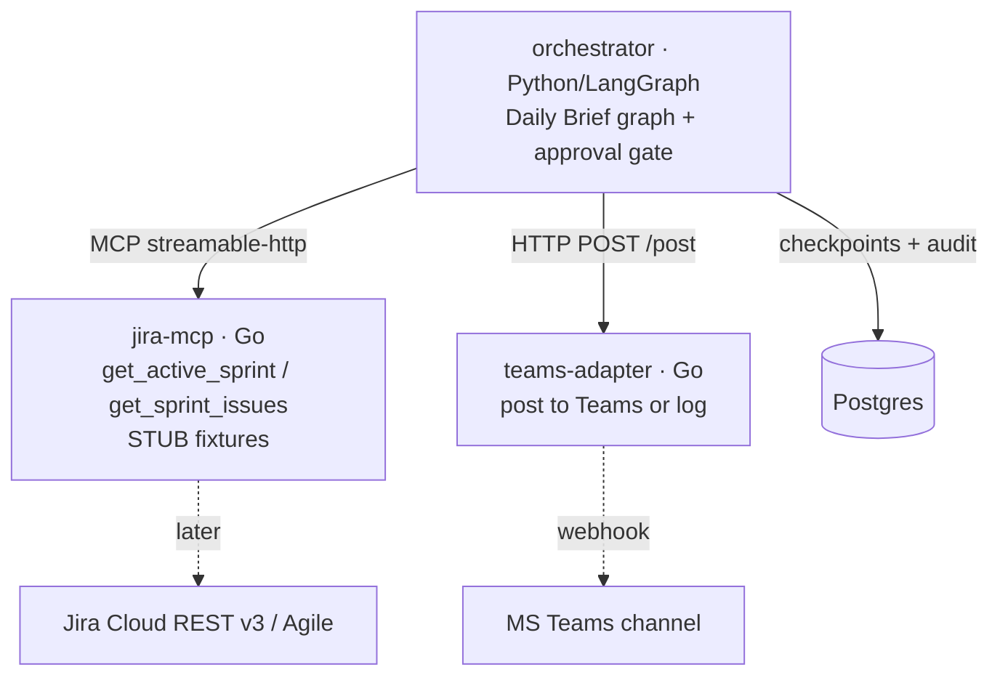

# Scrum Master Agent

A Jira-connected Scrum Intelligence Layer. Reads sprint state from Jira Cloud, analyzes
it, and posts recommendations to Microsoft Teams under a strict human-in-the-loop write
model: **Read → Analyze → Recommend → Approve → Write**.

This `code/` folder is the **code**, nested inside the project home. The specs, decisions,
and plans live one level up in the parent home **[`../`](../)** — start with its
[`tracking/Status.md`](../tracking/Status.md).

> **P0 skeleton.** This is the Phase-0 vertical slice: one feature (Daily Scrum Brief)
> wired end-to-end through every layer. Jira tools return **stubbed fixture data** so the
> whole system runs with zero credentials. Swapping in real Jira (OAuth 3LO) and a real
> Teams webhook touches only the marked spots — the contracts don't change.

## Architecture (P0 slice)



Language split follows [ADR-0001](../design/adr/0001-langgraph-orchestration.md):
LangGraph (Python) is the reasoning layer only; the Jira integration and channel adapters
are Go; state is Postgres.

## Quickstart

Prereqs: Docker + Docker Compose.

```bash
cp .env.example .env        # defaults are fine
docker compose up --build
```

What happens: Postgres starts and applies `db/migrations/0001_init.sql`; the Go services
come up; the orchestrator fetches the (stubbed) active sprint, builds the brief, hits the
approval gate, auto-approves (`AUTO_APPROVE=true`), and "posts" to the teams-adapter —
which logs the brief (no webhook set). The recommendation → approval → action is written
to Postgres.

Try the **real approval gate**: set `AUTO_APPROVE=false` in `.env` and re-run — the
orchestrator stops at *pending approval* and prints the preview instead of posting.

Deliver to a real channel: set `TEAMS_WEBHOOK_URL` in `.env`.

## Run the pieces standalone

```bash
# jira-mcp (Go)         → MCP at http://localhost:8080/mcp
cd apps/jira-mcp && go run .

# teams-adapter (Go)    → http://localhost:8090  (POST /post, GET /healthz)
cd apps/teams-adapter && go run .

# orchestrator (Python) → see apps/orchestrator/README.md
```

## Tests

```bash
make test        # Go (both services) + Python (pure brief/report unit tests)
```

The Python tests are pure (no network/DB) and cover blocker detection, stale detection,
the time-based summary, and the Report.md table-of-contents.

## Layout

```
scrum-master/code/
├── apps/
│   ├── jira-mcp/        Go MCP server — Jira read tools (stubbed fixtures)
│   ├── teams-adapter/   Go HTTP service — post to Teams (or log)
│   └── orchestrator/    Python LangGraph — Daily Brief graph + approval gate
├── db/migrations/       Postgres schema (trust chain: recommendation→approval→action_audit)
├── infra/terraform/     AzureRM scaffold (stub)
├── .github/workflows/   CI (Go + Python)
├── docker-compose.yml   full P0 slice
└── docs/                pointer to ../ (the parent brain)
```

## What's stubbed → how to make it real

| Stub | Where | To productionize |
|------|-------|------------------|
| Jira data (fixtures) | `apps/jira-mcp/internal/tools/jira_tools.go` | Replace fixture reads with Jira REST v3 / Agile calls; add OAuth 3LO (parked — see `../planning/Open_Questions.md`) |
| Teams delivery | `apps/teams-adapter/internal/teams/teams.go` | Set `TEAMS_WEBHOOK_URL` to a Power Automate **Workflows** webhook (O365 connectors retire 2026-05); adapter already emits an Adaptive Card |
| Approval = auto/CLI | `apps/orchestrator/scrum_orchestrator/main.py` | Resume the graph from a Teams Action.Submit callback |
| Infra | `infra/terraform/` | Fill PostgreSQL + Key Vault + Container Apps resources |

## Decisions (locked)

Orchestration **LangGraph** · integration **Go MCP** · auth **OAuth 2.0 3LO** · channel
**Teams** (Slack in P2) · estimation **time-based** · reports **`Report.md` with TOC*