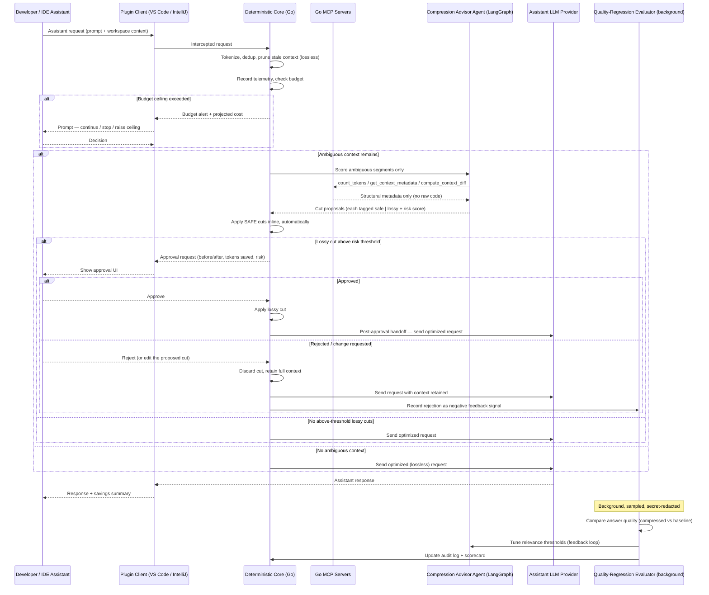

# AI Token Optimizer — Agent Blueprint v0.1

**Status:** Pre-build design baseline · **Date:** 2026-05-21 · **Author persona:** AITO AI Agent Blueprint Advisor v1.1 (composed with Module 8 v1.2)
**Produced for:** Raja / AITO · **Next handoff:** Module 5 (AI Systems Review) once this baseline is approved.

> This is a buildable specification, not a pitch. Every number without a measured baseline is marked `[VERIFY]`. Boundary was set before architecture (Boundary Gate). Architecture Theatre Check and Diagram Completion Check were run before this draft was released.

---

## 0. Architecture decision — settled

**Decided 2026-05-21: bundled local sidecar.** You confirmed LangGraph (Python) + Go MCP servers as the required stack, which settles the architecture.

Why this was a decision at all: a VS Code extension runs in a Node/JS sandbox and an IntelliJ plugin runs on the JVM — neither can host a Python (LangGraph) process or a Go binary *inside* its own runtime. You cannot literally embed Python in a `.vsix`. Keeping both LangGraph and Go therefore requires the sidecar model.

**The settled model:** the plugin package *ships* the Go binaries (deterministic core + MCP servers) and the packaged LangGraph agent inside it, and the plugin spawns and supervises them as `127.0.0.1` child processes. The install experience is still single-artifact — nothing external to download or configure, nothing leaves the machine — but there is a managed local process boundary, and the blueprint is honest about it. Lifecycle (start, health-check, restart, stop) is owned by each plugin client.

Rejected alternatives, for the record: (a) all-TypeScript inside the extension host — drops Python LangGraph and Go entirely, contradicting the required stack; (b) LangGraph.js for VS Code only — IntelliJ (JVM) still cannot host it, so a sidecar reappears for IntelliJ anyway. Neither keeps both technologies the stack requires.

Sections 4, 5, 6, 11, 13, and 14 already assume this model.

---

## 1. Job-to-be-done

For individual developers (and, by aggregation, their teams) who use an in-IDE AI coding assistant, the AI Token Optimizer reduces the **input tokens sent per assistant request** through deterministic and agent-assisted context compression and pruning, and gives **per-request / per-session / per-repo token-and-cost visibility with enforceable budgets** — targeting a **25–45% reduction in input tokens per request `[VERIFY against your own usage baseline]`** with **no measurable degradation in assistant answer quality**, while every lossy compression stays developer-approved.

The measurable improvement is an outcome (tokens-per-request and cost-per-request), not a delivery timebox. The quality-non-degradation clause is the part that makes the number honest — token reduction alone is trivial if you are allowed to make the assistant worse.

---

## 2. Agent Justification

**Is an agent even needed? Mostly no — and saying so is the point.**

A large share of the value here is deterministic and must *not* be an agent: exact-duplicate removal, whitespace/comment normalization, token counting against provider tokenizers, truncating context that rules already prove stale (unchanged-since-last-request files, closed editors), telemetry capture, and budget arithmetic. Wrapping any of that in an LLM is slower, less reliable, and — for a *token optimizer* — self-defeating, because the agent's own reasoning burns tokens.

**The genuinely agentic slice is narrow and real.** When deterministic rules are *ambiguous* — "this 600-line file is open but is it relevant to the developer's actual query?", "can this conversation history be summarized without losing the constraint the developer stated four turns ago?" — a fixed ruleset fails in one of two directions: too timid (leaves easy savings on the table) or too aggressive (silently strips context the assistant needed, and *nothing detects the resulting quality drop*). Resolving that ambiguity requires reasoning over uncertain, semantic input, and — critically — a **feedback loop** that measures whether a compression strategy degraded answers and adjusts. Reasoning under uncertainty plus a learning loop is the textbook justification for agentic behavior.

**Simpler alternative considered and rejected.** A purely deterministic compressor with no agent and no feedback loop. Rejected because its failure mode is *silent quality regression*: it will compress aggressively, the developer will get subtly worse completions, and there is no mechanism that ever catches it or rolls the strategy back. The agent exists specifically to close that loop. The deterministic core still does ~70% of the work `[VERIFY]`; the agent governs the risky 30%.

**Autonomy posture:** background-worker for the learning loop; copilot posture for the inline path — the developer stays in control of every lossy cut. No autonomous-workflow posture anywhere; the optimizer never takes an irreversible action.

---

## 3. Scope and Boundary

Set *before* any tool, memory, or workflow design (Boundary Gate).

### In scope
- Intercepting the developer's own IDE coding-assistant requests, locally, before they reach the assistant's LLM provider.
- Deterministic, lossless compression: exact dedup, comment/whitespace normalization, rule-provable stale-context pruning.
- Agent-assisted relevance scoring of *ambiguous* context segments, and proposal of lossy cuts (summarization, partial pruning) with a per-cut risk score.
- Per-request / per-session / per-repo token and cost **telemetry**, **budgets**, and threshold **alerts**.
- Hybrid application: safe cuts inline and automatic; lossy cuts above a configurable risk threshold surfaced for approval.
- Local quality-regression evaluation and threshold self-tuning.
- Delivery as a VS Code extension (`.vsix`) and an IntelliJ Platform plugin (`.zip`), both manually installable from local disk.

### Out of scope (explicitly — these were considered and excluded)
- **Model routing / model substitution** — not selected; the optimizer never changes which model the assistant uses.
- **Response or semantic caching** — not selected this version.
- Optimizing LLM calls inside the developer's *application code* (only the IDE assistant's traffic is in scope).
- Changing the assistant's provider, prompt templates, or system prompt.
- Fine-tuning, model hosting, or cloud sync of any kind.
- Multi-tenant SaaS, team server, org-wide dashboards (single-developer, local-only for v1).

### Human-only (never automated)
- Approving any lossy or summarizing compression above the configured risk threshold.
- Setting or raising a budget ceiling.
- Approving any request that would fall *below* the configured minimum-context floor.
- Disabling/enabling the optimizer for a given repo or workspace.

---

## 4. Agent Decomposition

**Decision: single agent over a deterministic core. Not multi-agent.**

**Rationale.** Only two responsibilities require reasoning — scoring ambiguous-context relevance and learning from quality regressions — and they share one context: the request, the compression result, and the quality signal. One agent means one trace per escalated request, which is what makes the system auditable.

**Rejected alternative: a multi-agent crew** (separate Compression Agent / Telemetry Agent / Budget Agent). Rejected because telemetry and budgeting are deterministic bookkeeping with zero reasoning content — wrapping them in LLM agents adds latency, audit complexity, and token cost. The concrete failure mode: a "Token Optimizer" that itself burns tokens running multi-agent orchestration over arithmetic. That is the exact anti-pattern the product exists to kill.

> Deviation note: Module 8's golden-set TokenOptimizer was *multi-agent*, justified by "distinct optimization domains" (routing + caching + compression). Your scope narrows v1 to compression + telemetry only — with that narrowing, multi-agent is no longer justified, and the Single-Agent Default applies. If you later add model routing and caching, re-open this decision.

### Components

| # | Component | Runtime | Role |
|---|---|---|---|
| 1 | **Deterministic Optimizer Core** | Go | Inline hot path. Tokenize, dedup, lossless prune, telemetry, budget enforcement, kill switch. Latency-critical. |
| 2 | **Compression Advisor Agent** | LangGraph (Python) | Invoked *only* for ambiguous context. Scores relevance, proposes cuts, tags each safe vs lossy + risk score. |
| 3 | **Quality-Regression Evaluator** | LangGraph (Python), durable background graph | Samples sessions, compares answer quality compressed-vs-baseline, tunes agent thresholds. |
| 4 | **Go MCP Servers** | Go | The agent's *only* path to the system. Allowlisted, typed, observable tools. |
| 5 | **IDE Plugin Clients** | TypeScript (VS Code), Kotlin (IntelliJ) | Thin clients: intercept, render approval/telemetry UI, supervise the sidecar. |

The Compression Advisor Agent has **no direct filesystem, network, or IDE access** — it reaches the world only through component 4. That boundary is the security design, not an afterthought.

---

## 5. Foundation and Stack

Foundation and Stack kept separate per Module 8. Choices follow the Stack Selection Decision Rule: autonomy posture → state/control model → framework → model.

### Foundation
- **LLM(s):** The optimizer owns no primary model. The Compression Advisor Agent's reasoning calls are routed through the assistant's existing provider endpoint (per the settled egress decision below), preferably to a small / low-cost model there to protect the Self-Funding constraint. `[VERIFY]` the specific model once the target provider is confirmed.
- **Retrieval / memory:** No vector DB in v1. Working memory is per-request and ephemeral; the only persisted state is the local telemetry store and the evaluator's scorecard.
- **Storage:** Embedded local store (SQLite) for telemetry, budgets, audit log, and scorecard. No remote storage.
- **Identity / secrets:** OS-user-scoped; the sidecar binds to `127.0.0.1` only, with a per-session loopback token so other local processes cannot drive it. No cloud identity.
- **Data sources:** The developer's open workspace (read-only, scoped per repo) and the intercepted assistant request.
- **Runtime environment:** The developer's machine. Windows / macOS / Linux. No cloud runtime.

### Stack
- **Orchestration framework — LangGraph.** Default choice. *Why it fits:* the Quality-Regression Evaluator is a durable, stateful, long-running, auditable workflow — exactly LangGraph's strength per Module 8's framework map. *Where it explicitly does NOT belong:* the inline hot path. LangGraph's durable-execution machinery is overhead on a per-keystroke latency budget. **The hot path is plain Go; LangGraph governs only the background learning loop and the escalated ambiguous-context calls.** *Switch condition:* if the agent slice shrinks to a single stateless call, drop LangGraph for a direct SDK call; if it grows to multi-domain optimization, re-evaluate against the OpenAI Agents SDK / Microsoft Agent Framework. *Environment assumption:* local desktop, single user.
- **MCP servers — custom, Go, `mark3labs/mcp-go` SDK, stdio transport.** Per the `mcp-go-server-building` skill: stdio is correct for a local same-host agent; logging goes to **stderr only** (stdout is the protocol wire); typed Go input structs; `internal/services/<name>` vs `internal/tools/<name>` layering; one verb-led action per tool; a contract file per tool; a risk tier per tool.
- **Tools (MCP):** `count_tokens`, `get_context_metadata` (structural metadata only — paths, symbol names, import/dependency edges, recency; never raw source code), `compute_context_diff` (change statistics, not raw diff text), `record_telemetry` (the only write-tier tool), `get_budget_state`. One action per tool — no kitchen-sink `manage_*`. The tool surface enforces the metadata-only egress decision *by construction*: no MCP tool ever hands the agent raw code.
- **Evaluation platform:** Local golden-set harness + LLM-as-judge answer-equivalence scoring. No third-party eval SaaS in v1.
- **Observability:** Structured JSON logs (stderr), per-tool-call `tool_call_started/completed/failed` events, local trace store. OpenTelemetry-shaped spans so a future team-server can ingest them without rework.
- **Deployment platform:** Bundled into the `.vsix` and the IntelliJ plugin `.zip`. No servers.
- **CI/CD:** GitHub Actions with OIDC (per AITO standing stack) building all four artifacts — Go sidecar binaries (cross-compiled), the packaged LangGraph agent, the `.vsix`, the IntelliJ `.zip` — plus the evaluation gate.

### Agent egress — settled: metadata-only reasoning

**Decided 2026-05-21: option 1, metadata-only.** The Compression Advisor Agent reasons about the developer's source code, so uncontrolled use of a cloud LLM would mean new egress of source code — even though the product is "local." The settled approach removes that risk by construction.

**The settled model:** the agent's reasoning inputs are *metadata only* — file paths, symbol names, symbols referenced by the developer's query, import/dependency edges, diff statistics, token counts, and recency — plus the developer's query text, which already goes to the assistant's provider anyway. **Raw source code is never sent to the agent's LLM.** The reasoning call is routed through the same provider endpoint the assistant already uses, so it adds no new network destination either. Both halves of the Section 6 no-new-egress control — no source-code egress and no new destination — therefore hold by design, not by configuration, and the tool surface enforces it (no MCP tool returns raw code to the agent). Metadata payloads are small, which also keeps the agent's own token spend low and the optimizer net-positive (Self-Funding constraint, Section 7).

Rejected alternatives, for the record: (a) reuse the assistant's provider *with raw code as the agent's input* — sends additional code bytes to the LLM purely to decide how to save tokens, fighting the Self-Funding constraint; (b) a bundled local small model — real semantic reasoning over full code with zero egress, but adds hundreds of MB and a runtime to the bundle. Option (b) is the planned **v2 upgrade**, gated on the evaluation harness (Section 8) proving it beats metadata-only on the golden set.

---

## 6. Cross-Cutting Controls

**Control pattern: defense-in-depth on a local trust boundary + human-gated lossy compression + trace-first operations.**

| Control | Implementation |
|---|---|
| Input validation | Intercepted request parsed and schema-validated before any processing; malformed → passthrough, never crash the assistant. |
| Output validation | Compressed request must be syntactically valid and must stay **above the minimum-context floor**; violation → discard the cut. |
| Tool-call allowlist | Agent may call only the five named MCP tools. No dynamic tool discovery. |
| AuthN / AuthZ | Sidecar binds `127.0.0.1` only; per-session loopback token; MCP tools read-tier except `record_telemetry`. |
| Workspace boundary | Per-repo isolation; context, telemetry, and budgets never cross workspace boundaries. |
| PII / secrets | The agent receives structural metadata only (`get_context_metadata`), never raw source code. Secret-redaction (API keys, tokens, `.env` values) runs on all MCP tool outputs and all logs before they are written or returned. Redaction recall is an evaluated scorer, target ~100%. |
| Secrets isolation | The optimizer holds no provider credentials of its own. Because interception is a loopback proxy (Section 11), the assistant's API key transits the proxy in request headers — the proxy forwards the `Authorization` header untouched and must never log, persist, or inspect it. Enforced by a header-redaction rule applied to all logging and a CI test. |
| **No-new-egress** | The optimizer must add zero network destinations beyond what the assistant already called. Enforced by an allowlist of outbound hosts + a CI test. |
| Audit logs | Every compression decision logged: before/after token counts, each cut, safe/lossy tag, risk score, approval state, timestamp. Local, append-only. |
| Traces / spans | One trace per request; spans for deterministic core, agent call, each MCP tool call. |
| Metrics | Tokens in/out, compression ratio, agent invocation rate, approval-prompt rate, latency p50/p95. |
| Cost telemetry | The product's core feature *and* a control: the optimizer's own agent token spend is metered and shown next to gross savings. |
| Human-in-loop | Hybrid: safe cuts inline; lossy cuts above threshold → approval UI. |
| Escalation | Repeated quality-regression detections escalate to a "review compression strategy" notification. |
| Rollback / kill switch | One-click **passthrough mode**: optimizer disabled, requests pass byte-for-byte unmodified. Also auto-trips if net savings goes negative or the sidecar is unhealthy. |
| Evaluation / regression gate | A compression-strategy change cannot ship if it fails the golden-set quality or net-savings gate (Section 8). |

---

## 7. Defining Operational Constraint

**Fidelity Floor — no compression ships without evidence it did not degrade the answer.**

This is the constraint that makes or breaks the product. A token optimizer that quietly makes the assistant worse is worse than no optimizer, because the developer cannot see the cost — they just get subtly degraded help. So:

- The optimizer is **lossless by default**. Deterministic, provably-safe cuts apply freely.
- It is **lossy only with evidence and consent**. Every lossy cut is (a) scored for risk, (b) above-threshold cuts surfaced for human approval, (c) measured after the fact by the Quality-Regression Evaluator, and (d) reversible — passthrough mode always restores full context.
- Every token amount in any output traces to a deterministic source. The agent may *reason*; it may not *invent* a count.

**Co-constraint — Self-Funding Economics.** The optimizer's own agent-reasoning token spend must stay a small fraction of the tokens it saves (target: optimizer overhead **< 5% of gross tokens saved `[VERIFY]`**). If net savings turn negative, the kill switch trips to passthrough automatically. A token optimizer that costs more than it saves has failed its one job.

---

## 8. Evaluation and Feedback Loop

Evaluation is mandatory. Four labels.

**Golden set.** A local corpus of `(workspace context, assistant query, baseline full-context answer)` tuples spanning languages (Go, TypeScript, Python, Java/Kotlin), task types (completion, explain, refactor, debug, test-gen), and context sizes. Versioned with the repo.

**Scorers — grouped by intent.**
- *Output quality:* answer-equivalence between the compressed-context answer and the full-context answer (LLM-as-judge + structural/diff checks). The primary gate.
- *Intermediate behavior:* compression ratio, % context dropped, agent invocation rate, MCP tool-call correctness, approval-prompt frequency, threshold-tuning stability.
- *Safety / policy:* secret-redaction recall (target ~100%), no-new-egress check, minimum-context-floor compliance.
- *Economic / latency / reliability:* net token savings (must stay positive after agent overhead), inline latency p50/p95, sidecar uptime, kill-switch trip rate.

**CI gate.** A compression-strategy or agent-prompt change is blocked from merge if answer-equivalence drops below threshold *or* net savings goes non-positive on the golden set. Wired into GitHub Actions.

**Feedback loop.** The Quality-Regression Evaluator samples real (locally consented, secret-redacted) sessions, scores compressed-vs-baseline quality, updates the scorecard, and tunes the Compression Advisor Agent's relevance thresholds. Rejections from the approval UI feed the same loop as negative signal. For any session flagged as a regression, human review is surfaced before the strategy is reinforced.

---

## 9. Lifecycle and Deployment

Framed as Plan → Build → Test → Deploy → Monitor → Learn.

- **Plan:** this blueprint; Module 5 systems review; egress decision confirmed.
- **Build:** Go core + MCP servers first (they are testable in isolation); LangGraph agent against the MCP boundary; IDE clients last.
- **Test:** layered — Go unit/contract/transport tests; agent eval harness; client integration tests; end-to-end smoke per IDE.
- **Deploy:** packaged artifacts; manual local install (Section 11).
- **Monitor:** local telemetry + audit log; the developer is their own ops dashboard in v1.
- **Learn:** the feedback loop tunes thresholds; quarterly review of the golden set.

**Hosting:** fully local; no cloud component.
**Cost ceiling:** the optimizer's own agent-reasoning spend, target **< 5% of gross tokens saved `[VERIFY]`**; absolute ceiling configurable per developer. Cost depends on the agent model and request volume — `[VERIFY]` once the egress decision and a usage baseline exist.
**Rollback:** passthrough mode (manual one-click + automatic trip). Uninstall is plain plugin removal; no residue beyond the local SQLite store, which uninstall offers to delete.

---

## 10. Principles, Anti-Patterns, and Phased Rollout

**Principles.** Deterministic-first, agent-only-for-ambiguity. Lossless by default. Local by default, zero new egress. The optimizer must self-fund. Every cut is auditable and reversible.

**Anti-patterns to avoid during build.**
- Routing deterministic work (token counting, dedup, budgets) through the agent because "it's an AI product."
- Letting the agent touch the filesystem or network directly instead of through MCP tools.
- Compressing below the minimum-context floor to chase a bigger headline number.
- Shipping a compression strategy without the golden-set gate.
- Treating "embedded" as license to pretend the sidecar process does not exist.

**Phased rollout.**
- **Phase 1 — Deterministic core + telemetry, VS Code only.** No agent. Ships lossless compression and the budget/telemetry surface. Proves the interception path and the value floor.
- **Phase 2 — Compression Advisor Agent + hybrid approval.** Adds the agentic ambiguous-context slice and the approval UX. VS Code.
- **Phase 3 — Quality-Regression Evaluator + threshold self-tuning.** Closes the Fidelity Floor loop.
- **Phase 4 — IntelliJ plugin** at feature parity, reusing the same sidecar.
- **Phase 5 (post-v1, re-open decomposition):** model routing and caching — the point at which multi-agent may become justified.

---

## 11. Implementation and Plugin Packaging

### Repository layout (monorepo)

```
ai-token-optimizer/
├── core/                 # Go: deterministic optimizer core (the hot path)
│   ├── cmd/sidecar/       # main.go — supervises core + MCP + agent; stderr logging
│   ├── internal/services/ # rule logic, no MCP imports, table-driven tests
│   └── internal/tools/    # MCP tool registration (parse-validate-call-format, ~25 lines each)
├── mcp/                  # Go MCP servers (mark3labs/mcp-go, stdio)
│   └── contracts/         # one contract file per tool
├── agent/                # LangGraph (Python): Compression Advisor + Quality Evaluator
│   ├── advisor/           # ambiguous-context relevance scoring graph
│   └── evaluator/         # durable background quality-regression graph
├── protocol/             # shared IDE <-> sidecar schema (JSON Schema / protobuf)
├── clients/
│   ├── vscode/            # TypeScript extension
│   └── intellij/          # Kotlin plugin (IntelliJ Platform SDK)
├── eval/                 # golden set + scorers + CI gate
└── packaging/            # build scripts for .vsix, IntelliJ .zip, cross-compiled binaries
```

### The sidecar

`tokenopt-sidecar` is one supervised process tree: the Go deterministic core, the Go MCP servers (stdio children of the core), and the packaged LangGraph agent. The IDE plugin talks to it over a `127.0.0.1` loopback (stdio for VS Code, a loopback port for IntelliJ), authenticated with a per-session token. Each plugin package embeds the platform-correct binaries and owns the sidecar's start/stop/health lifecycle.

### Interception — settled: localhost loopback proxy

**Decided 2026-05-21.** The sidecar exposes an HTTP proxy bound to `127.0.0.1:<port>`. The IDE assistant's API base-URL is pointed at that proxy; the proxy applies optimization and forwards the request to the assistant's real provider. The plugin auto-configures the base-URL where the assistant exposes that setting, and otherwise shows one-time setup instructions.

- *Why this path:* it is assistant-agnostic — it works for any assistant whose endpoint is configurable — and the interception logic lives once in the shared sidecar, so it is not reimplemented per IDE.
- *Rejected alternatives, for the record:* the VS Code Language Model / chat-participant API (clean, but assistant-specific and has no IntelliJ equivalent); shipping a thin assistant UI of our own (full control, but expands scope into building an assistant).
- *Known boundary / gating check:* an assistant that hard-pins its endpoint and allows no custom base-URL cannot be intercepted this way. Confirming that the target assistant(s) expose a configurable API endpoint is the Phase 1 compatibility gate.
- *Credential note:* the assistant's API key transits the proxy in request headers — see the secrets-isolation control in Section 6.

### VS Code extension
- TypeScript, packaged as a `.vsix` with `vsce package`.
- Supervises the sidecar; auto-points the assistant base-URL at the loopback proxy where possible.
- **Manual install:** Extensions view → "Install from VSIX…" → select the `.vsix`.

### IntelliJ plugin
- Kotlin, IntelliJ Platform SDK, packaged as a plugin `.zip` via the Gradle IntelliJ plugin.
- Uses the identical loopback-proxy interception — the proxy lives in the shared sidecar, so the IntelliJ client only supervises the sidecar and configures the assistant base-URL.
- **Manual install:** Settings → Plugins → gear icon → "Install Plugin from Disk…" → select the `.zip`.

### Build order
Go core + MCP servers → eval harness → LangGraph agent against the MCP boundary → VS Code client → IntelliJ client. The Go side is fully testable before any IDE code exists.

---

## 12. Acceptance Criteria for Systems Review

A later reviewer (Module 5) should accept the implemented optimizer as faithful to this blueprint only if:

- **Scope fidelity:** no model routing, no caching, no app-code interception shipped in v1; out-of-scope items stayed out.
- **Agent decomposition:** single-agent-over-deterministic-core preserved; deterministic work did not migrate into the agent.
- **Defining operational constraint:** the Fidelity Floor is enforced at runtime — no lossy cut reaches the provider without risk scoring, threshold check, and (above threshold) approval; passthrough fully restores context.
- **Tool access:** the agent reaches the system only through the five allowlisted, typed, audited MCP tools; `register.go` stayed under 50 lines per tool.
- **Data boundaries:** the agent receives metadata only via `get_context_metadata` (no raw code); secret redaction runs on all tool outputs and logs; per-repo isolation holds; no-new-egress holds — no source-code egress and no new destination (verified by the CI test).
- **Control plane:** input/output validation, minimum-context floor, audit log, kill switch, and the self-funding auto-trip all exist and function.
- **Evaluation:** golden set, intent-grouped scorers, CI gate, and the feedback loop are live — not just specified.
- **Observability:** per-request traces, per-tool-call events, audit log, cost telemetry, and latency telemetry are queryable locally.
- **Failure modes:** malformed request → passthrough; sidecar down → passthrough; agent timeout → deterministic-only result; net-negative savings → auto kill switch.
- **Architecture fidelity:** the deployed system still matches the poster specification in Section 13.

**Re-review triggers:**
- Adding model routing or caching (re-opens the single-vs-multi-agent decision).
- The agent gaining a write-access tool, or any new outbound network destination.
- A new autonomous (non-approved) lossy-compression path.
- Expansion to app-code LLM traffic or to a team/multi-tenant deployment.
- A material regression in answer quality, net savings, latency, or sidecar reliability.
- Any production compression decision that cannot be traced in the audit log.

---

## 13. Workflow Sequence Diagram



The diagram includes the happy path, an error/alt branch (budget exceeded, no-ambiguous-context), the human-in-loop approval, the approval request *and* outcome, the post-approval implementation handoff, the rejection / change-request path, and the feedback/audit recording — the five elements the Diagram Completion Check requires.

---

## 14. Architecture Poster Specification

For Module 2, Figma, Draw.io, or a visual-generation workflow. Engineering-grade documentation quality; board-deck polish needs a downstream design pass.

- **Canvas:** 1600 × 1000.
- **Theme:** white enterprise architecture poster.
- **Header:** "AI Token Optimizer — Bundled-Sidecar Agent Architecture (v0.1)". Subtitle: "Deterministic-first context compression + budget telemetry for in-IDE AI assistants."
- **Left context panel:** beneficiary (individual developer / team-by-aggregation); job-to-be-done; In scope / Out of scope / Human-only boundary; autonomy posture (copilot inline, background-worker for learning).
- **Center orchestration / agent / MCP panel:** the bundled sidecar boundary box containing the Deterministic Core (hot path), the Compression Advisor Agent (LangGraph), the Quality-Regression Evaluator (durable graph), and the five Go MCP tools as the agent's only egress to the system; IDE Plugin Clients as thin clients outside the sidecar box; arrows showing intercept → core → (escalate) agent → MCP → cut proposals → core → provider.
- **Defining operational constraint callout strip:** a dedicated horizontal band — **"Fidelity Floor — lossless by default; lossy only with evidence + consent; self-funding (<5% overhead)."** Not a tag; a full callout slot.
- **Right controls and observability panel:** the Section 6 control plane — input/output validation, minimum-context floor, no-new-egress, audit log, traces, cost telemetry, hybrid HITL approval, kill switch / passthrough.
- **Foundation strip:** local SQLite store, loopback-bound sidecar, OS-user identity, workspace data source, desktop runtime (Win/macOS/Linux).
- **Typical flow strip:** Intercept → Deterministic compress → (ambiguous?) Agent score → Safe cuts inline / Lossy cuts approved → Provider → Response + savings → Background quality eval → Threshold tuning.
- **Required callout:** failure modes must be visible — malformed→passthrough, sidecar-down→passthrough, agent-timeout→deterministic-only, net-negative→auto kill switch.

> This is specified as an engineering-grade architecture visual. Board-deck polish requires a downstream design pass in Figma, Draw.io, or a visual-generation workflow (Module 2 handoff).

---

## 15. Open items and assumptions to confirm

1. ~~Sidecar reconciliation~~ — **settled 2026-05-21**: bundled-and-supervised sidecar, LangGraph + Go MCP confirmed (Section 0).
2. ~~Agent egress~~ — **settled 2026-05-21**: option 1, metadata-only reasoning, routed through the assistant's existing provider (Section 5).
3. ~~Interception path~~ — **settled 2026-05-21**: localhost loopback proxy in the sidecar (Section 11). Remaining gating check: confirm the target assistant(s) allow a configurable API endpoint.
4. **Baseline numbers** — every `[VERIFY]` (25–45% token reduction, <5% overhead) needs a measurement against your own assistant usage before it can be stated as a target rather than a guess.
5. **Target assistant(s)** — which IDE assistant(s) this intercepts (Copilot, Claude, Continue, etc.) materially shapes the interception path; assumed assistant-agnostic via the proxy.

---

## Handoff

**Next:** Module 5 (AI Systems Review) — payload: agent decomposition decision, runtime flow (Section 13), data and tool boundaries (Sections 5–6), trust boundary (the loopback sidecar), control plane (Section 6), observability path, failure modes (Section 12), human approval points (Section 7–8). Module 5 returns architecture critique, boundary/failure-mode improvements, and production-readiness risks before this becomes a build baseline.

This blueprint is written to be used as that review baseline — it is specific enough to fail against.
