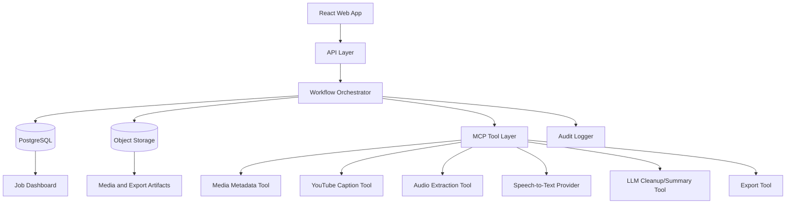

# PRD: Podcast Transcript Agent v1.6 — Handoff-Ready MVP

| | |
|---|---|
| **Status** | Draft v1.6 — MVP built; §25 blocking decisions recorded |
| **Author** | Raja |
| **Original Draft** | v1.0, July 3, 2026 |
| **Updated** | July 9, 2026 — v1.6 records §25 decisions (no owned YouTube channel, same-person approval, 30-day retention) |
| **Audience** | Internal enterprise media/content team, engineering, architecture, security, product, operations |
| **Target Scale** | 1–10 podcast episodes/month, English-only |
| **Primary Channel** | YouTube + direct media upload |
| **MVP Principle** | Build the smallest reliable transcript workflow with human approval, auditability, and export readiness |

---

## 0. Version Change Summary

This v1.6 records the resolved §25 blocking decisions (July 9, 2026): the YouTube channel is **not owned** and OAuth is not available, so caption download/reuse is out of MVP scope (pre-check remains as availability logging only; `fetch_existing_captions`/`parse_captions_to_transcript` stay defined but inactive until an owned channel exists); **same-person approval is allowed** (producer may review and approve their own submission); **media retention is 30 days** after approval. The v1.5 change summary below is retained for history.

This v1.5 keeps the v1.4 MVP scope and closes review gaps found before engineering handoff:

1. Adds `parse_captions_to_transcript` (14.5) and defines null-confidence handling, closing the gap between caption download and transcript versions in the caption-reuse path.
2. Adds a post-approval correction flow (11.4): approved versions are superseded, never edited; `approvals.superseded_by_approval_id` records the chain.
3. Adds `replace_job_media` (14.13) and `cancel_job` (14.14) so the `needs_user_action` and `cancelled` lifecycle states have supporting tool contracts.
4. Moves summary generation parameters (`summary_max_words`, `summary_style`) into `job_config`, consistent with the centralized-configuration rule; `generate_summary` now receives `job_config_id`.
5. Returns jobs to `queued` on STT quota exhaustion instead of leaving them in `transcribing`.
6. Adds manual per-episode effort baseline capture to Phase 0 so the ≥70% effort-reduction outcome is measurable against a recorded baseline.
7. Flags past-due blocking decisions in section 25 per the missed-date rule and resets target dates to July 10, 2026.
8. Preserves sizing, MVP-minimum controls, verified YouTube/Azure assumptions, and the Level 2 drafting boundary.

---

## 1. Executive Summary

The internal media/content team produces podcast episodes, primarily published to YouTube, that require accurate, timestamped, speaker-attributed transcripts for accessibility, SEO, content reuse, and compliance. Today the process is manual or ad hoc. Transcript quality varies, speaker labels are inconsistent, and derived assets such as summaries, chapters, quotes, and show notes are created separately by hand.

The **Podcast Transcript Agent** will automate the review-ready draft creation process while keeping final publication under human control. It will accept a YouTube URL or uploaded media file, check whether reusable official captions exist, transcribe audio when needed, produce raw and clean transcripts, flag low-confidence sections, support human review and approval, and export approved outputs in publishing-ready formats.

This is not an autonomous publishing agent. The MVP is a **Level 2 — Drafting Agent**. Any future caption upload, CMS update, or external publishing action must be **Level 3 — Approval-Gated Execution**.

---

## 2. Problem Statement

The internal media team produces podcast episodes that need reliable transcripts and derived text assets. Current manual workflows create four problems:

1. **Turnaround delay** — transcripts can take days rather than hours.
2. **Quality inconsistency** — speaker attribution, timestamps, and formatting depend on the person doing the work.
3. **Missed repurposing value** — summaries, show notes, quotes, and chapters are often skipped.
4. **Governance risk** — without a standard approval trail, it is hard to prove which transcript was reviewed and published.

At the target scale of 1–10 episodes/month, a lightweight workflow is sufficient. The value is not in heavy infrastructure. The value is in standardizing the intake, transcription, review, approval, export, and audit process.

---

## 3. Business Outcomes

| Outcome | Target | Measurement |
|---|---:|---|
| Faster transcript turnaround | Review-ready draft in under 1 hour for a 60-minute episode, excluding human review | Job timestamps in PostgreSQL |
| Reduced manual effort | ≥70% reduction in manual effort; target ≤30 minutes review time for a 60-minute episode | Phase 0 manual baseline vs. reviewer self-report + job audit |
| Transcript coverage | 100% of new published episodes have transcripts after MVP adoption | Job/export audit |
| Caption cost avoidance | Caption pre-check runs on 100% of YouTube-sourced jobs | Tool audit logs |
| Trust and compliance | Zero unreviewed transcripts published | Approval audit |
| Repurposing lift | At least one summary generated per approved transcript | Artifact records |

---

## 4. Users and Personas

| Persona | Responsibilities | Needs |
|---|---|---|
| Content Producer | Submits episodes, downloads outputs, prepares publishing assets | Simple intake, job status, export-ready files |
| Reviewer/Editor | Reviews transcript, fixes speaker labels, approves final version | Audio-aligned transcript editor, confidence flags, versioning |
| Team Lead | Tracks work-in-progress and approval status | Audit trail, job dashboard, completion metrics |
| System Admin | Manages users, configuration, retention, integration credentials | RBAC, secure configuration, logs, failure visibility |
| Security/Governance Reviewer | Reviews data handling and publishing controls | Access controls, audit logs, retention, approval boundaries |

---

## 5. Agent Scope and Autonomy

### 5.1 What the Agent Does

The agent will:

1. Accept a YouTube URL or direct media upload.
2. Validate media type, duration, and ownership attestation.
3. Extract media metadata.
4. For YouTube-sourced jobs, check whether reusable official captions exist.
5. Download captions when available and authorized.
6. Extract/normalize audio when transcription is needed.
7. Run batch speech-to-text with timestamps, confidence scores, and diarization.
8. Generate raw transcript and clean transcript.
9. Flag low-confidence segments.
10. Run transcript quality checks.
11. Provide a human review and approval workflow.
12. Generate summary from draft or approved transcript.
13. Export approved transcript artifacts in supported formats.
14. Record audit events for all important actions.

### 5.2 What the Agent Does Not Do in MVP

The MVP will not:

1. Publish captions directly to YouTube.
2. Create or update CMS/blog pages.
3. Generate video clips.
4. Transcribe live streams in real time.
5. Support non-English transcription.
6. Support Vimeo, Spotify, Apple Podcasts, or other connectors.
7. Process content without ownership/licensing attestation.
8. Auto-apply inferred speaker names without reviewer confirmation.
9. Present low-confidence text as reliable.

### 5.3 Autonomy Level

| Workflow Area | Autonomy Level | Rationale |
|---|---|---|
| Intake validation | Level 2 — Drafting/System Processing | Low-risk validation, no external write |
| Transcription and normalization | Level 2 — Drafting | Generates draft artifacts only |
| Summary generation | Level 2 — Drafting | Derived content must remain editable/reviewable |
| Transcript approval | Human-owned | Approval must be explicit and logged |
| Export generation | Level 2 — Drafting | Export files generated from approved version only |
| YouTube/CMS publishing | Level 3 — Approval-Gated Execution, future only | External/public write requires explicit approval |

**Decision:** MVP remains **Level 2 — Drafting** end-to-end.

---

## 6. Goals

1. **Reduce transcript turnaround from days to under 1 hour** of elapsed time per 60-minute episode, excluding human review.
2. **Cut human effort per episode by at least 70%**, shifting work from transcription to review/editing.
3. **Ensure 100% transcript coverage** for new published episodes after MVP adoption.
4. **Avoid redundant transcription cost** by checking owned-channel YouTube captions before transcription.
5. **Require human review before final transcript export or publication use.**
6. **Create a durable audit trail** for job status, transcript versions, approvals, exports, and failures.
7. **Generate useful derived assets** without introducing unsupported claims.

---

## 7. Non-Goals

1. **Autonomous publishing.** Direct caption publishing, CMS updates, and public content writes are deferred to a future approval-gated phase.
2. **Non-English support.** v1 is English-only. The architecture should keep language as an explicit parameter to avoid future rework.
3. **Real-time transcription.** Batch-only.
4. **Multi-platform connector buildout.** YouTube and direct upload only.
5. **Automated video clipping.** Text outputs only.
6. **Large-scale multi-tenant platform.** Target scale does not justify heavy multi-tenant infrastructure.
7. **Fully automated editorial judgment.** The agent can suggest summaries, quotes, chapters, and names; the human owns final approval.

---

## 8. MVP Cut Line

### MVP Must Include

1. YouTube URL intake.
2. Direct upload intake for common audio/video formats.
3. Ownership/licensing attestation during submission.
4. Media metadata extraction.
5. YouTube caption pre-check for official captions where authorized.
6. Audio extraction and normalization.
7. Batch transcription with timestamps and diarization.
8. Segment-level confidence scores.
9. Raw transcript.
10. Clean transcript with documented cleanup policy.
11. Low-confidence flags.
12. Minimal review UI.
13. Speaker relabeling.
14. Approval action with immutable approved version.
15. Export to `.txt`, `.md`, `.srt`, and `.vtt`.
16. Short summary generation.
17. Job status and audit log.

### MVP Should Defer

1. `.docx` export.
2. Show notes/blog draft.
3. Key quote extraction.
4. Chapter markers.
5. Teams notifications.
6. Speaker name suggestions.
7. Auto-publish to YouTube.
8. CMS integration.
9. Historical backfill.

**Rationale:** The first product proof is not feature breadth. It is one episode processed from intake to approved export with quality, auditability, and clear failure behavior.

---

## 9. User Stories

Ordered by MVP priority.

1. As a **content producer**, I want to submit a YouTube URL or upload a media file so that a transcript job starts without manual file handling.
2. As a **content producer**, I want to confirm ownership/licensing at submission so that the team does not process unauthorized content.
3. As a **content producer**, I want the agent to check whether official captions already exist so that we avoid unnecessary transcription cost where reuse is allowed.
4. As a **content producer**, I want a timestamped, speaker-labeled transcript so that I can navigate the episode and attribute quotes correctly.
5. As a **reviewer**, I want low-confidence sections highlighted so that I focus review effort where the transcript is most likely wrong.
6. As a **reviewer**, I want to edit transcript text and speaker labels before approval.
7. As a **reviewer**, I want to approve a transcript and create an immutable approved version.
8. As a **content producer**, I want raw and clean transcript versions so that we retain ground truth and have a publishable version.
9. As a **content producer**, I want to export approved transcripts in `.txt`, `.md`, `.srt`, and `.vtt`.
10. As a **team lead**, I want job status and approval audit logs so that I can see what is in flight and who approved what.
11. As a **reviewer**, I want failures to be explicit and actionable rather than silent.
12. As a **content producer**, I want a short transcript-grounded summary that I can edit before use.

---

## 10. Functional Requirements

### P0 — MVP Requirements

#### R1. Media Intake

- Accept YouTube URL and direct upload.
- Supported formats: `mp3`, `m4a`, `wav`, `mp4`, `mov`.
- Reject unsupported formats with a specific error.
- Require ownership/licensing attestation checkbox.

**Acceptance Criteria**

- Given a valid YouTube URL, when submitted, then a job record is created within 30 seconds.
- Given a supported uploaded file, when submitted, then media metadata is extracted and the job enters `queued` state.
- Given an unsupported file type, when submitted, then the user receives a specific rejection reason.
- Given no ownership attestation, when submitted, then the job is not created.

#### R2. Caption Pre-Check

- For YouTube jobs, check for existing official caption tracks before transcription.
- Treat official captions as reusable only when the channel is owned/authorized and captions are downloadable.
- Treat auto-generated captions as unavailable for reuse unless a future policy explicitly permits them.
- **Scope note (July 9, 2026):** the team does not own the target channel and has no OAuth authorization, so caption download/reuse cannot activate in MVP. The pre-check runs for availability logging and cost-signal purposes only; all jobs proceed to transcription.

**Acceptance Criteria**

- Given an owned-channel video with official captions, when submitted, then the user is offered caption reuse before transcription starts.
- Given a third-party/public video without owned-channel authorization, when submitted, then caption download is not attempted and the job proceeds only if ownership policy allows transcription.
- Caption pre-check result is audit-logged.

#### R3. Audio Extraction and Normalization

- Extract audio from video files.
- Normalize to a transcription-compatible format.
- Record duration, channels, codec, sample rate, and extraction status.

**Acceptance Criteria**

- Given an `mp4` or `mov`, when extraction runs, then an audio artifact is created.
- Given a video with no audio track, when extraction runs, then the job enters `needs_user_action` if the producer can replace the media; otherwise it fails with `NO_AUDIO_TRACK`.
- Extraction output is stored in temporary artifact storage with retention policy.

#### R4. Transcription with Diarization and Timestamps

- Run batch speech-to-text with diarization enabled.
- Output transcript segments with start/end timestamps, speaker labels, text, and confidence.

**Acceptance Criteria**

- Given a 60-minute two-speaker episode with clean speech, when transcribed, then output contains timestamped segments with at least two speaker labels.
- Segment records include start time, end time, text, speaker label, and confidence score.
- On the benchmark set, clean-speech word error rate target is ≤10% after provider selection.

#### R5. Confidence Flagging

- Flag segments below configurable threshold.
- Default threshold: `0.80`.
- Surface flags in review UI and quality summary.
- Segments without provider confidence (caption-derived transcripts) are exempt from threshold flagging; the quality report marks the transcript `confidence_unavailable` and the review UI shows a caption-origin notice.

**Acceptance Criteria**

- Given a segment with confidence below threshold, then it is visibly marked in the review UI.
- Low-confidence segments are counted in the job quality summary.
- Low-confidence text is never presented as fully reliable.
- Given a caption-derived transcript, then the review UI displays a caption-origin notice and the quality report records `confidence_unavailable`.

#### R6. Raw and Clean Transcript Generation

- Raw transcript preserves STT text, fillers, timestamps, and speaker labels.
- Clean transcript removes fillers and minor disfluencies based on a documented cleanup policy.
- Clean transcript must not paraphrase, summarize, or change meaning.

**Acceptance Criteria**

- Raw transcript remains immutable after generation except through versioned review edits.
- Clean transcript preserves timestamps and speaker labels.
- Cleanup changes are limited to allowed disfluency edits.

#### R7. Human Review and Approval

- Provide minimal web review UI with audio playback and transcript editing.
- Reviewer can edit text, relabel speakers, assign real names, and approve.
- Approval creates immutable approved transcript version.

**Acceptance Criteria**

- Given a draft transcript, when reviewer approves it, then approved version is immutable and timestamped.
- Approval records reviewer identity, timestamp, transcript version, and job ID.
- Exports are generated only from approved version.

#### R8. Export Generation

- Generate `.txt`, `.md`, `.srt`, and `.vtt` from approved transcript.
- `.docx` is deferred unless required by pilot users.

**Acceptance Criteria**

- Given an approved transcript, when exported to `.srt` or `.vtt`, then the file passes format validation.
- Given no approved transcript, when export is requested, then export is blocked with a clear message.
- Export artifacts are versioned and linked to the approved transcript version.

#### R9. Job Tracking and Audit

- Track job status using the canonical lifecycle enum: `submitted`, `queued`, `validating`, `metadata_extracted`, `caption_checked`, `needs_user_action`, `extracting_audio`, `transcribing`, `normalizing`, `quality_checking`, `drafted`, `in_review`, `approved`, `exported`, `failed`, `cancelled`.
- Use `needs_user_action` when the job can resume after corrected input, authorization, replacement media, or reviewer/admin decision.
- Use `failed` only for terminal failures that cannot continue without a new job or engineering/admin intervention.
- Record status transitions and tool executions.

**Acceptance Criteria**

- Given any job, when viewed, then current status, history, and errors are visible.
- Every tool call creates an audit event.
- Approval and export events are traceable to user identity.

#### R10. Summary Generation

- Generate an editable short summary, target ≤150 words.
- Summary must be grounded only in transcript content.
- Summary can be generated from draft transcript but should be regenerated or reconfirmed after approval.

**Acceptance Criteria**

- Given a transcript, when summary is generated, then the summary includes no claims absent from the transcript.
- Summary is editable before use.
- Summary generation records source transcript version.

### P1 — Fast Follows

1. Chapter markers with timestamps.
2. Key quote extraction with verbatim matching.
3. Show-notes/blog draft.
4. Speaker name suggestions.
5. Teams notifications for `in_review` and `failed` states.
6. `.docx` export.

### P2 — Future Considerations

1. Approval-gated YouTube caption publishing.
2. CMS draft creation.
3. Multi-language transcription.
4. Translation.
5. Historical backfill mode.
6. Batch processing.
7. Advanced analytics on review effort and transcript quality.

---

## 11. Workflow Design

### 11.1 MVP Workflow

1. Producer submits YouTube URL or uploads file.
2. Producer confirms ownership/licensing attestation.
3. Agent creates job record.
4. Agent extracts media metadata.
5. For YouTube source, agent checks for official captions.
6. If authorized official captions exist, producer chooses reuse or fresh transcription.
7. If caption reuse is chosen, agent downloads captions and parses them into a raw transcript version. Caption-derived segments carry no confidence scores; the job is marked `confidence_unavailable` and proceeds directly to normalization (step 12).
8. If transcription is required, agent extracts/normalizes audio.
9. Agent submits audio to speech-to-text provider.
10. Agent receives diarized transcript segments with timestamps and confidence.
11. Agent generates raw transcript.
12. Agent generates clean transcript using cleanup policy.
13. Agent runs quality checks.
14. Job enters `in_review`.
15. Reviewer edits transcript and speaker labels.
16. Reviewer approves transcript.
17. Agent generates approved exports.
18. Producer manually uploads caption file to YouTube or uses transcript in downstream workflows.

### 11.2 Exception Workflow

1. Tool failure occurs.
2. Orchestrator records structured error.
3. Job status changes to `failed` or `needs_user_action`.
4. User sees actionable error message.
5. Retry is allowed only for retryable failures.
6. Permanent failures require corrected input or admin action.

### 11.3 Human Approval Boundaries

Human approval is required for:

1. Final transcript approval.
2. Speaker real-name assignment.
3. Any future external publishing action.
4. Any future CMS/blog creation action.
5. Any exception override involving ownership, privacy, or content policy.

### 11.4 Post-Approval Correction

Approved transcript versions are immutable and are never edited in place. If an error is found after approval:

1. Reviewer reopens the job; status returns to `in_review`.
2. A new `reviewed` version is created from the approved version.
3. Reviewer approves again, creating a new approved version.
4. The prior approval record is retained; `approvals.superseded_by_approval_id` links it to the superseding approval.
5. Exports are regenerated from the new approved version; prior export artifacts remain linked to the superseded version for audit.

---

## 12. Architecture View

### 12.1 Logical Architecture



### 12.2 Component Responsibilities

| Component | Responsibility |
|---|---|
| React Web App | Submission, job list, review UI, speaker relabeling, approval, export download |
| API Layer | Auth enforcement, request validation, job API, artifact API |
| Workflow Orchestrator | State transitions, tool sequencing, retry handling, failure handling |
| MCP Tool Layer | Standard tool contracts for media, captions, transcription, normalization, quality, export |
| PostgreSQL | Jobs, transcript versions, segments, approvals, exports, audit events |
| Object Storage | Uploaded media, extracted audio, generated export files |
| Speech-to-Text Provider | Batch transcription, diarization, confidence scoring |
| LLM Layer | Cleanup, summary, future chapters/quotes/show notes |
| Audit Logger | Immutable action trail for tool calls, approvals, errors, exports |

### 12.3 Model Selection Guidance

| Task | Model Class | Notes |
|---|---|---|
| Transcription | Speech-to-text model with diarization | Accuracy and diarization quality matter more than LLM capability |
| Cleanup | Low/mid-cost LLM with strict transformation rules | Must not paraphrase or change meaning |
| Summary | Mid-tier summarization model | Must cite/source transcript version internally |
| Quote extraction | Mid-tier model + deterministic verbatim matcher | Quotes must be validated against transcript text |
| Metadata formatting | Low-cost model or deterministic code | Prefer code when possible |
| Tool orchestration | Deterministic workflow/state machine | Avoid letting model decide high-risk state transitions |

---

## 13. Data and Knowledge Model

### 13.1 Data Domains and Authoritative Sources

| Data Domain | Authoritative Source | Type | Notes |
|---|---|---|---|
| Source media | Uploaded file or YouTube source | Original source | May be deleted after retention window |
| Media metadata | Metadata extraction tool | Derived | Recomputable from source media |
| Existing captions | YouTube caption source, if authorized | External source | Reusable only when owned/authorized |
| Audio artifact | Audio extraction tool | Derived | Temporary processing artifact |
| Raw transcript | STT provider output or parsed official captions | Derived from audio/captions | Preserved as initial generated version |
| Clean transcript | Normalization tool | Derived | Must preserve meaning |
| Reviewed transcript | Reviewer edits | Human-curated | Editable until approval |
| Approved transcript | Reviewer approval record | Durable record | Official internal transcript source of truth |
| Summary | LLM output | Derived | Must reference source transcript version |
| Quality report | Quality check tool | Derived control artifact | Must reference transcript version and job config snapshot |
| Export files | Export tool | Derived from approved transcript | Regenerable |
| Audit trail | PostgreSQL audit table | Durable control record | Append-only recommended |

### 13.2 Source-of-Truth Rules

1. The **approved transcript version** is the source of truth for exports.
2. Raw transcript is preserved for traceability but is not official.
3. Clean transcript is a derived readability version and must not override raw meaning.
4. Summaries, chapters, quotes, and show notes are derived assets.
5. Export files are generated artifacts and are regenerated whenever a new approved version supersedes the prior one (see 11.4).
6. Object storage contains artifacts; PostgreSQL contains state, metadata, configuration snapshots, quality reports, summaries, and audit.
7. Job-level configuration is snapshotted before processing begins; tools read configuration from the job record rather than accepting independent threshold values.

### 13.3 Suggested Relational Data Model

#### `jobs`

| Field | Type | Notes |
|---|---|---|
| `job_id` | UUID | Primary key |
| `source_type` | enum | `youtube`, `upload` |
| `source_uri` | text | YouTube URL or object storage URI |
| `status` | enum | Current job status |
| `submitted_by` | text | User ID |
| `ownership_attested` | boolean | Required for processing |
| `language` | text | Default `en` |
| `job_config_id` | UUID nullable | FK to `job_config`; created during validation |
| `duration_seconds` | integer | From metadata |
| `created_at` | timestamp | Submission time |
| `updated_at` | timestamp | Last state update |

**Canonical status enum**

```text
submitted
queued
validating
metadata_extracted
caption_checked
needs_user_action
extracting_audio
transcribing
normalizing
quality_checking
drafted
in_review
approved
exported
failed
cancelled
```

#### `job_config`

| Field | Type | Notes |
|---|---|---|
| `job_config_id` | UUID | Primary key |
| `job_id` | UUID | FK to jobs |
| `language` | text | Default `en` |
| `confidence_threshold` | decimal | Default `0.80`; single source for confidence flagging |
| `enable_diarization` | boolean | Default `true` |
| `expected_speaker_count` | integer nullable | Optional reviewer/producer hint |
| `style_policy_id` | text | Default `default-clean-v1` |
| `summary_max_words` | integer | Default `150` |
| `summary_style` | text | Default `neutral-professional` |
| `stt_provider` | text | Provider selected for job |
| `stt_model` | text nullable | Provider model/deployment identifier |
| `max_duration_seconds` | integer nullable | MVP guardrail; admin override allowed |
| `created_by` | text | User/system that created config snapshot |
| `created_at` | timestamp | Config snapshot creation time |

**Configuration rule:** `confidence_threshold` is stored once in `job_config` and read by both `transcribe_audio` and `quality_check_transcript`. Tools must not accept independent threshold values unless an admin creates a new job configuration snapshot.

**Handoff consistency check:**

- `needs_user_action` is a valid lifecycle state, not an error string.
- `summary_id` returned by `generate_summary` must persist in `summaries`.
- `quality_report_id` returned by `quality_check_transcript` must persist in `quality_reports`.
- `confidence_threshold` must be read from `job_config`; it must not be duplicated in individual tool inputs.
- `style_policy_id` must be read from `job_config`; `normalize_transcript` must receive `job_config_id`, not a standalone `style_policy_id`.
- `summary_max_words` and `summary_style` must be read from `job_config`; `generate_summary` must receive `job_config_id`, not standalone values.
- Any exception path that can be corrected by the user/admin should use `needs_user_action`; terminal or unrecoverable paths should use `failed`.
- Approved versions are never edited; corrections follow the supersede flow in 11.4 and set `approvals.superseded_by_approval_id`.

#### `media_artifacts`

| Field | Type | Notes |
|---|---|---|
| `artifact_id` | UUID | Primary key |
| `job_id` | UUID | FK to jobs |
| `artifact_type` | enum | `source_media`, `audio_extract`, `caption_source`, `export` |
| `uri` | text | Object storage URI |
| `mime_type` | text | File type |
| `size_bytes` | bigint | Size |
| `retention_until` | timestamp | Deletion date |
| `created_at` | timestamp | Created time |

#### `transcript_versions`

| Field | Type | Notes |
|---|---|---|
| `transcript_version_id` | UUID | Primary key |
| `job_id` | UUID | FK to jobs |
| `version_type` | enum | `raw`, `clean`, `reviewed`, `approved` |
| `source_version_id` | UUID nullable | For derived versions |
| `created_by` | text | Tool or user ID |
| `is_immutable` | boolean | True for approved version |
| `created_at` | timestamp | Created time |

#### `transcript_segments`

| Field | Type | Notes |
|---|---|---|
| `segment_id` | UUID | Primary key |
| `transcript_version_id` | UUID | FK to transcript version |
| `start_ms` | integer | Start timestamp |
| `end_ms` | integer | End timestamp |
| `speaker_label` | text | `Speaker 1`, `Speaker 2`, or assigned name |
| `text` | text | Segment text |
| `confidence` | decimal nullable | Provider confidence |
| `flags` | jsonb | Low-confidence, unclear, overlap, etc. |

#### `summaries`

| Field | Type | Notes |
|---|---|---|
| `summary_id` | UUID | Primary key |
| `job_id` | UUID | FK to jobs |
| `source_transcript_version_id` | UUID | FK to transcript_versions |
| `text` | text | Summary content |
| `validation_status` | enum | `passed`, `needs_review`, `failed` |
| `validation_notes` | text nullable | Unsupported-claim or grounding concerns |
| `created_by` | text | Tool/user ID |
| `created_at` | timestamp | Created time |
| `updated_at` | timestamp nullable | Last edited time |

#### `quality_reports`

| Field | Type | Notes |
|---|---|---|
| `quality_report_id` | UUID | Primary key |
| `job_id` | UUID | FK to jobs |
| `transcript_version_id` | UUID | FK to transcript_versions |
| `job_config_id` | UUID | FK to job_config used during check |
| `confidence_threshold` | decimal | Threshold value used from job config snapshot |
| `quality_score` | decimal nullable | Composite score if enabled |
| `average_confidence` | decimal nullable | Provider confidence average |
| `low_confidence_segment_count` | integer | Count below threshold |
| `coverage_gap_seconds` | integer | Transcript/audio coverage gap |
| `timestamp_gap_count` | integer | Number of timestamp discontinuities |
| `diarization_warning_count` | integer | Speaker/sanity warnings |
| `issue_summary_json` | jsonb | Detailed issues and severities |
| `created_at` | timestamp | Created time |

#### `approvals`

| Field | Type | Notes |
|---|---|---|
| `approval_id` | UUID | Primary key |
| `job_id` | UUID | FK to jobs |
| `approved_transcript_version_id` | UUID | FK to transcript_versions |
| `approved_by` | text | Reviewer ID |
| `approved_at` | timestamp | Approval time |
| `approval_note` | text nullable | Optional note |
| `superseded_by_approval_id` | UUID nullable | Set when a later approval supersedes this one (see 11.4) |

#### `audit_events`

| Field | Type | Notes |
|---|---|---|
| `audit_event_id` | UUID | Primary key |
| `job_id` | UUID nullable | Related job |
| `actor_type` | enum | `user`, `system`, `tool` |
| `actor_id` | text | User/tool/service ID |
| `event_type` | text | Tool call, status change, approval, export, error |
| `event_payload` | jsonb | Structured event details |
| `created_at` | timestamp | Event time |

---

## 14. MCP-Style Tool Contracts

### Contract Standards

Every tool must:

1. Validate input.
2. Return structured output.
3. Return structured errors.
4. Emit an audit event.
5. Enforce permissions.
6. Avoid durable external writes unless explicitly approval-gated.
7. Never hide low-confidence or partial results.
8. Read job-level configuration from `job_config` instead of accepting duplicate configuration values in tool-specific input contracts.

**Shared configuration:** `confidence_threshold`, `enable_diarization`, `expected_speaker_count`, `language`, `style_policy_id`, `summary_max_words`, `summary_style`, and provider selection are captured in `job_config` before processing. Any change requires a new config snapshot and audit event.

### 14.1 `submit_media_job`

**Purpose**  
Create a transcript job from a YouTube URL or uploaded media artifact.

**Input Contract**

```json
{
  "source_type": "youtube | upload",
  "source_uri": "string",
  "language": "en",
  "submitted_by": "user_id",
  "ownership_attested": true
}
```

**Output Contract**

```json
{
  "job_id": "uuid",
  "status": "submitted",
  "created_at": "timestamp"
}
```

**Permissions**

- Producer, reviewer, team lead, admin can submit.
- Ownership attestation is mandatory.

**Failure Handling**

| Error | Handling |
|---|---|
| `OWNERSHIP_ATTESTATION_MISSING` | Reject job creation |
| `UNSUPPORTED_SOURCE_TYPE` | Reject with clear message |
| `INVALID_SOURCE_URI` | Reject with validation message |

**Audit Record**

- `job.submitted`
- Includes user ID, source type, source URI hash, language, attestation flag.

---

### 14.2 `get_media_metadata`

**Purpose**  
Extract duration, format, audio-track presence, and basic media properties.

**Input Contract**

```json
{
  "job_id": "uuid",
  "source_uri": "string",
  "source_type": "youtube | upload"
}
```

**Output Contract**

```json
{
  "job_id": "uuid",
  "duration_seconds": 3600,
  "format": "mp4",
  "audio_tracks": 1,
  "video_tracks": 1,
  "codec": "string",
  "sample_rate_hz": 48000,
  "captions_possible": true
}
```

**Permissions**

- Read source media metadata.
- No external write.

**Failure Handling**

| Error | Handling |
|---|---|
| `MEDIA_NOT_FOUND` | Set `needs_user_action` if the user can provide a replacement URL/file; otherwise `failed` |
| `UNSUPPORTED_FORMAT` | Set `needs_user_action` with supported-format guidance |
| `NO_AUDIO_TRACK` | Set `needs_user_action` if the user can replace/re-upload media; otherwise set `failed` |
| `METADATA_TIMEOUT` | Retry once, then set `failed` and alert admin if repeated |

**Audit Record**

- `tool.get_media_metadata.completed` or `tool.get_media_metadata.failed`

---

### 14.3 `check_youtube_captions`

**Purpose**  
Check whether reusable official captions exist for a YouTube-sourced job.

**Input Contract**

```json
{
  "job_id": "uuid",
  "youtube_video_id": "string",
  "language": "en",
  "requesting_user": "user_id"
}
```

**Output Contract**

```json
{
  "job_id": "uuid",
  "official_captions_found": true,
  "auto_captions_found": true,
  "download_authorized": true,
  "caption_tracks": [
    {
      "caption_track_id": "string",
      "language": "en",
      "caption_type": "official | auto_generated",
      "downloadable": true
    }
  ]
}
```

**Permissions**

- Requires YouTube read/caption metadata scope where available.
- Caption download is allowed only for authorized/owned channel content.

**Failure Handling**

| Error | Handling |
|---|---|
| `YOUTUBE_AUTH_REQUIRED` | Continue to transcription or ask admin to connect channel |
| `VIDEO_NOT_OWNED` | Do not download captions; proceed only if ownership policy allows transcription |
| `CAPTION_API_UNAVAILABLE` | Retry; if still failing, proceed to transcription with warning |

**Audit Record**

- `tool.check_youtube_captions.completed`
- Includes video ID hash, caption availability, authorization status.

**Verified API Notes — July 2026**

- `captions.list` returns caption-track metadata only; it does not return actual caption text.
- `captions.download` is required to retrieve caption text.
- `captions.download` requires permission to edit the video and authorized OAuth scope such as `youtube.force-ssl` or `youtubepartner`.
- Quota planning baseline: `captions.list` costs 50 units; `captions.download` costs 200 units; future `captions.insert` publishing costs 400 units.
- Design implication: caption reuse is feasible only for owned/authorized channel content; third-party/public videos should fall back to transcription unless separate licensed access exists.

---

### 14.4 `fetch_existing_captions`

**Purpose**  
Download authorized official captions for reuse.

**Input Contract**

```json
{
  "job_id": "uuid",
  "caption_track_id": "string",
  "format": "vtt | srt | text",
  "requested_by": "user_id"
}
```

**Output Contract**

```json
{
  "job_id": "uuid",
  "caption_artifact_uri": "string",
  "format": "vtt",
  "segment_count": 500,
  "duration_seconds": 3600
}
```

**Permissions**

- Requires authorized caption download permission.
- No public write.

**Failure Handling**

| Error | Handling |
|---|---|
| `CAPTION_DOWNLOAD_UNAUTHORIZED` | Fall back to transcription |
| `CAPTION_TRACK_NOT_FOUND` | Fall back to transcription |
| `CAPTION_FORMAT_UNSUPPORTED` | Convert if possible; otherwise fall back |

**Audit Record**

- `tool.fetch_existing_captions.completed` or `tool.fetch_existing_captions.failed`

---

### 14.5 `parse_captions_to_transcript`

**Purpose**  
Parse a downloaded official caption artifact into a raw transcript version so the caption-reuse path produces the same transcript structures as the transcription path.

**Input Contract**

```json
{
  "job_id": "uuid",
  "caption_artifact_uri": "string",
  "job_config_id": "uuid"
}
```

**Output Contract**

```json
{
  "job_id": "uuid",
  "transcript_version_id": "uuid",
  "segment_count": 500,
  "confidence_available": false,
  "speaker_labels_available": false
}
```

**Behavior rules**

- Caption-derived segments store `confidence` as null; threshold-based flagging is skipped and the quality report marks the transcript `confidence_unavailable`.
- `speaker_label` defaults to `Speaker 1` unless the caption format carries speaker cues; the review UI shows a caption-origin notice so the reviewer knows diarization did not run.
- The resulting version is `version_type = raw`; normalization, quality check, review, and approval apply unchanged.

**Permissions**

- Read caption artifact.
- Write raw transcript version.
- No external write.

**Failure Handling**

| Error | Handling |
|---|---|
| `CAPTION_PARSE_FAILED` | Fall back to transcription |
| `CAPTION_EMPTY_OR_TRUNCATED` | Fall back to transcription with warning |
| `TIMESTAMP_INVALID` | Attempt repair; otherwise fall back to transcription |

**Audit Record**

- `tool.parse_captions_to_transcript.completed` or `tool.parse_captions_to_transcript.failed`
- Includes caption artifact ID, transcript version ID, segment count.

---

### 14.6 `extract_audio`

**Purpose**  
Extract normalized audio artifact from uploaded media or YouTube source.

**Input Contract**

```json
{
  "job_id": "uuid",
  "source_artifact_uri": "string",
  "target_format": "wav",
  "target_sample_rate_hz": 16000
}
```

**Output Contract**

```json
{
  "job_id": "uuid",
  "audio_artifact_uri": "string",
  "duration_seconds": 3600,
  "format": "wav",
  "sample_rate_hz": 16000,
  "channels": 1
}
```

**Permissions**

- Read source artifact.
- Write temporary audio artifact to object storage.

**Failure Handling**

| Error | Handling |
|---|---|
| `NO_AUDIO_TRACK` | Set `needs_user_action` if replacement/re-upload is possible; otherwise set `failed` |
| `EXTRACTION_FAILED` | Retry once with safe fallback settings |
| `ARTIFACT_WRITE_FAILED` | Retry; alert if storage issue persists |

**Audit Record**

- `tool.extract_audio.completed`
- Includes artifact ID, duration, format, retention date.

---

### 14.7 `transcribe_audio`

**Purpose**  
Run batch transcription with timestamps, diarization, and confidence scores.

**Input Contract**

```json
{
  "job_id": "uuid",
  "audio_artifact_uri": "string",
  "job_config_id": "uuid"
}
```

**Output Contract**

```json
{
  "job_id": "uuid",
  "transcript_version_id": "uuid",
  "segments": [
    {
      "start_ms": 0,
      "end_ms": 4200,
      "speaker_label": "Speaker 1",
      "text": "Welcome to the podcast.",
      "confidence": 0.93
    }
  ],
  "provider_metadata": {
    "provider": "string",
    "model": "string",
    "request_id": "string"
  },
  "config_used": {
    "job_config_id": "uuid",
    "language": "en",
    "enable_diarization": true,
    "expected_speaker_count": null,
    "confidence_threshold": 0.8
  }
}
```

**Permissions**

- Read temporary audio artifact.
- Send audio to approved STT provider.
- Write raw transcript version.

**Failure Handling**

| Error | Handling |
|---|---|
| `STT_PROVIDER_TIMEOUT` | Retry with backoff |
| `STT_PROVIDER_QUOTA_EXCEEDED` | Return job to `queued`; pause queue; alert admin |
| `LANGUAGE_UNSUPPORTED` | Fail job with clear message |
| `DIARIZATION_UNAVAILABLE` | Continue transcription but flag diarization unavailable |

**Audit Record**

- `tool.transcribe_audio.completed`
- Includes provider, model, request ID, duration, segment count, job config ID, and low-confidence count based on the configured threshold.

---

### 14.8 `normalize_transcript`

**Purpose**  
Create clean transcript from raw transcript according to documented cleanup policy.

**Input Contract**

```json
{
  "job_id": "uuid",
  "source_transcript_version_id": "uuid",
  "job_config_id": "uuid",
  "preserve_timestamps": true,
  "preserve_speaker_labels": true
}
```

**Output Contract**

```json
{
  "job_id": "uuid",
  "clean_transcript_version_id": "uuid",
  "style_policy_id_used": "default-clean-v1",
  "change_summary": {
    "segments_processed": 500,
    "filler_words_removed": 320,
    "meaning_change_detected": false
  }
}
```

**Permissions**

- Read raw transcript.
- Write clean transcript version.
- No external write.

**Failure Handling**

| Error | Handling |
|---|---|
| `STYLE_POLICY_NOT_FOUND` | Fail normalization; raw transcript remains available; requires corrected `job_config` snapshot |
| `MEANING_CHANGE_RISK` | Flag for human review; do not auto-approve clean transcript |
| `LLM_OUTPUT_INVALID` | Retry once; otherwise fail normalization only |

**Audit Record**

- `tool.normalize_transcript.completed`
- Includes source version, clean version, job config ID, and style policy ID used from `job_config`.

---

### 14.9 `quality_check_transcript`

**Purpose**  
Check transcript completeness, timestamp coverage, confidence distribution, diarization sanity, and export readiness.

**Input Contract**

```json
{
  "job_id": "uuid",
  "transcript_version_id": "uuid",
  "audio_duration_seconds": 3600,
  "job_config_id": "uuid"
}
```

**Output Contract**

```json
{
  "job_id": "uuid",
  "quality_report_id": "uuid",
  "quality_score": 0.87,
  "confidence_threshold_used": 0.8,
  "issues": [
    {
      "issue_type": "LOW_CONFIDENCE_SEGMENT",
      "severity": "medium",
      "start_ms": 120000,
      "end_ms": 124000,
      "message": "Segment confidence below threshold."
    }
  ],
  "low_confidence_segment_count": 12,
  "coverage_gap_seconds": 0,
  "speaker_count": 2
}
```

**Permissions**

- Read transcript, job metadata, and `job_config`.
- Write `quality_reports` row with queryable metrics and detailed `issue_summary_json`.

**Failure Handling**

| Error | Handling |
|---|---|
| `TRANSCRIPT_NOT_FOUND` | Fail quality check |
| `DURATION_MISMATCH` | Flag for review |
| `QUALITY_CHECK_FAILED` | Job can still enter review with warning |

**Audit Record**

- `tool.quality_check_transcript.completed`
- Includes quality report ID, job config ID, confidence threshold used, quality score, and issue counts.

---

### 14.10 `approve_transcript`

**Purpose**  
Create immutable approved transcript version after human review.

**Input Contract**

```json
{
  "job_id": "uuid",
  "reviewed_transcript_version_id": "uuid",
  "approved_by": "user_id",
  "approval_note": "string"
}
```

**Output Contract**

```json
{
  "job_id": "uuid",
  "approved_transcript_version_id": "uuid",
  "approved_at": "timestamp",
  "status": "approved"
}
```

**Permissions**

- Reviewer, team lead, or admin.
- Producer may approve only if team policy allows same-person review.

**Failure Handling**

| Error | Handling |
|---|---|
| `USER_NOT_AUTHORIZED` | Block approval |
| `TRANSCRIPT_VERSION_NOT_REVIEWABLE` | Block approval |
| `OPEN_CRITICAL_ISSUES` | Block or require explicit override based on policy |

**Audit Record**

- `transcript.approved`
- Includes reviewer ID, version ID, timestamp, open issue counts.

---

### 14.11 `generate_summary`

**Purpose**  
Generate short transcript-grounded summary.

**Input Contract**

```json
{
  "job_id": "uuid",
  "transcript_version_id": "uuid",
  "job_config_id": "uuid"
}
```

Summary length and style are read from `job_config` (`summary_max_words`, `summary_style`); the tool must not accept independent values.

**Output Contract**

```json
{
  "job_id": "uuid",
  "summary_id": "uuid",
  "summary_text": "string",
  "source_transcript_version_id": "uuid",
  "validation_status": "passed | needs_review",
  "created_at": "timestamp"
}
```

**Permissions**

- Producer, reviewer, team lead, admin.
- No external write.

**Failure Handling**

| Error | Handling |
|---|---|
| `SUMMARY_UNGROUNDED_CLAIM_RISK` | Mark summary as needs review |
| `LLM_PROVIDER_TIMEOUT` | Retry; allow user to regenerate later |
| `TRANSCRIPT_TOO_LONG` | Chunk transcript; summarize with map-reduce workflow |

**Audit Record**

- `tool.generate_summary.completed`
- Includes source transcript version, summary ID, model/provider metadata, validation status.

---

### 14.12 `export_transcript`

**Purpose**  
Generate export artifacts from approved transcript.

**Input Contract**

```json
{
  "job_id": "uuid",
  "approved_transcript_version_id": "uuid",
  "formats": ["txt", "md", "srt", "vtt"]
}
```

**Output Contract**

```json
{
  "job_id": "uuid",
  "exports": [
    {
      "format": "vtt",
      "artifact_uri": "string",
      "validation_status": "passed",
      "created_at": "timestamp"
    }
  ]
}
```

**Permissions**

- Producer, reviewer, team lead, admin.
- Read approved transcript.
- Write export artifact to object storage.

**Failure Handling**

| Error | Handling |
|---|---|
| `APPROVED_TRANSCRIPT_REQUIRED` | Block export |
| `FORMAT_VALIDATION_FAILED` | Return failed format and validation message |
| `ARTIFACT_WRITE_FAILED` | Retry; alert if persistent |

**Audit Record**

- `tool.export_transcript.completed`
- Includes formats, artifact IDs, validation status.

---

### 14.13 `replace_job_media`

**Purpose**  
Replace source media on a job in `needs_user_action` so processing can resume without creating a new job.

**Input Contract**

```json
{
  "job_id": "uuid",
  "source_type": "youtube | upload",
  "source_uri": "string",
  "replaced_by": "user_id",
  "ownership_attested": true
}
```

**Output Contract**

```json
{
  "job_id": "uuid",
  "status": "queued",
  "replaced_at": "timestamp"
}
```

Replacement re-runs validation and metadata extraction from the top of the workflow. Prior artifacts remain in storage under their retention policy and are marked superseded.

**Permissions**

- Original submitter, team lead, or admin.
- Allowed only when the job is in `needs_user_action`.
- Ownership attestation is required again for the replacement media.

**Failure Handling**

| Error | Handling |
|---|---|
| `JOB_NOT_IN_ACTIONABLE_STATE` | Reject with current status |
| `OWNERSHIP_ATTESTATION_MISSING` | Reject replacement |
| `INVALID_SOURCE_URI` | Reject with validation message |

**Audit Record**

- `job.media_replaced`
- Includes user ID, prior and new source URI hashes, attestation flag.

---

### 14.14 `cancel_job`

**Purpose**  
Cancel a job that should not continue processing.

**Input Contract**

```json
{
  "job_id": "uuid",
  "cancelled_by": "user_id",
  "reason": "string"
}
```

**Output Contract**

```json
{
  "job_id": "uuid",
  "status": "cancelled",
  "cancelled_at": "timestamp"
}
```

**Permissions**

- Original submitter, team lead, or admin.
- Not allowed after `approved` except by admin; cancellation never deletes approvals, transcript versions, or audit records.

**Failure Handling**

| Error | Handling |
|---|---|
| `JOB_ALREADY_TERMINAL` | Reject with current status |
| `USER_NOT_AUTHORIZED` | Block cancellation |

**Audit Record**

- `job.cancelled`
- Includes user ID, reason, prior status.

---

### 14.15 `publish_caption_file` — Future, Disabled in MVP

**Purpose**  
Upload approved caption file to YouTube after explicit human approval.

**MVP Status**

- Defined as interface stub only.
- Disabled in production MVP.
- Must not be callable by the agent without approval-gated workflow.

**Input Contract — Future**

```json
{
  "job_id": "uuid",
  "video_id": "string",
  "caption_artifact_uri": "string",
  "format": "srt | vtt",
  "approved_by": "user_id",
  "approval_token": "string"
}
```

**Output Contract — Future**

```json
{
  "job_id": "uuid",
  "publish_status": "submitted | completed | failed",
  "external_caption_id": "string",
  "published_at": "timestamp"
}
```

**Permissions — Future**

- Team lead/admin approval required.
- YouTube caption write scope required.

**Failure Handling — Future**

| Error | Handling |
|---|---|
| `APPROVAL_TOKEN_REQUIRED` | Block publish |
| `YOUTUBE_WRITE_SCOPE_MISSING` | Block publish |
| `CAPTION_UPLOAD_FAILED` | Mark publish failed; transcript remains approved |

**Audit Record — Future**

- `caption.publish.requested`
- `caption.publish.completed` or `caption.publish.failed`

---

## 15. Prompt and Agent Behavior

### 15.1 System Behavior Rules

The agent must:

1. Treat transcript generation as draft work until human approval.
2. Preserve raw transcript as generated evidence.
3. Never silently remove uncertain text.
4. Flag low-confidence segments.
5. Avoid unsupported claims in summaries.
6. Preserve speaker attribution and timestamps during cleanup.
7. Avoid paraphrasing when generating clean transcripts.
8. Make source transcript version visible for every derived asset.
9. Refuse or block processing when ownership attestation is missing.
10. Escalate external publishing to human approval.

### 15.2 Clean Transcript Policy — Initial Draft

Allowed cleanup:

- Remove repeated filler words such as `um`, `uh`, `you know`, `like` when clearly non-semantic.
- Remove obvious false starts where meaning is not changed.
- Fix punctuation and capitalization.
- Split long segments for readability when timestamps remain valid.

Not allowed:

- Changing meaning.
- Reordering statements.
- Adding facts.
- Removing controversial, sensitive, or legally meaningful statements.
- Rewriting the speaker's intent in polished marketing language.

### 15.3 Summary Rules

The summary must:

1. Be based only on transcript content.
2. Avoid claims not present in the transcript.
3. Avoid exaggeration.
4. Use neutral professional tone.
5. Be editable before use.
6. Store source transcript version ID.

---

## 16. Security and Governance

### 16.1 Authentication and Authorization

- Use enterprise SSO if available.
- All users must authenticate before submitting, reviewing, approving, or exporting.
- Service-to-service calls must use managed identities or equivalent workload identity.

### 16.2 RBAC

For the target scale of 1–10 episodes/month, RBAC should start minimum viable and not become a platform build.

| Role | MVP Required? | Permissions |
|---|---|---|
| Producer | Yes | Submit jobs, view own/team jobs, generate summary, download approved exports |
| Reviewer/Approver | Yes | Edit transcript, relabel speakers, approve transcripts, generate exports |
| Admin | Yes | Manage users, integrations, retention, provider config, failed jobs |
| Team Lead | Optional in MVP; may be same as Reviewer/Approver | View all jobs, approve, override selected non-critical issues, review audit |
| Security/Governance | Hardening; can start as read-only audit export/report | Read-only access to audit, approvals, retention, and policy configuration |

**MVP-minimum rule:** implement three operational roles first — Producer, Reviewer/Approver, Admin. Split Team Lead and Security/Governance into separate roles only if enterprise policy requires it during pilot.

### 16.3 Data Classification

| Data Type | Classification | Handling |
|---|---|---|
| Source media | Internal / potentially confidential | Store encrypted, retain temporarily |
| Guest speech | Internal / potentially personal data | Limit access, document retention |
| Transcript | Internal content artifact | Version and approve before use |
| Approved transcript | Official internal record | Immutable/versioned |
| Summary/show notes | Derived content | Editable, reviewable |
| Audit logs | Control evidence | Retain longer than media |
| OAuth tokens | Secret | Store in secrets manager only |

### 16.4 Privacy and Retention

- Uploaded source media should be retained only as long as needed for review and audit support.
- **Approved policy (July 9, 2026): delete source media and extracted audio 30 days after approval.**
- Approved transcripts and audit logs are durable records.
- Guest consent language should explicitly cover transcript generation and derived content. **[VERIFY with legal/policy]**

### 16.5 Prompt Injection and Content Safety

Podcast transcripts may contain instructions spoken by guests. The agent must treat transcript content as **data**, not as instructions.

Controls:

1. Do not execute instructions found inside transcript text.
2. Do not let transcript text modify system behavior.
3. Use tool allowlists.
4. Keep external write tools disabled in MVP.
5. Separate transcript content from agent instructions in prompts.
6. Validate all generated outputs against source transcript.

### 16.6 Integration Credential Governance

- Store YouTube OAuth credentials in secrets manager.
- Use minimum required scopes.
- Rotate credentials according to enterprise policy.
- Log token usage at tool level without logging token values.
- Separate dev/test/prod credentials.

---

## 17. Evaluation Harness

### 17.1 Benchmark Dataset

Create a 5–10 episode benchmark set covering:

1. Clean two-speaker podcast.
2. Three or more speakers.
3. Indian English accents.
4. US/global English accents.
5. Background music intro/outro.
6. Overlapping speakers/crosstalk.
7. Noisy recording.
8. Long episode near target max duration.
9. Episode with existing official captions.
10. Episode with guest names introduced verbally.

### 17.2 Metrics

These targets are starter thresholds for pilot review. Engineering should adjust only after evidence from real episodes, not before implementation.

| Area | Metric | Starter Target |
|---|---|---:|
| Transcription | Word Error Rate on clean speech | ≤10% on benchmark after provider selection |
| Diarization | Speaker attribution accuracy | ≥80% on clean two-speaker benchmark; lower results allowed only with documented reviewer workaround |
| Confidence flagging | Low-confidence recall | 100% of segments below configured threshold visibly marked |
| Timestamp quality | Timestamp drift | ≤2 seconds median drift on clean benchmark; ≤5 seconds maximum tolerated before review flag |
| Cleanup | Meaning preservation | 0 critical meaning changes in spot checks |
| Summary | Unsupported claim rate | 0 critical unsupported claims in pilot checks |
| Export | SRT/VTT validation pass rate | 100% |
| Workflow | Job completion rate without manual intervention | ≥90% |
| Review | Median review time for 60-min episode | ≤30 minutes |
| Governance | Unreviewed published transcripts | 0 |

**Pilot calibration rule:** diarization and timestamp thresholds can be revised after the first 3 real episodes, but any relaxation must be recorded as a product decision with owner, reason, and reviewer impact.

### 17.3 Release Gates

MVP can move from pilot to team adoption only when:

1. At least 3 real episodes are processed end-to-end.
2. Exports pass `.srt` and `.vtt` validation.
3. Reviewer confirms transcript review workload is lower than manual baseline.
4. No transcript is exported without approval.
5. Audit log proves who approved which version.
6. Failure cases are visible and recoverable.
7. Security review accepts retention and OAuth handling.

### 17.4 Regression Tests

Run regression tests when:

1. STT provider/model changes.
2. LLM model changes.
3. Cleanup prompt changes.
4. Export logic changes.
5. Diarization configuration changes.
6. YouTube API integration changes.

---

## 18. Operations and Observability

For MVP, operations should be practical, not overbuilt. A full enterprise observability stack is not required before the first pilot, but the system must expose enough evidence to debug failed jobs, prove approvals, and monitor cost.

**MVP-minimum operations:** application logs, PostgreSQL job/audit records, provider request IDs, basic admin/job dashboard, and alerting for stuck jobs, provider quota failures, export validation failures, and audit logging failures.

**Hardening later:** centralized tracing, full SLO dashboards, automated incident workflows, long-term trend analytics, and multi-team operational reporting.

### 18.1 Logs

Log:

- Job creation.
- Tool start/end/failure.
- Status transitions.
- Provider request IDs.
- Processing duration.
- Segment counts.
- Low-confidence counts.
- Approval actions.
- Export actions.
- Errors and retries.

Do not log:

- OAuth tokens.
- Secrets.
- Full media URLs when sensitive; prefer hashed or redacted values where appropriate.

### 18.2 Metrics

| Metric | Purpose |
|---|---|
| Jobs submitted per month | Adoption |
| Median processing time | SLA tracking |
| Failure rate by tool | Reliability |
| Retry count | Provider/storage stability |
| Average audio duration | Capacity planning |
| Low-confidence segment count | Quality signal |
| Review time | Productivity impact |
| Export validation failures | Publishing readiness |
| STT cost per episode | Cost control |
| LLM cost per episode | Cost control |

### 18.3 Dashboard

MVP dashboard can be a simple admin page backed by PostgreSQL queries. Grafana or a centralized observability platform is useful later, but not required to prove the workflow.

Minimum dashboard:

1. Jobs by status.
2. Jobs failed by failure type.
3. Median time from submission to review-ready.
4. Median time from review-ready to approval.
5. Transcription provider errors.
6. Low-confidence segment distribution.
7. Export validation pass/fail.
8. Monthly processing cost.

### 18.4 Alerts

Alert on:

1. Transcription provider quota exceeded.
2. Object storage write failures.
3. Job stuck in same state longer than threshold.
4. Export validation failures above threshold.
5. Audit logging failure.
6. Unauthorized approval attempt.
7. OAuth credential failure.

### 18.5 Replay and Recovery

- Jobs should be replayable from last durable successful state.
- Audio extraction can be rerun from source media if still retained.
- Transcription can be rerun from audio artifact.
- Exports can be regenerated from approved transcript.
- Approval history must not be overwritten.

---

## 19. Failure Handling Matrix

| Failure | User Message | System Action | Retry? | Owner |
|---|---|---|---|---|
| Unsupported file format | “This file type is not supported.” | Reject submission | No | Producer |
| Missing ownership attestation | “Please confirm ownership/licensing before submission.” | Block job creation | No | Producer |
| Private YouTube video inaccessible | “The video cannot be accessed with current permissions.” | Set `needs_user_action` | No | Producer/Admin |
| No audio track | “No audio track was detected. Please replace the media with an audio-bearing file or confirm cancellation.” | Set `needs_user_action` if replacement is possible; otherwise `failed` | No | Producer |
| Caption check unavailable | “Caption check failed; transcription can continue.” | Proceed with warning | Yes | System/Admin |
| Caption download unauthorized | “Captions cannot be downloaded with current authorization.” | Fall back to transcription | No | Admin |
| Audio extraction failed | “Audio extraction failed.” | Retry once; then fail | Yes | System/Admin |
| STT timeout | “Transcription provider timed out.” | Retry with backoff | Yes | System |
| STT quota exceeded | “Transcription is paused due to provider quota.” | Return job to `queued`; pause queue; alert admin | Later | Admin |
| Diarization unavailable | “Speaker detection was unavailable; transcript needs manual speaker review.” | Continue with warning | No | Reviewer |
| Low transcript confidence | “Some sections require focused review.” | Flag sections | No | Reviewer |
| Summary validation issue | “Summary may contain unsupported content; please review.” | Mark summary needs review | No | Reviewer |
| Export validation failed | “Export file did not pass validation.” | Block export format | Yes after fix | Engineering |
| Audit logging failure | “System control failure. Processing paused.” | Pause high-risk actions | No | Admin/Security |

---

## 20. Cost and Quota Controls

### 20.1 Verified External Cost and Quota Assumptions — July 2026

1. YouTube `captions.list` has a quota cost of 50 units and returns caption-track metadata, not caption text.
2. YouTube `captions.download` has a quota cost of 200 units and requires permission to edit the video.
3. Future YouTube `captions.insert` publishing has a quota cost of 400 units and remains disabled in MVP.
4. Azure Speech batch transcription is billed by audio hours sent to the service, with per-second billing.
5. Azure Speech batch diarization is included in Standard/Custom batch transcription pricing, while real-time diarization is priced as an enhanced add-on.
6. Current Azure price values are region/currency dependent and should be pulled from the official Azure pricing page or internal cloud pricing agreement during implementation. Use a 10-audio-hour/month pilot budget line rather than a fixed global price in the PRD.

### 20.2 Controls

1. Check captions before transcription for YouTube-sourced jobs.
2. Store duration estimate before STT execution.
3. Show estimated processing cost using the region/currency-specific configured price table before transcription starts.
4. Limit maximum file duration for MVP unless admin override is granted.
5. Queue jobs to avoid provider quota spikes.
6. Track STT and LLM cost per job.
7. Use deterministic code instead of LLMs for export formatting.
8. Use lower-cost models for formatting tasks.
9. Use mid-tier models only where semantic judgment is required.

---

## 21. Risks and Mitigations

| Risk | Impact | Mitigation |
|---|---|---|
| Diarization errors | Misattributed quotes | Confidence flags, reviewer relabeling, no auto-trust of speaker labels |
| Overlapping speech | Transcript quality drops | Flag low-confidence/overlap regions for review |
| Existing captions unavailable | Higher STT cost | Fall back to transcription; log reason |
| Unauthorized content processing | Legal/compliance risk | Ownership attestation, access controls, audit |
| Guest privacy concerns | Trust and compliance risk | Consent language, retention policy, access control |
| Hallucinated summary | Reputation risk | Summary validation, human edit, source transcript version linkage |
| Cleanup changes meaning | Content integrity risk | Strict cleanup policy, review, raw transcript preservation |
| Export invalid format | Publishing delay | Automated SRT/VTT validation |
| Provider cost spikes | Budget risk | Quotas, duration limits, cost tracking |
| Workflow scope creep | MVP delay | Enforce MVP cut line |

---

## 22. Sizing and Delivery Estimate

This is a rough engineering estimate for planning. It assumes one small product-engineering squad, existing enterprise SSO/storage patterns, and no custom transcript editor framework beyond MVP needs. The estimate should be revisited after the 3-episode STT bake-off.

| Phase | Scope | T-Shirt Size | Calendar Estimate | Primary Dependencies |
|---|---|---|---|---|
| Phase 0 — Sprint 0 decisions | Confirm YouTube ownership/OAuth, retention, approval role, sample episodes, clean transcript policy; capture manual per-episode effort baseline | S | 2–4 working days | Content/Admin, Security, Legal/Policy |
| Phase 1 — Core processing pipeline | Intake, metadata, caption check, audio extraction, STT, diarization, raw/clean transcript generation | M | 2–3 weeks | STT provider access, object storage, queue/state machine |
| Phase 2 — Review and approval UI | Job list, transcript editor, speaker relabeling, low-confidence flags, approval/versioning | M | 2–3 weeks | UX decisions, transcript data model, reviewer workflow |
| Phase 3 — Exports, evaluation, audit | TXT/MD/SRT/VTT exports, validation, audit events, quality reports, summary generation | S–M | 1–2 weeks | Export validation, LLM provider, benchmark episodes |
| Phase 4 — Pilot hardening | 3 real episodes, bug fixes, operational dashboard, security signoff | S | 1 week | Reviewer availability, security review |

**MVP total estimate:** 5–7 calendar weeks for a small squad.

**Suggested squad:** 1 full-stack engineer, 1 backend/platform engineer, 0.25 product/BA, 0.25 content reviewer/editor, security/governance review part-time.

**Sizing assumptions:**

1. Existing auth, storage, secrets, and database patterns are available.
2. YouTube channel ownership: resolved July 9, 2026 — not owned; caption reuse out of MVP scope.
3. Retention policy: resolved July 9, 2026 — 30 days after approval.
4. No real-time transcription, multi-language support, CMS integration, or auto-publishing enters MVP.
5. The review UI is purpose-built and minimal; it is not a full media-editing product.
6. `.docx`, chapters, quotes, show notes, Teams notifications, and speaker name suggestions remain deferred.

**Risk to estimate:** the transcript review UI is the largest uncertainty. If waveform/audio-synchronized editing becomes sophisticated, add 2–4 weeks or adopt an existing transcript-editor component.

---

## 23. Roadmap

### Phase 1 — MVP: Transcript Workflow

Target scope:

1. R1–R10 from P0.
2. Manual caption upload.
3. One complete episode processed end-to-end.
4. Security and audit baseline.
5. Evaluation harness started with at least 3 pilot episodes.

Success:

- Review-ready transcript generated.
- Reviewer approves transcript.
- `.srt` and `.vtt` exports validate.
- Manual YouTube upload succeeds.
- Audit shows full chain from submission to approval.

### Phase 2 — Content Repurposing

Add:

1. Chapter markers.
2. Key quotes with verbatim validation.
3. Show notes/blog draft.
4. Speaker name suggestions.
5. Teams notifications.
6. `.docx` export if still needed.

### Phase 3 — Approval-Gated Publishing

Add only after at least two months of stable MVP usage:

1. YouTube caption upload with explicit approval.
2. CMS draft creation.
3. Stronger approval workflows.
4. Additional audit and rollback procedures.

### Phase 4 — Scale and Backfill

Add only if demand exists:

1. Historical archive backfill.
2. Batch processing.
3. Multi-language support.
4. Translation.
5. Rich analytics.

---

## 24. Ownership Model

| Area | Owner | Responsibilities |
|---|---|---|
| Business Outcome | Content Team Lead | Adoption, quality expectations, approval policy |
| Product | Product Owner / BA | Requirements, backlog, prioritization |
| Engineering | Engineering Lead | Architecture, implementation, testing, releases |
| Tool/API Integrations | Platform Engineer | YouTube, STT provider, object storage, OAuth |
| Data | Data/Application Owner | Transcript records, retention, source-of-truth rules |
| Security/Governance | Security Partner | RBAC, OAuth scopes, audit, privacy review |
| Operations | Support/Platform Team | Monitoring, incidents, retries, cost tracking |
| Review Quality | Reviewer/Editor Lead | Style policy, approval discipline, feedback loop |

### Review Cadence

- Weekly during MVP build.
- Twice weekly during pilot if actively processing episodes.
- Monthly after stable adoption.
- Post-incident review for any published transcript error or approval bypass.

---

## 25. Open Questions

Blocking questions must have a target resolution date. If the date is missed, the product owner must either cut scope, assign a decision owner, or pause the dependent workstream.

**Status as of July 9, 2026:** three of the four blocking items are RESOLVED (recorded below). The STT provider bake-off remains the only open blocking item.

| Question | Owner | Blocking? | Target Resolution | Notes |
|---|---|---|---|---|
| Is the YouTube channel owned and OAuth-authorizable? | Content/Admin | Yes | **RESOLVED July 9, 2026** | **Decision: not owned, no OAuth.** Caption download/reuse is out of MVP scope; caption pre-check remains as availability logging only. `fetch_existing_captions`/`parse_captions_to_transcript` stay defined but inactive until an owned channel exists. Future auto-publish (Phase 3) is infeasible without channel ownership. |
| Which STT provider should be selected? | Engineering | Yes | July 13, 2026 | Run 3-episode bake-off before final choice; pricing basis captured in section 20 |
| What is the clean transcript style policy? | Content/Reviewer | No | July 8, 2026 | Draft during MVP build |
| Does guest consent cover transcript and derived content? | Legal/Policy | No, but needed before external guests | July 15, 2026 | **[VERIFY]** before processing external guest episodes |
| Who can approve transcripts? | Team Lead | Yes | **RESOLVED July 9, 2026** | **Decision: same person allowed.** A producer may review and approve their own submission (small-team mode). Revisit if the team grows or governance requires separation of duties. |
| What is the media retention window? | Content/Security | Yes | **RESOLVED July 9, 2026** | **Decision: 30 days after approval** for source media and extracted audio. Approved transcripts and audit logs remain durable. |
| What is the maximum episode duration for MVP? | Product/Engineering | No | July 8, 2026 | Helps cost and timeout control |
| Is `.docx` truly required in MVP? | Content Team | No | July 8, 2026 | Recommendation: defer |

---

## 26. Acceptance Criteria Summary

The MVP is accepted when:

1. A producer can submit a YouTube URL or supported file.
2. Ownership attestation is required.
3. Metadata extraction works.
4. YouTube caption pre-check runs for YouTube jobs.
5. Audio extraction works for video uploads.
6. Transcription produces timestamped segments with speaker labels and confidence scores.
7. Low-confidence segments are visible.
8. Raw and clean transcript versions are produced.
9. Reviewer can edit and relabel speakers.
10. Reviewer can approve transcript.
11. Approved transcript is immutable/versioned.
12. `.txt`, `.md`, `.srt`, and `.vtt` exports are generated from approved version only.
13. `.srt` and `.vtt` pass validation.
14. Summary generation is grounded in transcript.
15. Job status and audit trail are visible.
16. Common failures produce actionable messages.
17. No external publishing occurs in MVP.

---

## 27. Recommendation

**Build the MVP, but protect the scope.**

The agent is valuable because it reduces manual transcription work, improves consistency, increases transcript coverage, and creates a governed approval trail. The MVP should not chase every content-repurposing feature immediately. The first proof should be a reliable, reviewable, approved transcript workflow.

Recommended MVP scope:

1. Intake.
2. Caption pre-check.
3. Transcription.
4. Diarization.
5. Confidence flags.
6. Raw + clean transcript.
7. Human review.
8. Approval.
9. Export.
10. Audit.

Defer publishing automation until the team has operational confidence, quality metrics, and stable approval behavior.

**Final decision:** Build as a **Level 2 Drafting Agent** now. Add **Level 3 Approval-Gated Execution** only for YouTube/CMS publishing in a later phase.
